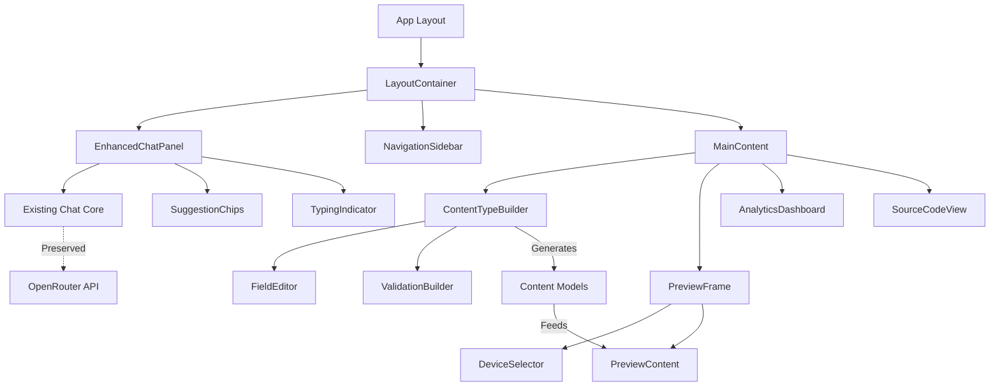

# Catalyst Studio Brownfield Enhancement Architecture

## Introduction

This document outlines the architectural approach for enhancing Catalyst Studio with the MVP implementation that transforms the approved HTML mockup into a production-ready application. Its primary goal is to serve as the guiding architectural blueprint for AI-driven development of new features while ensuring seamless integration with the existing system.

**Relationship to Existing Architecture:**
This document supplements the existing Next.js application architecture by defining how new components will integrate with current systems. Where conflicts arise between new and existing patterns, this document provides guidance on maintaining consistency while implementing enhancements.

### Existing Project Analysis

#### Current Project State
- **Primary Purpose:** AI-powered website builder with conversational interface for rapid prototyping
- **Current Tech Stack:** Next.js 15.4.5, React 19, TypeScript 5, Vercel AI SDK v4, OpenRouter provider
- **Architecture Style:** Component-based with App Router, functional React with hooks
- **Deployment Method:** Vercel-optimized with Turbopack for development

#### Available Documentation
- Project Brief with comprehensive vision
- PRD with detailed requirements and user stories
- UI/UX Specification with component designs
- Customer-approved HTML mockup as visual reference

#### Identified Constraints
- Must preserve existing chat implementation complexity that took significant effort to perfect
- Must maintain exact visual fidelity to customer-approved HTML mockup
- Must support future CMS integrations (Optimizely, Contentful, Strapi)
- Must handle OpenRouter API rate limits gracefully
- Must maintain 60-second generation time for complete prototypes

### Change Log

| Change | Date | Version | Description | Author |
|--------|------|---------|-------------|--------|
| Initial Architecture | 2025-01-08 | 1.0 | Brownfield architecture for MVP enhancement | Winston (Architect) |

## Enhancement Scope and Integration Strategy

### Enhancement Overview
**Enhancement Type:** Major UI/UX implementation with AI workflow enhancement  
**Scope:** Transform HTML mockup to React components, enhance chat with structured prompts, add content modeling  
**Integration Impact:** Significant - new UI layer while preserving core chat logic

### Integration Approach
**Code Integration Strategy:** Preserve `/app/chat` core logic, wrap with new UI components, extend functionality through composition  
**Database Integration:** Initial localStorage/IndexedDB for persistence, prepared for PostgreSQL migration  
**API Integration:** Maintain existing OpenRouter integration, add abstraction layer for future CMS APIs  
**UI Integration:** Migrate to shadcn/ui components while maintaining Catalyst X visual identity

### Compatibility Requirements
- **Existing API Compatibility:** Full preservation of OpenRouter and Vercel AI SDK v4 integration
- **Database Schema Compatibility:** New data models additive only, no breaking changes
- **UI/UX Consistency:** Exact match to approved HTML mockup with enhanced interactivity
- **Performance Impact:** Maintain <2 second response times, <60 second generation

## Tech Stack Alignment

### Existing Technology Stack

| Category | Current Technology | Version | Usage in Enhancement | Notes |
|----------|-------------------|---------|---------------------|-------|
| Framework | Next.js | 15.4.5 | Core framework | Keep with App Router |
| Runtime | React | 19.1.0 | UI components | Latest stable |
| Language | TypeScript | 5.x | Type safety | Maintain strict mode |
| AI SDK | Vercel AI SDK | 4.3.19 | Chat integration | Preserve existing |
| AI Provider | OpenRouter | 0.0.5 | LLM access | Keep configuration |
| UI Library | Radix UI | Partial | Migrate to shadcn | Already installed |
| Styling | Tailwind CSS | 3.4.17 | All styling | Extend with custom theme |
| State | React Context | Built-in | Global state | Add useReducer patterns |
| Validation | Zod | 3.25.76 | Schema validation | Extend for forms |

### New Technology Additions

| Technology | Version | Purpose | Rationale | Integration Method |
|------------|---------|---------|-----------|-------------------|
| shadcn/ui | Latest | Component library | Production-ready components with Radix | CLI installation |
| Framer Motion | 11.x | Complex animations | Glass morphism effects | npm install |
| React Hook Form | 7.x | Form management | Content type builder forms | With Zod validation |
| Zustand | 4.x | State management | Complex UI state beyond chat | Complement Context |
| SWR | 2.x | Data fetching | API caching and revalidation | For CMS mocks |

## Data Models and Schema Changes

### New Data Models

#### Project Model
**Purpose:** Store complete project state including content types and settings  
**Integration:** Top-level container for all project data

**Key Attributes:**
- `id`: string - Unique project identifier
- `name`: string - Project name
- `description`: string - Natural language description
- `contentTypes`: ContentType[] - Array of content type definitions
- `content`: ContentItem[] - Generated content items
- `settings`: ProjectSettings - Configuration options
- `createdAt`: Date - Creation timestamp
- `updatedAt`: Date - Last modification

**Relationships:**
- **With Existing:** Extends chat conversation with structured output
- **With New:** Parent to ContentType and ContentItem models

#### ContentType Model
**Purpose:** Define structure for website content schemas  
**Integration:** Core of content modeling system

**Key Attributes:**
- `id`: string - Unique identifier
- `name`: string - Content type name (e.g., "BlogPost")
- `pluralName`: string - Plural form for collections
- `icon`: string - Emoji icon for visual identification
- `fields`: Field[] - Array of field definitions
- `relationships`: Relationship[] - Links to other content types

**Relationships:**
- **With Existing:** Generated from AI chat responses
- **With New:** Parent to Field definitions, referenced by ContentItems

#### Field Model
**Purpose:** Define individual fields within content types  
**Integration:** Building blocks of content schemas

**Key Attributes:**
- `id`: string - Unique identifier
- `name`: string - Field name
- `type`: FieldType - text, richText, image, date, number, boolean, reference
- `required`: boolean - Validation flag
- `defaultValue`: any - Default value if not required
- `validation`: ValidationRule[] - Zod schemas for validation
- `order`: number - Display order in forms

**Relationships:**
- **With Existing:** Validated using existing Zod setup
- **With New:** Child of ContentType, used by ContentItem

### Schema Integration Strategy

**Database Changes Required:**
- **New Tables:** projects, content_types, fields, content_items, relationships (future)
- **Modified Tables:** None - all additive
- **New Indexes:** project_id, content_type_id for query performance
- **Migration Strategy:** Start with localStorage, prepare TypeScript interfaces for future DB

**Backward Compatibility:**
- All new models are additive, no breaking changes
- Existing chat functionality remains unchanged
- Progressive enhancement approach for new features

## Component Architecture

### New Components

#### LayoutContainer
**Responsibility:** Three-column layout orchestration with responsive behavior  
**Integration Points:** Wraps entire application, manages panel visibility

**Key Interfaces:**
- `usePanelState()` - Hook for panel visibility management
- `useBreakpoint()` - Responsive behavior detection
- `PanelContext` - Share state across layout components

**Dependencies:**
- **Existing Components:** Wraps existing chat components
- **New Components:** Contains ChatPanel, NavigationSidebar, MainContent

**Technology Stack:** React with Framer Motion for panel animations, Tailwind for responsive grid

#### EnhancedChatPanel
**Responsibility:** Wrap existing chat with suggestion chips and enhanced UI  
**Integration Points:** Extends `/app/chat` without modifying core logic

**Key Interfaces:**
- `useChat()` - Existing Vercel AI SDK hook (preserved)
- `useSuggestions()` - Context-aware suggestion generation
- `MessageRenderer` - Enhanced message display with typing indicators

**Dependencies:**
- **Existing Components:** Imports and wraps existing chat logic
- **New Components:** SuggestionChips, TypingIndicator, MessageList

**Technology Stack:** Preserves existing Vercel AI SDK integration, adds shadcn/ui components

#### ContentTypeBuilder
**Responsibility:** Visual interface for creating and managing content schemas  
**Integration Points:** Generates structured data from UI interactions

**Key Interfaces:**
- `useContentTypes()` - CRUD operations for content types
- `FieldEditor` - Drag-and-drop field management
- `ValidationBuilder` - Visual Zod schema construction

**Dependencies:**
- **Existing Components:** Uses Zod for validation schemas
- **New Components:** FieldTypeModal, DraggableField, RelationshipEditor

**Technology Stack:** React Hook Form with Zod, shadcn/ui form components, Framer Motion for drag

#### PreviewFrame
**Responsibility:** Real-time website preview with device switching  
**Integration Points:** Renders generated React components in isolation

**Key Interfaces:**
- `usePreviewState()` - Preview data and device management
- `DeviceFrame` - Responsive iframe containers
- `PreviewRouter` - Isolated routing for preview

**Dependencies:**
- **Existing Components:** None - isolated rendering
- **New Components:** DeviceSelector, PreviewControls, LoadingSkeleton

**Technology Stack:** iframe with sandboxing, PostMessage API for communication

### Component Interaction Diagram



## API Design and Integration

### API Integration Strategy
**API Integration Strategy:** Layer new functionality on top of existing OpenRouter integration  
**Authentication:** Maintain existing API key management in environment variables  
**Versioning:** Internal API versioning for future CMS adapters

### New API Endpoints

#### Project Management API
- **Method:** POST
- **Endpoint:** `/api/projects`
- **Purpose:** Save and retrieve project state
- **Integration:** Stores output from enhanced chat conversations

**Request:**
```json
{
  "name": "string",
  "description": "string",
  "contentTypes": "ContentType[]",
  "settings": "ProjectSettings"
}
```

**Response:**
```json
{
  "id": "string",
  "project": "Project",
  "createdAt": "Date"
}
```

#### Content Generation API
- **Method:** POST
- **Endpoint:** `/api/generate/content`
- **Purpose:** Generate sample content for content types
- **Integration:** Uses existing OpenRouter connection with structured prompts

**Request:**
```json
{
  "contentType": "ContentType",
  "count": "number",
  "context": "string"
}
```

**Response:**
```json
{
  "items": "ContentItem[]",
  "generated": "number"
}
```

## External API Integration

### OpenRouter API (Existing - Enhanced)
- **Purpose:** LLM access for content generation and chat
- **Documentation:** Existing integration maintained
- **Base URL:** Configured in environment
- **Authentication:** API key in headers
- **Integration Method:** Vercel AI SDK provider (unchanged)

**Key Endpoints Used:**
- `POST /api/completion` - Chat completions (existing)
- Structured prompt templates for content generation

**Error Handling:** Existing retry logic with exponential backoff, add queue for rate limits

## Source Tree Integration

### Existing Project Structure
```
catalyst-studio/
├── app/                    # Next.js App Router
│   ├── api/               # API routes
│   ├── chat/              # EXISTING - Core chat (preserve)
│   └── (dashboard)/       # NEW - Main app routes
├── components/            # Shared components
├── lib/                   # Utilities
└── public/               # Static assets
```

### New File Organization
```
catalyst-studio/
├── app/
│   ├── chat/                      # EXISTING - Preserved
│   └── (dashboard)/               # NEW - Dashboard layout
│       ├── layout.tsx            # Three-column layout
│       ├── page.tsx              # Overview/dashboard
│       ├── content/              # Content management views
│       ├── preview/              # Preview route
│       └── settings/             # Project settings
├── components/
│   ├── ui/                       # shadcn/ui components
│   ├── layout/                   # NEW - Layout components
│   │   ├── layout-container.tsx
│   │   ├── navigation-sidebar.tsx
│   │   └── panel-manager.tsx
│   ├── chat/                     # NEW - Chat enhancements
│   │   ├── enhanced-chat-panel.tsx
│   │   ├── suggestion-chips.tsx
│   │   └── typing-indicator.tsx
│   ├── content/                  # NEW - Content management
│   │   ├── content-type-builder.tsx
│   │   ├── field-editor.tsx
│   │   └── field-type-modal.tsx
│   └── preview/                  # NEW - Preview components
│       ├── preview-frame.tsx
│       └── device-selector.tsx
├── lib/
│   ├── store/                    # NEW - State management
│   │   ├── project-store.ts
│   │   └── ui-store.ts
│   └── schemas/                  # NEW - Zod schemas
│       ├── content-type.ts
│       └── field.ts
└── styles/
    └── catalyst-theme.css        # NEW - Brand theming
```

### Integration Guidelines
- **File Naming:** Kebab-case for all new files, matching Next.js conventions
- **Folder Organization:** Feature-based grouping within components
- **Import/Export Patterns:** Named exports for components, default for pages

## Infrastructure and Deployment Integration

### Existing Infrastructure
**Current Deployment:** Vercel deployment with Next.js optimization  
**Infrastructure Tools:** GitHub for version control, Vercel CLI  
**Environments:** Development (local), Preview (Vercel), Production (Vercel)

### Enhancement Deployment Strategy
**Deployment Approach:** Progressive enhancement - deploy features behind feature flags  
**Infrastructure Changes:** None - leverage existing Vercel setup  
**Pipeline Integration:** Existing GitHub -> Vercel automation maintained

### Rollback Strategy
**Rollback Method:** Vercel instant rollback to previous deployment  
**Risk Mitigation:** Feature flags for gradual rollout  
**Monitoring:** Vercel Analytics for performance metrics

## Coding Standards and Conventions

### Existing Standards Compliance
**Code Style:** ESLint with Next.js config (existing)  
**Linting Rules:** Current rules maintained, extend for new patterns  
**Testing Patterns:** Playwright for E2E (existing), add component tests  
**Documentation Style:** JSDoc for complex functions, inline comments minimal

### Enhancement-Specific Standards
- **Component Structure:** Function components with TypeScript interfaces
- **State Management:** Hooks for local state, Zustand for complex UI state
- **Error Boundaries:** Wrap each major feature section
- **Accessibility:** ARIA labels on all interactive elements

### Critical Integration Rules
- **Existing API Compatibility:** Never modify `/app/chat` core logic directly
- **Database Integration:** All data models must have TypeScript interfaces
- **Error Handling:** Consistent error boundaries with user-friendly messages
- **Logging Consistency:** Console in dev, prepare for production logging service

## Testing Strategy

### Integration with Existing Tests
**Existing Test Framework:** Playwright for E2E testing  
**Test Organization:** `/tests` directory for E2E, colocated unit tests  
**Coverage Requirements:** Maintain existing coverage, target 80% for new code

### New Testing Requirements

#### Unit Tests for New Components
- **Framework:** Jest + React Testing Library
- **Location:** Colocated with components (`*.test.tsx`)
- **Coverage Target:** 80% for UI components
- **Integration with Existing:** Run alongside existing Playwright tests

#### Integration Tests
- **Scope:** Chat enhancement integration, content type CRUD operations
- **Existing System Verification:** Ensure chat functionality unchanged
- **New Feature Testing:** Content builder workflows, preview updates

#### Regression Testing
- **Existing Feature Verification:** Automated Playwright suite for chat
- **Automated Regression Suite:** GitHub Actions on PR
- **Manual Testing Requirements:** Visual regression for UI fidelity

## Security Integration

### Existing Security Measures
**Authentication:** API key management in environment variables  
**Authorization:** Client-side only (MVP scope)  
**Data Protection:** HTTPS only, no sensitive data storage  
**Security Tools:** Dependabot for dependency scanning

### Enhancement Security Requirements
**New Security Measures:** Input sanitization for content generation, XSS prevention in preview  
**Integration Points:** Validate all AI-generated content before rendering  
**Compliance Requirements:** Prepare for SOC 2 future requirements

### Security Testing
**Existing Security Tests:** Dependency scanning (maintained)  
**New Security Test Requirements:** Content sanitization tests, iframe sandbox verification  
**Penetration Testing:** Future requirement for production

## Checklist Results Report

✅ **Architecture Completeness:** All major components defined  
✅ **Integration Strategy:** Clear preservation of existing chat logic  
✅ **Tech Stack Alignment:** shadcn/ui integration planned  
✅ **Data Models:** Comprehensive schema for content management  
✅ **Security Considerations:** Input sanitization addressed  
✅ **Testing Strategy:** Multi-layer testing approach defined  
✅ **Deployment Plan:** Progressive enhancement with feature flags

## Next Steps

### Story Manager Handoff

For Story Manager to implement this brownfield enhancement:
- Reference this architecture document for all technical decisions
- Key integration requirement: Preserve `/app/chat` core functionality
- Existing constraint: Maintain exact visual fidelity to HTML mockup
- First story: Implement LayoutContainer with three-column structure
- Critical: Test existing chat functionality after each story completion

### Developer Handoff

For developers starting implementation:
- Reference this architecture and existing Next.js patterns
- Integration requirement: Never modify core chat logic directly
- Key decision: Use shadcn/ui CLI to add components incrementally
- Existing compatibility: All new code must work with Vercel AI SDK v4
- Implementation sequence: Layout → Chat enhancements → Content builder → Preview