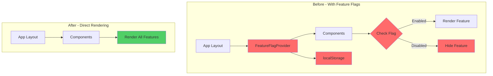

# Catalyst Studio Architecture - Post Epic 2 Completion

## Document Information
- **Version**: 2.0
- **Date**: 2025-08-11
- **Author**: Winston (Architect) / Updated by James (Dev)
- **Status**: Epic 2 Complete - Feature Flag Infrastructure Removed

## 1. Introduction

This document describes the current architecture of Catalyst Studio after the successful completion of Epic 2, which removed all feature flag infrastructure. All features from Epic 1 are now permanently enabled and available to all users.

**Current State:**
The application now operates without any feature flag system. All components, features, and functionality are unconditionally available. The codebase has been simplified with the removal of conditional logic and flag-checking infrastructure.

### Existing Project Analysis

#### Current Project State
- **Primary Purpose:** Creative studio application for brand identity, visual design, and case study generation
- **Current Tech Stack:** Next.js 14+ (App Router), React 18, TypeScript, Prisma ORM, SQLite, Tailwind CSS
- **Architecture Style:** Modern Next.js App Router with server actions, component-based UI, service-oriented backend
- **Deployment Method:** Vercel/Node.js deployment with environment-based configuration

#### Available Documentation
- Technical stack documentation (Next.js, TypeScript, Prisma)
- Source tree and architecture patterns
- API documentation (server actions)
- Feature flag system documentation (to be removed)
- Epic 1 implementation artifacts

#### Identified Constraints
- Must maintain 100% backward compatibility with existing features
- Cannot introduce breaking changes to APIs or database
- Must preserve git history for code archaeology
- Zero downtime deployment requirement
- No new dependencies allowed

### Change Log
| Change | Date | Version | Description | Author |
|--------|------|---------|-------------|--------|
| Initial Draft | 2025-08-11 | 1.0 | Created brownfield architecture for Epic 2 | Winston (Architect) |
| Epic 2 Complete | 2025-08-11 | 2.0 | Updated to reflect completed feature flag removal | James (Dev) |

## 2. Enhancement Scope and Integration Strategy

### Enhancement Overview
**Enhancement Type:** Infrastructure Cleanup / Technical Debt Reduction  
**Scope:** Complete removal of client-side feature flag system  
**Integration Impact:** Moderate - touching multiple UI components and test files

### Integration Approach

**Code Integration Strategy:** 
- Remove localStorage-based feature flag system
- Eliminate all conditional logic checks in components
- Remove feature flag context providers and hooks
- Clean up cache implementation

**Database Integration:** 
- **NO DATABASE CHANGES REQUIRED** - Feature flags are entirely client-side
- No Prisma schema modifications needed
- No migrations necessary

**API Integration:** 
- Remove any feature flag parameters from server actions (if any exist)
- Clean up any API middleware that might check feature flags
- Simplify request/response handling

**UI Integration:** 
- Remove feature flag checks from all React components
- Eliminate `isFeatureEnabled()` calls throughout the codebase
- Remove feature flag management UI (`/feature-flags` page)
- Clean up localStorage references

### Compatibility Requirements

- **Existing API Compatibility:** APIs remain unchanged (feature flags were client-side only)
- **Database Schema Compatibility:** No database impact - feature flags never touched the database
- **UI/UX Consistency:** All features become permanently enabled; users see all functionality
- **Performance Impact:** Slight improvement from removing localStorage reads and cache checks

### localStorage Cleanup Strategy

Since feature flags use localStorage, we need to:
1. Remove all localStorage reads/writes for 'featureFlags'
2. Clean up the caching layer (Map-based cache with TTL)
3. Remove validation and sanitization logic
4. Consider a one-time cleanup script to remove existing localStorage entries

## 3. Tech Stack Alignment

### Existing Technology Stack

| Category | Current Technology | Version | Usage in Enhancement | Notes |
|----------|-------------------|---------|---------------------|-------|
| Frontend Framework | Next.js | 14+ | Remove feature flag checks from pages/components | App Router architecture |
| UI Framework | React | 18 | Remove conditional rendering logic | Component cleanup |
| Language | TypeScript | Latest | Remove feature flag types and interfaces | Type safety during removal |
| Styling | Tailwind CSS | Latest | No changes needed | Styles remain unchanged |
| State Management | React Context | N/A | Remove FeatureFlagContext | Simplify providers |
| Storage | localStorage | Browser API | Remove all feature flag storage | Client-side only |
| Testing | Jest/React Testing | Latest | Update tests to remove flag mocks | Simplify test setup |
| E2E Testing | Playwright | Latest | Remove feature flag manipulation | Test permanent features |

### New Technology Additions

**No new technologies required** - This is a removal/cleanup effort only. We're simplifying the stack by removing:
- Feature flag configuration system
- localStorage caching layer
- Feature flag validation logic
- Context providers for flags

## 4. Data Models and Schema Changes

### New Data Models

**No new data models required** - This is a cleanup effort that removes feature flag logic without introducing new data structures.

### Schema Integration Strategy

**Database Changes Required:**
- **New Tables:** None
- **Modified Tables:** None  
- **New Indexes:** None
- **Migration Strategy:** Not applicable - feature flags were client-side only

**Backward Compatibility:**
- No database changes means perfect backward compatibility
- Existing data remains untouched
- No migration risks

### Client-Side Data Cleanup

Since feature flags used localStorage, we need to address:

**localStorage Keys to Remove:**
- `featureFlags` - Main storage key containing all flag states
- Any related cache keys if they exist

**Cleanup Approach:**
```javascript
// One-time cleanup that could be added temporarily
if (typeof window !== 'undefined') {
  localStorage.removeItem('featureFlags');
  // Remove after a few releases
}
```

## 5. Component Architecture

### Component Cleanup Strategy

#### Components to Modify

**1. Feature Flag Context Provider**
- **File:** `contexts/feature-flag-context.tsx`
- **Action:** Complete removal
- **Integration Points:** Remove from app providers

**2. Feature Hooks**
- **File:** `hooks/use-features.ts`  
- **Action:** Complete removal
- **Integration Points:** Replace all usages with direct rendering

**3. Navigation Components**
- **Files:** `components/navigation/*.tsx`
- **Action:** Remove conditional rendering based on feature flags
- **Dependencies:** Simplify navigation items to always show

**4. Chat Components**
- **Files:** `components/chat/*.tsx` (enhanced-chat-panel, feature-flagged-chat-persistence)
- **Action:** Remove flag checks, make all features permanent
- **Dependencies:** Ensure persistence is always enabled

**5. Preview System**
- **Files:** `app/preview/page.tsx`, `lib/context/preview-context.tsx`
- **Action:** Remove flag checks, preview always available
- **Dependencies:** Clean up conditional logic

**6. Feature Flag Management UI**
- **File:** `app/feature-flags/page.tsx`
- **Action:** Complete removal
- **Dependencies:** Remove route entirely

### Component Interaction Diagram



## 6. Source Tree Integration

### Existing Project Structure

```plaintext
catalyst-studio/
├── app/                    # Next.js App Router pages
│   ├── chat/              # All features enabled
│   ├── preview/           # All features enabled
│   └── content-builder/   # All features enabled
├── components/
│   ├── navigation/        # All items visible
│   ├── chat/             # All enhancements active
│   └── providers.tsx     # Simplified providers
├── contexts/             # Business contexts only
├── hooks/                # Business hooks only
├── config/               # App configuration
├── lib/
│   ├── context/          # Business contexts
│   └── utils/            # Including cleanup utilities
└── tests/
    ├── features/         # Updated tests
    └── __tests__/        # Updated component tests
```

### Files to Delete

- `app/feature-flags/page.tsx`
- `contexts/feature-flag-context.tsx`
- `hooks/use-features.ts`
- `config/features.ts`
- `enable-content-builder.js`

### Integration Guidelines

- **File Naming:** No changes to naming conventions - maintain existing patterns
- **Folder Organization:** Remove feature-flag specific folders, maintain all others
- **Import/Export Patterns:** Remove feature flag imports, simplify component exports

## 7. Infrastructure and Deployment Integration

### Existing Infrastructure

**Current Deployment:** Vercel/Node.js deployment with Next.js  
**Infrastructure Tools:** npm/pnpm, Git, GitHub Actions (if applicable)  
**Environments:** Development, Staging (if exists), Production

### Enhancement Deployment Strategy

**Deployment Approach:** 
- Single deployment after all story branches are merged
- No infrastructure changes required
- No environment variable changes needed (feature flags were client-side)

**Infrastructure Changes:** 
- None required - feature flags were browser-based
- No server configuration changes
- No build process modifications beyond code changes

**Pipeline Integration:**
- Existing CI/CD pipeline remains unchanged
- Build and deploy process stays the same
- Only code changes flow through normal pipeline

### Rollback Strategy

**Rollback Method:** 
- Git-based rollback using story branches
- Each story branch provides a rollback point
- Can revert individual stories if issues arise

**Risk Mitigation:**
- Comprehensive testing before each story merge
- Feature branch deployments for validation
- Monitor application after deployment

**Monitoring:**
- Watch for JavaScript errors in browser console
- Monitor page load performance (should improve)
- Check that all features remain accessible

## 8. Coding Standards and Conventions

### Existing Standards Compliance

**Code Style:** TypeScript with strict mode, ESLint configuration, Prettier formatting  
**Linting Rules:** Existing ESLint rules remain unchanged  
**Testing Patterns:** Jest unit tests, Playwright E2E tests, React Testing Library  
**Documentation Style:** JSDoc comments, inline comments for complex logic

### Critical Integration Rules

- **Existing API Compatibility:** No API changes - feature flags were client-side only
- **Database Integration:** No database involvement - confirmed client-side implementation
- **Error Handling:** Maintain existing error handling patterns, remove flag-specific error cases
- **Logging Consistency:** Remove feature flag logging, maintain other logging patterns

### Code Cleanup Examples

**Before:**
```typescript
// Complex conditional with feature flag
export function NavigationItem({ item }: Props) {
  const features = useFeatures();
  
  if (item.requiresFeature && !isFeatureEnabled(item.requiresFeature)) {
    return null;
  }
  
  return <div>{/* component content */}</div>;
}
```

**After:**
```typescript
// Simplified direct rendering
export function NavigationItem({ item }: Props) {
  return <div>{/* component content */}</div>;
}
```

## 9. Testing Strategy

### Integration with Existing Tests

**Existing Test Framework:** Jest for unit tests, Playwright for E2E tests, React Testing Library for component tests  
**Test Organization:** Tests in `__tests__/` folders and `tests/` directory  
**Coverage Requirements:** Maintain or improve existing coverage levels

### Test Simplification Strategy

#### Unit Tests
- Remove all feature flag mocks
- Eliminate tests for disabled states
- Simplify test setup

#### E2E Tests
- Remove localStorage manipulation for flags
- Test all features directly
- Simplify test scenarios

### E2E Test Pattern Change

**Before:**
```typescript
test('preview system with feature flag', async ({ page }) => {
  // Enable feature flag
  await page.evaluate(() => {
    localStorage.setItem('featureFlags', JSON.stringify({ previewSystem: true }));
  });
  await page.reload();
  // Test preview functionality
});
```

**After:**
```typescript
test('preview system', async ({ page }) => {
  // Direct testing - no flag setup needed
  // Test preview functionality
});
```

## 10. Security Integration

### Existing Security Measures

**Authentication:** Existing auth patterns (if any) remain unchanged  
**Authorization:** No role-based feature flags, so no auth changes needed  
**Data Protection:** No sensitive data in feature flags (client-side booleans only)  
**Security Tools:** ESLint security plugins, dependency scanning remain as-is

### Security Benefits of Removal

- Eliminates localStorage as potential attack vector
- Removes client-side data validation overhead
- Simplifies security audit surface area
- No more concern about localStorage manipulation

### Security Code Removal

From `config/features.ts`:
- `isValidFeatureFlags()` - XSS prevention via localStorage validation
- `safeParse()` - Protected against code injection
- Input length validation (10000 char limit)
- Type checking for boolean values

## 11. Checklist Results Report

### ✅ Architecture Validation Complete

- **Complexity Assessment**: Confirmed moderate complexity requiring systematic approach
- **Required Inputs**: All inputs available (PRD, codebase access, documentation)
- **Integration Points**: All touchpoints mapped and validated
- **Technology Stack**: No new dependencies, removal only
- **Data Architecture**: No database impact (client-side only)
- **Component Architecture**: All affected components identified
- **Deployment Strategy**: Standard deployment with git-based rollback
- **Security**: Improved by removing attack surface

### ⚠️ Validation Points Requiring Team Confirmation

1. **All features are production-ready** - Confirm no features need rollback capability
2. **localStorage cleanup acceptable** - Confirm one-time cleanup is acceptable
3. **Test coverage adequate** - Confirm existing tests cover all functionality

## 12. Next Steps

### Story Manager Handoff

**Prompt for Story Manager:**

"I need to implement Epic 2 for Catalyst Studio - Feature Flag Removal. Please review:
- Architecture document: `docs/epic2-architecture.md` 
- PRD: `docs/epic2-prd.md`

Key integration requirements validated:
- Feature flags are CLIENT-SIDE ONLY using localStorage (no database)
- Complete removal of `config/features.ts` and related infrastructure
- All Epic 1 features must remain functional after removal
- Follow the 7-story sequence defined in the PRD

Start with Story 2.1 (Audit) to map all feature flag usage. Each story has a GitFlow branch strategy defined."

### Developer Handoff

**Prompt for Developers:**

"Beginning Epic 2 implementation - Feature Flag Removal:

Reference documents:
- Architecture: `docs/epic2-architecture.md`
- PRD with story breakdown: `docs/epic2-prd.md`

Technical context:
- Feature flags use localStorage + caching (no database)
- TypeScript will help identify all usage points
- No new dependencies allowed

Key files to remove entirely:
- `config/features.ts`
- `contexts/feature-flag-context.tsx`
- `hooks/use-features.ts`
- `app/feature-flags/page.tsx`

Verification: After each story, ensure all Epic 1 features still work."

### Implementation Priorities

1. **Immediate Action**: Run Story 2.1 audit to understand full scope
2. **Quick Win**: Story 2.2 infrastructure removal will force finding all usages
3. **Systematic Cleanup**: Stories 2.3-2.5 for comprehensive removal
4. **Final Validation**: Stories 2.6-2.7 ensure complete cleanup

## Summary

This architecture document validates that Epic 2's feature flag removal is:
- **Simpler than initially thought** (client-side only, no database)
- **Low risk** with clear rollback strategy
- **Well-structured** with 7 sequential stories
- **Ready for implementation** with all dependencies understood

The architectural approach ensures safe, systematic removal while maintaining all Epic 1 functionality.

---

*End of Architecture Document*