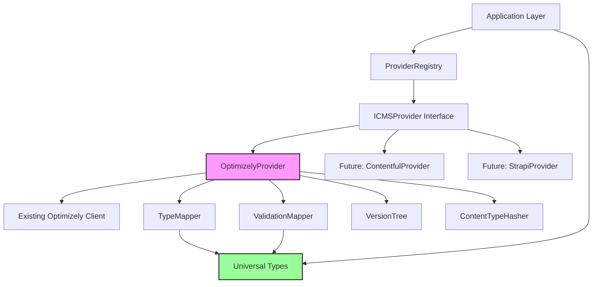

# Catalyst Studio Universal CMS Content Type Architecture

## Introduction

This document outlines the architectural approach for enhancing Catalyst Studio with the Universal CMS Content Type Architecture (Epic 7). Its primary goal is to serve as the guiding architectural blueprint for AI-driven development of new features while ensuring seamless integration with the existing system.

**Relationship to Existing Architecture:**
This document supplements existing project architecture by defining how new components will integrate with current systems. Where conflicts arise between new and existing patterns, this document provides guidance on maintaining consistency while implementing enhancements.

### Existing Project Analysis

#### Current Project State
- **Primary Purpose:** Content management and deployment platform with AI-driven content generation capabilities
- **Current Tech Stack:** Next.js 15.4.5, React 19, TypeScript, Prisma ORM, PostgreSQL, TailwindCSS
- **Architecture Style:** Modular monolith with layered architecture (UI components, API routes, services, data layer)
- **Deployment Method:** Vercel/Next.js deployment with PostgreSQL database

#### Available Documentation
- ✅ Epic 7 PRD with detailed requirements
- ✅ Project Brief with technical specifications
- ✅ Database schema and models (Prisma)
- ✅ Existing Optimizely integration code
- ⚠️ Coding standards (implied through codebase patterns)
- ⚠️ UX/UI guidelines (component-based design system)

#### Identified Constraints
- Must maintain backward compatibility with existing content types and data
- Existing versioning system (ContentTypeVersion) must remain unchanged
- Change tracking and synchronization mechanisms are already in place
- Current Optimizely integration is scattered across multiple modules
- Performance must not degrade by more than 10%
- Must work within Next.js App Router architecture

### Change Log

| Change | Date | Version | Description | Author |
|--------|------|---------|-------------|--------|
| Initial Creation | 2025-01-19 | 1.0 | Created brownfield architecture for Epic 7 | Winston (Architect) |

## Enhancement Scope and Integration Strategy

### Enhancement Overview
**Enhancement Type:** Major Feature Modification - Provider-based architecture with universal type system
**Scope:** Refactor existing Optimizely integration into provider pattern, implement universal content type system
**Integration Impact:** High - Requires systematic refactoring of existing CMS integration code

### Integration Approach
**Code Integration Strategy:** Gradual refactoring with parallel old/new code paths, feature flags for rollout
**Database Integration:** Preserve existing schema, extend with provider metadata fields as needed
**API Integration:** Maintain existing API contracts while internally routing through provider abstraction
**UI Integration:** Components remain unchanged, work with universal types transparently

### Compatibility Requirements
- **Existing API Compatibility:** All current API endpoints must continue functioning identically
- **Database Schema Compatibility:** No breaking changes to existing tables, additive changes only
- **UI/UX Consistency:** No visible changes to user interface during refactor
- **Performance Impact:** Provider overhead must be < 100ms per operation

## Tech Stack Alignment

### Existing Technology Stack

| Category | Current Technology | Version | Usage in Enhancement | Notes |
|----------|-------------------|---------|---------------------|-------|
| Framework | Next.js | 15.4.5 | Core framework | App Router architecture |
| UI Library | React | 19.1.0 | Component development | Latest stable version |
| Language | TypeScript | ^5 | Type safety for providers | Strict mode enabled |
| Database | PostgreSQL | Latest | Content type storage | Via Prisma ORM |
| ORM | Prisma | 6.13.0 | Database abstraction | Existing models preserved |
| State Management | Zustand | 5.0.7 | Client state | Provider selection state |
| API Integration | Native fetch | Built-in | CMS API calls | Within providers |
| Testing | Jest/Playwright | 30.0.5/1.54.2 | Provider testing | Existing test structure |

### New Technology Additions

No new technologies required. The enhancement uses existing stack with architectural patterns only.

## Data Models and Schema Changes

### New Data Models

#### UniversalContentType
**Purpose:** Platform-agnostic content type definition
**Integration:** Maps to existing ContentType model through providers

**Key Attributes:**
- `version`: string - Semantic versioning for type evolution
- `id`: string - Unique identifier
- `name`: string - Human-readable name
- `type`: 'page' | 'component' - Content classification
- `isRoutable`: boolean - Whether content has URLs
- `fields`: UniversalField[] - Field definitions using three-layer system
- `metadata`: TypeMetadata - AI generation tracking and platform info

**Relationships:**
- **With Existing:** Maps 1:1 with ContentType through provider transformation
- **With New:** References UniversalField, UniversalValidation types

#### UniversalField
**Purpose:** Platform-agnostic field definition with three-layer type system
**Integration:** Transforms to/from existing field JSON structure

**Key Attributes:**
- `id`: string - Field identifier
- `name`: string - Field name
- `layer`: 'primitive' | 'common' | 'extension' - Type layer classification
- `type`: FieldType - Specific field type within layer
- `validations`: UniversalValidation[] - Portable validation rules
- `fallbackStrategy`: string - Degradation approach for incompatible platforms

**Relationships:**
- **With Existing:** Maps to fields JSON in ContentType
- **With New:** Part of UniversalContentType structure

### Schema Integration Strategy

**Database Changes Required:**
- **New Tables:** None - using existing structure
- **Modified Tables:** 
  - ContentType: Add `providerMetadata` JSON field (optional)
  - Deployment: Extend `deploymentData` to include provider configuration
- **New Indexes:** None required
- **Migration Strategy:** Additive changes only, no data migration needed

**Backward Compatibility:**
- All existing data remains valid
- Provider metadata is optional and doesn't affect existing functionality
- Gradual migration path for existing content types

## Component Architecture

### New Components

#### OptimizelyProvider
**Responsibility:** Encapsulates all Optimizely-specific logic and API interactions
**Integration Points:** ICMSProvider interface, existing versioning service, Optimizely API

**Key Interfaces:**
- `ICMSProvider` - Standard provider interface
- `getContentTypes()` - Retrieve and transform Optimizely types
- `mapToUniversal()` - Convert Optimizely → Universal format
- `mapFromUniversal()` - Convert Universal → Optimizely format

**Dependencies:**
- **Existing Components:** VersionTree, ContentTypeHasher, database services
- **New Components:** TypeMapper, ValidationMapper, ProviderRegistry

**Technology Stack:** TypeScript, existing Optimizely client code (refactored)

#### ProviderRegistry
**Responsibility:** Manages provider instances and routing
**Integration Points:** All providers, application services

**Key Interfaces:**
- `register()` - Register new provider instance
- `getProvider()` - Retrieve provider by platform ID
- `listProviders()` - Get available providers

**Dependencies:**
- **Existing Components:** None (pure TypeScript)
- **New Components:** All provider implementations

**Technology Stack:** TypeScript singleton pattern

#### UniversalTypeMapper
**Responsibility:** Handles type transformations between universal and platform-specific formats
**Integration Points:** All providers, type system

**Key Interfaces:**
- `transformField()` - Convert individual fields
- `calculateConfidence()` - Migration confidence scoring
- `generateFallback()` - Create degradation strategies

**Dependencies:**
- **Existing Components:** Field utilities
- **New Components:** Three-layer type definitions

**Technology Stack:** Pure TypeScript transformations

### Component Interaction Diagram



## API Design and Integration

### API Integration Strategy
**API Integration Strategy:** Provider pattern abstracts all CMS-specific API calls
**Authentication:** Existing authentication preserved, provider handles CMS credentials
**Versioning:** No API versioning changes required

### Internal API Structure

#### Provider Interface Methods

##### getContentTypes
- **Method:** async
- **Endpoint:** Internal method (wraps CMS-specific endpoints)
- **Purpose:** Retrieve all content types in universal format
- **Integration:** Uses existing database and Optimizely APIs

##### createContentType
- **Method:** async  
- **Endpoint:** Internal method
- **Purpose:** Create new content type through provider
- **Integration:** Maintains versioning system integration

##### updateContentType
- **Method:** async
- **Endpoint:** Internal method  
- **Purpose:** Update existing type with change tracking
- **Integration:** Uses existing VersionTree and change detection

## Source Tree Integration

### Existing Project Structure
```plaintext
catalyst-studio/
├── app/                    # Next.js App Router
├── components/            # React components
├── lib/                   # Core libraries
│   ├── api/              # API utilities
│   ├── content-types/    # Type management
│   ├── deployment/       # CMS deployment (scattered)
│   ├── sync/            # Synchronization logic
│   └── versioning/      # Version control system
├── prisma/               # Database schema
└── tests/               # Test suites
```

### New File Organization
```plaintext
catalyst-studio/
├── lib/
│   ├── providers/                    # New: Provider architecture
│   │   ├── index.ts                 # Provider exports
│   │   ├── registry.ts              # ProviderRegistry
│   │   ├── types.ts                 # ICMSProvider interface
│   │   ├── optimizely/              # Optimizely provider module
│   │   │   ├── index.ts            # Single entry point
│   │   │   ├── OptimizelyProvider.ts
│   │   │   ├── mapping/            # Type transformations
│   │   │   ├── validation/         # Validation logic
│   │   │   └── internal/           # Private implementation
│   │   └── universal/               # Universal type system
│   │       ├── types.ts            # Type definitions
│   │       ├── primitives.ts       # Layer 1 types
│   │       ├── common.ts           # Layer 2 types
│   │       └── extensions.ts       # Layer 3 types
│   ├── sync/                        # Existing (modified)
│   │   └── transformers/           # Refactored to use providers
├── prompts/                          # New: AI system prompts
│   └── universal-types/
│       ├── generation-rules.md      # AI generation guidelines
│       ├── type-examples.json       # Example content types
│       ├── validation-rules.md      # Validation criteria
│       └── platform-mappings.json   # Platform capabilities
├── .env.template                     # Environment template
└── tests/
    └── providers/                    # Provider tests
```

### Integration Guidelines
- **File Naming:** Follow existing camelCase for files, PascalCase for classes
- **Folder Organization:** Providers are self-contained modules with clear boundaries
- **Import/Export Patterns:** Single entry points per provider, no deep imports

## Infrastructure and Deployment Integration

### Existing Infrastructure
**Current Deployment:** Next.js on Vercel or similar platforms
**Infrastructure Tools:** GitHub Actions, environment variables for configuration
**Environments:** Development (local), Staging, Production

### Enhancement Deployment Strategy
**Deployment Approach:** Feature flags control provider activation
**Infrastructure Changes:** None - configuration through environment variables
**Pipeline Integration:** Existing CI/CD pipeline continues unchanged

**Environment Variables Required:**
```bash
# Provider Configuration
PROVIDER_TYPE=optimizely
OPTIMIZELY_API_KEY={encrypted}
OPTIMIZELY_PROJECT_ID={project_id}
ENABLE_PROVIDER_PATTERN=false
USE_MOCK_PROVIDER=false
```

### Rollback Strategy
**Rollback Method:** Feature flags allow instant rollback to direct Optimizely integration
**Risk Mitigation:** Parallel code paths until provider proven stable
**Monitoring:** Console logging for MVP, structured logs for transformation operations

## Coding Standards and Conventions

### Existing Standards Compliance
**Code Style:** ESLint + Next.js configuration, Prettier formatting
**Linting Rules:** TypeScript strict mode, React hooks rules
**Testing Patterns:** Jest for unit tests, Playwright for E2E
**Documentation Style:** JSDoc comments for public APIs

### Enhancement-Specific Standards
- **Provider Encapsulation:** ALL platform-specific code must be within provider boundaries
- **Type Safety:** Strict TypeScript for all provider interfaces
- **Error Handling:** Graceful degradation with detailed logging
- **Async Patterns:** All provider methods return Promises for consistency

### Critical Integration Rules
- **Existing API Compatibility:** Provider must not change external API behavior
- **Database Integration:** Use existing Prisma models, no direct SQL
- **Error Handling:** Maintain existing error response formats
- **Logging Consistency:** Use existing monitoring utilities

## Testing Strategy

### Integration with Existing Tests
**Existing Test Framework:** Jest 30.0.5 for unit tests, Playwright 1.54.2 for E2E
**Test Organization:** Tests co-located with code in __tests__ folders
**Coverage Requirements:** Maintain 80% coverage threshold

### New Testing Requirements

#### Unit Tests for New Components
- **Framework:** Jest (existing)
- **Location:** lib/providers/__tests__/
- **Coverage Target:** 90% for provider code
- **Integration with Existing:** Mock existing services for isolation

#### Integration Tests
- **Scope:** Provider ↔ Database, Provider ↔ Versioning
- **Existing System Verification:** Ensure no regression in current functionality
- **New Feature Testing:** Universal type transformations, confidence scoring

#### Regression Testing
- **Existing Feature Verification:** Full test suite must pass unchanged
- **Automated Regression Suite:** Existing GitHub Actions workflow
- **Manual Testing Requirements:** Provider switching, type migration flows

## Security Integration

### Existing Security Measures
**Authentication:** Next.js session management
**Authorization:** Role-based access control (if implemented)
**Data Protection:** HTTPS, encrypted database
**Security Tools:** ESLint security plugin

### Enhancement Security Requirements
**New Security Measures:** 
- Secure storage of CMS API credentials in environment variables
- Input validation for universal type definitions
- Sanitization of provider responses

**Integration Points:** Provider configuration, API credential management
**Compliance Requirements:** Maintain existing security posture

### Security Testing
**Existing Security Tests:** Current test suite
**New Security Test Requirements:** 
- Credential leak prevention tests
- Input validation tests for type definitions
- Provider response sanitization tests

**Penetration Testing:** Not required for MVP

## Implementation Roadmap

### Phase 1: Foundation (Week 1-2)
- **Story 7.0:** Environment Setup & Credential Management
  - Document Optimizely credential acquisition
  - Create .env.template with all variables
  - Setup mock provider for offline development
  - Document security best practices

- **Story 7.1:** Provider Architecture Foundation & Interface Definition
  - Create ICMSProvider interface
  - Implement ProviderRegistry
  - Define universal types
  
- **Story 7.2:** Extract & Encapsulate Optimizely Logic
  - Refactor existing Optimizely code into provider
  - Create mapping layer
  - Ensure zero regression

### Phase 2: Type System (Week 3)
- **Story 7.3:** Implement Three-Layer Type System
  - Define primitive types
  - Implement common patterns
  - Create extension mechanism
  
- **Story 7.4:** Create AI System Prompt Integration
  - Generate AI guidelines in prompts/universal-types/
  - Create validation system with confidence scoring
  - Update CLAUDE.md with universal type patterns
  - Define type-examples.json catalog
  - Create platform-mappings.json matrix

### Phase 3: Migration (Week 4)
- **Story 7.5:** Migration & Transformation Engine
  - Build transformation rules
  - Implement confidence scoring
  - Create migration reports

### Phase 4: Integration (Week 5)
- **Story 7.6:** Update Application Layer & Testing
  - Replace direct Optimizely calls
  - Update test suite
  - Configure provider injection
  
- **Story 7.7:** Documentation & AI Training Data
  - Create provider development guide
  - Document transformation examples
  - Update CLAUDE.md

## Risk Assessment and Mitigation

### Technical Risks

#### Risk: Complex Optimizely Logic Difficult to Encapsulate
- **Probability:** Medium
- **Impact:** High
- **Mitigation:** 
  - Gradual refactoring with feature flags
  - Maintain parallel code paths
  - Comprehensive test coverage before switching

#### Risk: Universal Type System Too Restrictive
- **Probability:** Low
- **Impact:** Medium
- **Mitigation:**
  - Three-layer system provides flexibility
  - Platform extensions preserve unique features
  - Fallback strategies for incompatible types

#### Risk: Breaking Existing Versioning System
- **Probability:** Low
- **Impact:** Critical
- **Mitigation:**
  - Inject existing versioning service
  - No changes to version tracking logic
  - Extensive testing of version history

### Integration Risks

#### Risk: Performance Degradation
- **Probability:** Medium
- **Impact:** Medium
- **Mitigation:**
  - Profile provider overhead
  - Implement caching where appropriate
  - Optimize transformation logic

#### Risk: AI Generation Incompatibility
- **Probability:** Low
- **Impact:** Medium
- **Mitigation:**
  - Clear AI guidelines in system prompts
  - Validation layer for generated types
  - Comprehensive examples

## Success Criteria

### MVP Success Metrics
- ✅ **Provider Encapsulation:** Optimizely logic fully contained in provider module
- ✅ **Zero Regression:** Existing functionality 100% preserved  
- ✅ **Extended Field Types:** JSON, repeater, and slug fields supported
- ✅ **Type Compatibility:** 80% field type mapping success rate achieved
- ✅ **Versioning Preserved:** Change tracking system remains unchanged
- ✅ **Error Handling:** Basic error recovery with retry logic
- ✅ **Transformation Examples:** 5+ real-world migration scenarios documented
- ✅ **Performance:** Provider overhead < 100ms per operation

### Post-MVP Goals
- Add Contentful provider implementation
- Add Strapi provider implementation  
- Performance optimization and caching
- Production monitoring and observability
- Advanced error handling and recovery

## Next Steps

### Story Manager Handoff

For the Story Manager to work with this brownfield enhancement:

**Reference Documents:**
- This architecture document (epic7-architecture.md)
- Epic 7 PRD (epic7-prd.md)
- Epic 7 Project Brief (epic7-project-brief.md)

**Key Integration Requirements:**
- Maintain 100% backward compatibility during refactoring
- Use feature flags for gradual rollout
- Preserve existing versioning system completely
- No changes to external API contracts

**First Story to Implement:**
Start with Story 7.1 (Provider Architecture Foundation) as it establishes the base structure without touching existing code. This allows validation of the approach before refactoring begins.

**Implementation Checkpoints:**
1. After Story 7.1: Validate provider interface design
2. After Story 7.2: Ensure zero regression in Optimizely functionality
3. After Story 7.3: Confirm type system flexibility
4. After Story 7.5: Test migration confidence scoring
5. After Story 7.6: Full regression testing

### Developer Handoff

For developers starting implementation:

**Reference Architecture:**
- Provider pattern with complete encapsulation
- Three-layer type system for universal compatibility
- Existing versioning system integration unchanged

**Key Technical Decisions:**
- TypeScript strict mode for all provider code
- Async/await pattern for all provider methods
- Single entry point per provider module
- No platform-specific imports outside providers

**Implementation Sequence:**
1. Create provider infrastructure without touching existing code
2. Gradually move Optimizely logic into provider
3. Test each migration step with parallel execution
4. Switch to provider-based routing only after validation
5. Remove old code only after provider proven stable

**Verification Steps:**
- Run existing test suite after each change
- Compare provider output with direct Optimizely calls
- Monitor performance metrics during migration
- Validate version history preservation
- Test rollback procedures at each stage

---

*Architecture Document Version: 1.0*  
*Epic: 7 - Universal CMS Content Type Architecture*  
*Status: Ready for Implementation*  
*Architect: Winston*