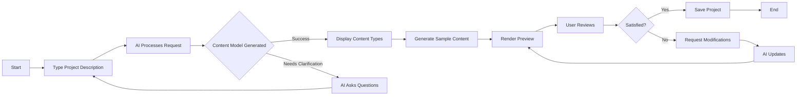
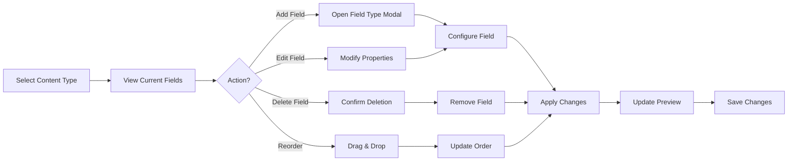
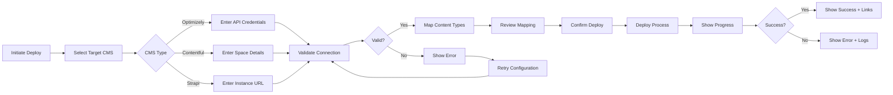

# Catalyst Studio UI/UX Specification

## Introduction

This document defines the user experience goals, information architecture, user flows, and visual design specifications for Catalyst Studio's user interface. It serves as the foundation for visual design and frontend development, ensuring a cohesive and user-centered experience.

### Overall UX Goals & Principles

#### Target User Personas

- **Digital Agency Developer** - Technical professionals at agencies who need to rapidly prototype websites for multiple clients, comfortable with code but seeking efficiency
- **Enterprise Marketing Manager** - Non-technical marketing professionals who need to create campaign sites quickly without IT dependency  
- **Freelance Designer** - Creative professionals who want to translate designs into working websites without deep coding knowledge

#### Usability Goals

- **Instant Value**: Users can create their first working prototype within 15 minutes
- **Natural Interaction**: Conversational AI interface feels intuitive without training
- **Visual Confidence**: Real-time preview provides immediate feedback on all changes
- **Seamless Workflow**: From idea to CMS deployment in under 72 hours
- **Error Prevention**: Smart validation and suggestions prevent common mistakes

#### Design Principles

1. **Conversation-First Design** - The AI chat is the primary interface, making complex tasks feel like natural dialogue
2. **Progressive Complexity** - Start simple with natural language, reveal advanced features as users grow
3. **Visual Feedback Always** - Every action has immediate visual confirmation in the preview
4. **Zero Lock-in Transparency** - Make it clear users own everything, with visible export options
5. **Delight Through Intelligence** - AI suggestions and smart defaults create moments of "wow, it understood me"

### Change Log

| Date | Version | Description | Author |
|------|---------|-------------|--------|
| 2025-01-08 | 1.0 | Initial UI/UX Specification | Sally (UX Expert) |
| 2025-01-08 | 2.0 | Added incremental implementation approach after PO validation | Sarah (PO) |

## Incremental Implementation Approach (v2.0)

### Protection-First UI Development

**Core Principle**: Every UI change must protect existing functionality. New features are added incrementally with feature flags and fallback mechanisms.

### Phased UI Rollout

#### Phase 1: Structure Without Style (Story 1.1a)
- Implement three-column grid layout
- No visual changes to existing chat
- Empty containers for new sections
- Feature flag: `threeColumnLayout`
- Fallback: Single column with chat only

#### Phase 2: Visual Identity (Story 1.1b)
- Apply Catalyst X colors and fonts
- Add geometric patterns as CSS
- No functional changes
- Feature flag: `catalystBranding`
- Fallback: Default theme

#### Phase 3: Polish & Motion (Story 1.1c)
- Glass morphism effects
- Hover animations
- Transition timing
- Feature flags: `glassMorphism`, `animations`
- Fallback: Static UI

#### Phase 4: Enhanced Functionality
- Component by component enhancement
- Each feature behind its own flag
- Gradual complexity increase

### Progressive Enhancement Strategy

```typescript
// Example: Chat Enhancement
const ChatPanel = () => {
  const { enhancedChat } = useFeatures();
  
  if (!enhancedChat) {
    return <ExistingChat />; // Preserved original
  }
  
  return (
    <ErrorBoundary fallback={<ExistingChat />}>
      <EnhancedChatPanel />
    </ErrorBoundary>
  );
};
```

### Visual Regression Testing

Each UI change requires:
1. Screenshot before change
2. Implementation with feature flag
3. Screenshot with flag enabled
4. Visual diff comparison
5. Approval before flag default change

## Information Architecture (IA)

### Site Map / Screen Inventory

```mermaid
graph TD
    A[Catalyst Studio] --> B[Chat Panel]
    A --> C[Navigation Sidebar]
    A --> D[Main Content Area]
    
    B --> B1[AI Assistant]
    B --> B2[Message History]
    B --> B3[Suggestion Chips]
    B --> B4[Input Area]
    
    C --> C1[Overview]
    C --> C2[Content Management]
    C --> C3[Analytics & Insights]
    C --> C4[Development]
    C --> C5[Integrations]
    
    C1 --> C1a[Dashboard]
    C1 --> C1b[Project Settings]
    
    C2 --> C2a[Content Types]
    C2 --> C2b[Content Items]
    C2 --> C2c[Preview]
    
    C3 --> C3a[Analytics Dashboard]
    C3 --> C3b[Experimentation]
    
    C4 --> C4a[Source Code]
    C4 --> C4b[File Browser]
    C4 --> C4c[Export]
    
    C5 --> C5a[CMS Connections]
    C5 --> C5b[Deploy]
    
    D --> D1[Content Type Builder]
    D --> D2[Content Editor Modal]
    D --> D3[Preview Frame]
    D --> D4[Analytics View]
    D --> D5[Code Editor]
```



### Navigation Structure

**Primary Navigation:** Left sidebar with collapsible sections using emoji icons for visual recognition. Each section expands to reveal sub-navigation items. Navigation persists across all views for consistent access.

**Secondary Navigation:** Within main content area, tabs or breadcrumbs provide context-specific navigation. For example, in Content Management, tabs switch between List View, Grid View, and Preview.

**Breadcrumb Strategy:** Show current location within the application hierarchy (e.g., "Content > Blog Posts > Edit"). Breadcrumbs appear at the top of the main content area, allowing quick navigation back to parent sections.

## User Flows

### Flow 1: Create Website from Natural Language

**User Goal:** Generate a complete website prototype from a text description

**Entry Points:** 
- Landing on Overview dashboard
- "Start New Project" button
- Direct message in chat

**Success Criteria:** Working website prototype visible in preview within 60 seconds

#### Flow Diagram



#### Edge Cases & Error Handling:
- API rate limit reached - Queue request with user notification
- Ambiguous description - AI requests clarification via chat
- Generation timeout - Show partial results with retry option
- Invalid content types - AI suggests alternatives

**Notes:** The flow emphasizes the conversational nature, allowing iterative refinement through natural language

### Flow 2: Modify Content Structure

**User Goal:** Add, edit, or remove fields from content types

**Entry Points:**
- Content Types section in navigation
- "Modify Structure" suggestion chip
- Direct chat command

**Success Criteria:** Content type updated and preview reflects changes immediately

#### Flow Diagram



#### Edge Cases & Error Handling:
- Deleting field with content - Warning modal with data loss confirmation
- Invalid field configuration - Inline validation with helpful error messages
- Circular dependencies - Prevent creation with clear explanation
- Maximum fields reached - Disable add button with tooltip explanation

**Notes:** Visual feedback is crucial - highlight changes in real-time

### Flow 3: Deploy to CMS

**User Goal:** Export and deploy the generated website to target CMS platform

**Entry Points:**
- "Deploy" button in header
- "Go Live" suggestion chip
- Integrations section

**Success Criteria:** Successful deployment confirmation with CMS access details

#### Flow Diagram



#### Edge Cases & Error Handling:
- Invalid credentials - Clear error message with documentation link
- CMS quota exceeded - Display limits and suggest alternatives
- Network timeout - Automatic retry with exponential backoff
- Partial deployment - Rollback option with detailed status

**Notes:** Mock deployment in MVP shows realistic progress without actual CMS connection

## Wireframes & Mockups

**Primary Design Files:** Customer-approved HTML mockup at `/index.html` serves as the visual reference. Future iterations will be created in Figma for component refinement.

### Key Screen Layouts

#### Chat Panel
**Purpose:** Primary interface for AI interaction and project control

**Key Elements:**
- AI assistant avatar with online status indicator
- Message history with user/AI message distinction
- Typing indicator with animated dots
- Suggestion chips for quick actions
- Auto-expanding textarea with send button

**Interaction Notes:** Messages appear with smooth slide-in animation. Suggestion chips update contextually based on conversation state.

**Design File Reference:** See chat panel in HTML mockup - left column (360px width)

#### Content Type Builder
**Purpose:** Visual interface for defining website data structure

**Key Elements:**
- Content type cards with emoji icons
- Field list with drag handles for reordering
- Add field button with dropdown menu
- Field property panels (collapsible)
- Relationship visualization lines

**Interaction Notes:** Drag-and-drop provides immediate visual feedback with ghost elements. Field additions trigger smooth expand animations.

**Design File Reference:** Main content area in Overview section of HTML mockup

#### Preview Frame
**Purpose:** Real-time visualization of generated website

**Key Elements:**
- Device frame selector (Desktop/Tablet/Mobile)
- Responsive iframe container
- Navigation controls (back/forward/refresh)
- URL bar showing current page
- Full-screen toggle button

**Interaction Notes:** Device switching animates frame size changes. Content updates appear with subtle highlight effect.

**Design File Reference:** Preview section in Content Management area of HTML mockup

## Component Library / Design System

**Design System Approach:** Leverage the established Catalyst X visual identity while creating a component library optimized for AI-powered interfaces. Components emphasize clarity, responsiveness, and state communication.

### Core Components

#### Button
**Purpose:** Primary interaction trigger for user actions

**Variants:** Primary (orange gradient), Secondary (outlined), Ghost (text only), Icon (square with icon)

**States:** Default, Hover (scale 1.05), Active (scale 0.95), Disabled (opacity 0.5), Loading (spinner overlay)

**Usage Guidelines:** Primary buttons for main actions (Generate, Deploy), Secondary for supporting actions (Save, Export), Ghost for tertiary actions (Cancel, Skip)

#### Card
**Purpose:** Container for grouped content and functionality

**Variants:** Default (white background), Elevated (shadow), Interactive (hover effect), Selected (orange border)

**States:** Default, Hover (elevated shadow), Selected (orange border), Disabled (greyed out)

**Usage Guidelines:** Use for content type display, analytics widgets, and grouped settings. Maintain consistent padding (16px) and border radius (8px).

#### Modal
**Purpose:** Overlay interface for focused tasks

**Variants:** Standard (medium size), Large (complex forms), Confirmation (small with actions)

**States:** Opening (fade in + scale), Open (backdrop blur), Closing (fade out)

**Usage Guidelines:** Use for content editing, field configuration, and confirmations. Always include clear close action and escape key support.

#### Field Input
**Purpose:** Data entry for various content types

**Variants:** Text, Textarea, Select, Checkbox, Radio, Date, File Upload, Rich Text

**States:** Default, Focus (orange border), Valid (green checkmark), Invalid (red border with message), Disabled

**Usage Guidelines:** Always include labels, use placeholder text sparingly, provide inline validation feedback immediately.

#### Navigation Item
**Purpose:** Sidebar navigation elements

**Variants:** Parent (expandable with arrow), Child (indented), Active (orange background)

**States:** Default, Hover (background highlight), Active (orange background), Expanded/Collapsed (for parents)

**Usage Guidelines:** Use emoji icons consistently, maintain 40px minimum height for touch targets, show active state clearly.

## Branding & Style Guide

### Visual Identity

**Brand Guidelines:** Catalyst X visual system emphasizing geometric patterns, gradient effects, and glass morphism

### Color Palette

| Color Type | Hex Code | Usage |
|------------|----------|--------|
| Primary | #FF5500 | Primary actions, brand identity, active states |
| Secondary | #212121 | Text, headers, dark backgrounds |
| Accent | #0077CC | Links, information, secondary highlights |
| Success | #00AA55 | Positive feedback, confirmations, success states |
| Warning | #FFA500 | Cautions, important notices, pending states |
| Error | #DC3545 | Errors, destructive actions, validation failures |
| Neutral | #F5F5F5, #E0E0E0, #9E9E9E | Backgrounds, borders, disabled states |

### Typography

#### Font Families
- **Primary:** Inter (UI text, headers, body)
- **Secondary:** Inter (same family, different weights)
- **Monospace:** 'Monaco', 'Courier New', monospace (code display)

#### Type Scale

| Element | Size | Weight | Line Height |
|---------|------|--------|-------------|
| H1 | 32px | 700 | 1.2 |
| H2 | 24px | 600 | 1.3 |
| H3 | 20px | 600 | 1.4 |
| Body | 14px | 400 | 1.5 |
| Small | 12px | 400 | 1.4 |

### Iconography

**Icon Library:** Emoji-based icons for navigation sections, maintaining playful yet professional tone

**Usage Guidelines:** 
- Use emoji consistently for section identification
- Maintain 24px size for navigation icons
- Apply subtle drop shadow for depth
- Consider cultural variations in emoji interpretation

### Spacing & Layout

**Grid System:** 12-column grid with 20px gutters, responsive breakpoints at 768px and 1024px

**Spacing Scale:** 
- Base unit: 4px
- Scale: 4, 8, 12, 16, 20, 24, 32, 40, 48, 64px
- Consistent padding: 16px for cards, 20px for sections

## Accessibility Requirements

### Compliance Target

**Standard:** WCAG 2.1 Level AA compliance, with Level AAA for critical user paths

### Key Requirements

**Visual:**
- Color contrast ratios: Minimum 4.5:1 for normal text, 3:1 for large text
- Focus indicators: 2px orange outline with 2px offset, visible in all states
- Text sizing: Base 14px minimum, scalable to 200% without horizontal scroll

**Interaction:**
- Keyboard navigation: All interactive elements accessible via Tab, arrow keys for grouped items
- Screen reader support: Semantic HTML, ARIA labels for complex interactions, live regions for updates
- Touch targets: Minimum 44x44px for all interactive elements

**Content:**
- Alternative text: Descriptive alt text for all images, empty alt for decorative elements
- Heading structure: Logical h1-h6 hierarchy, one h1 per page
- Form labels: Every input has associated label, required fields marked clearly

### Testing Strategy

Automated testing with axe-core, manual keyboard navigation testing, screen reader testing with NVDA/JAWS, color contrast validation with built-in tools

## Responsiveness Strategy

### Breakpoints

| Breakpoint | Min Width | Max Width | Target Devices |
|------------|-----------|-----------|----------------|
| Mobile | 320px | 767px | Phones (preview only, not full app) |
| Tablet | 768px | 1023px | iPads, small laptops |
| Desktop | 1024px | 1919px | Standard monitors, laptops |
| Wide | 1920px | - | Large monitors, ultra-wide displays |

### Adaptation Patterns

**Layout Changes:** 
- Below 1024px: Chat panel becomes overlay/drawer
- Below 768px: Single column layout, navigation as hamburger menu
- Preview device frames scale proportionally

**Navigation Changes:**
- Mobile: Bottom tab bar for primary sections
- Tablet: Collapsible sidebar, swipe gestures
- Desktop: Full persistent sidebar

**Content Priority:**
- Mobile: Chat interface prioritized, preview secondary
- Tablet: Split view with chat and preview
- Desktop: Full three-column layout

**Interaction Changes:**
- Touch: Larger tap targets, swipe gestures for navigation
- Desktop: Hover states, right-click context menus
- Keyboard: Full keyboard navigation support

## Animation & Micro-interactions

### Motion Principles

- **Purposeful**: Every animation has a clear function - guide attention, provide feedback, or maintain context
- **Quick**: 200-300ms for most transitions, 100ms for immediate feedback
- **Smooth**: Cubic-bezier easing (0.4, 0, 0.2, 1) for natural movement
- **Subtle**: Enhance, don't distract - animations should feel invisible

### Key Animations

- **Message Appearance:** Slide up + fade in (Duration: 300ms, Easing: ease-out)
- **Suggestion Chip Tap:** Scale down to 0.95 then spring back (Duration: 200ms, Easing: spring)
- **Modal Open:** Fade backdrop + scale modal from 0.95 to 1 (Duration: 250ms, Easing: ease-out)
- **Field Reorder:** Smooth position transition with ghost element (Duration: 200ms, Easing: ease-in-out)
- **Loading States:** Pulse animation for skeletons (Duration: 1.5s, Easing: ease-in-out)
- **Preview Update:** Subtle highlight flash on changed elements (Duration: 400ms, Easing: ease-out)
- **Navigation Expand:** Height animation with arrow rotation (Duration: 200ms, Easing: ease-out)
- **Typing Indicator:** Three dots with staggered bounce (Duration: 1.4s, Easing: ease-in-out)

## Performance Considerations

### Performance Goals

- **Page Load:** Initial load under 3 seconds on 3G connection
- **Interaction Response:** UI responds within 100ms of user action
- **Animation FPS:** Maintain 60fps for all animations and transitions

### Design Strategies

- Implement skeleton screens during content loading instead of spinners
- Use progressive image loading with blur-up technique for preview images
- Virtualize long lists in content management sections
- Lazy load below-the-fold content and non-critical features
- Optimize animations using CSS transforms instead of position changes
- Implement debouncing for real-time preview updates (500ms delay)
- Use web fonts with font-display: swap for faster text rendering

## Next Steps

### Immediate Actions

1. Convert HTML mockup to React component library
2. Set up Storybook for component documentation and testing
3. Create Figma component library matching the implementation
4. Conduct accessibility audit of HTML mockup
5. Define animation timing functions in design tokens

### Design Handoff Checklist

- ✅ All user flows documented
- ✅ Component inventory complete
- ✅ Accessibility requirements defined
- ✅ Responsive strategy clear
- ✅ Brand guidelines incorporated
- ✅ Performance goals established

## Checklist Results

All critical UX/UI elements have been specified. The document provides comprehensive guidance for implementing the Catalyst Studio interface while maintaining the approved visual design and ensuring an exceptional user experience.