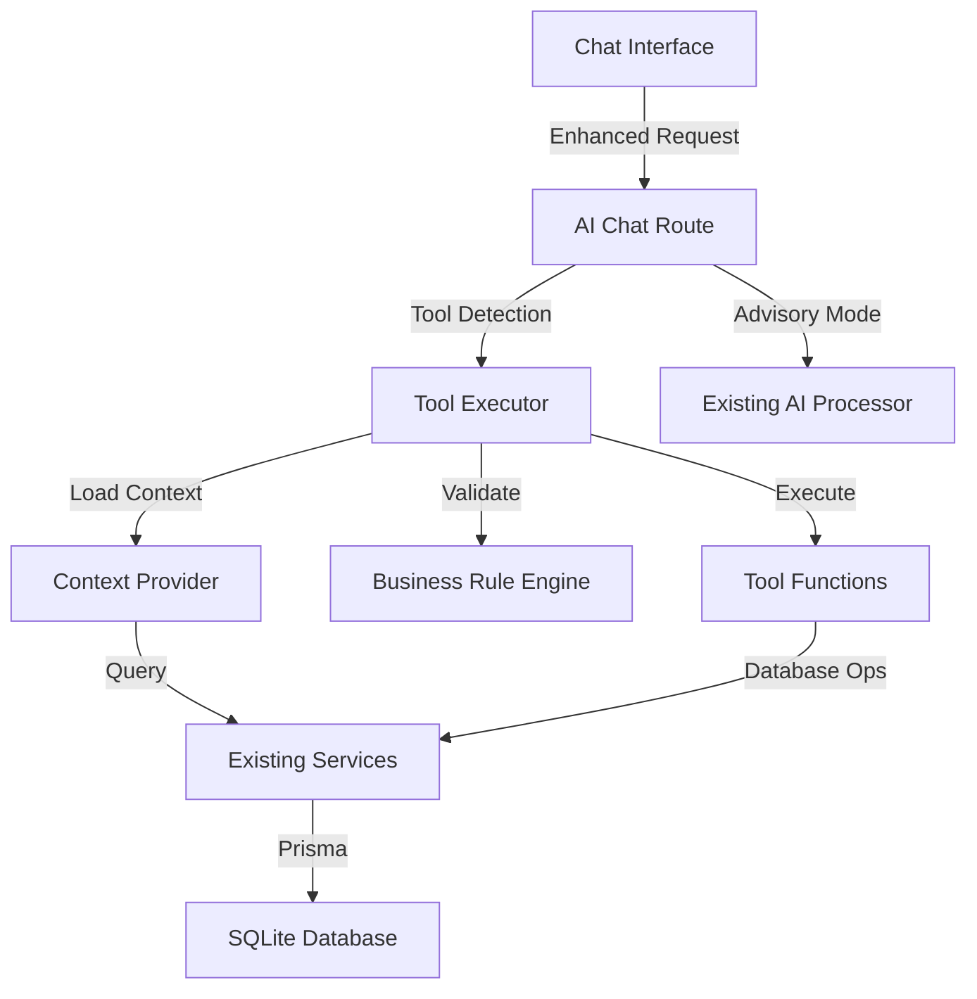

# Epic 5: AI-Powered Content Management Tool Integration - Brownfield Enhancement Architecture

## Introduction

This document outlines the architectural approach for enhancing Catalyst Studio with AI-powered content management tool integration. Its primary goal is to serve as the guiding architectural blueprint for transforming the existing AI chat interface from a passive advisor to an active executor, enabling direct database operations through natural language commands while ensuring seamless integration with the existing system.

**Relationship to Existing Architecture:**
This document supplements existing project architecture by defining how new AI tool components will integrate with current systems. Where conflicts arise between new and existing patterns, this document provides guidance on maintaining consistency while implementing enhancements.

### Existing Project Analysis

#### Current Project State
- **Primary Purpose:** Next.js-based Content Management System (CMS) with AI advisory capabilities
- **Current Tech Stack:** Next.js 15.4.5, React 19.1.0, TypeScript 5, Prisma ORM with SQLite, Vercel AI SDK
- **Architecture Style:** Server Components with App Router pattern, Service layer abstraction, API routes for data operations
- **Deployment Method:** Vercel platform with environment-based configuration

#### Available Documentation
- ✅ Comprehensive Epic 5 PRD with integration requirements
- ✅ Original AI tools requirements with validated POC (100% test success)
- ✅ Database schema (Prisma models for Website, ContentType, ContentItem, AIContext)
- ✅ Existing service patterns (WebsiteService, ContentTypeService)
- ✅ API route structure and patterns
- ✅ Test infrastructure (Jest, Playwright)

#### Identified Constraints
- Cannot modify existing Prisma schema structure (only additions allowed)
- Must maintain backward compatibility with existing chat advisory functionality
- Must work within existing service layer patterns
- SQLite limitations require JSON string storage for complex fields
- No authentication/authorization in MVP phase (open access)
- Must preserve existing API endpoints without modification

### Change Log
| Change | Date | Version | Description | Author |
|--------|------|---------|-------------|--------|
| Initial Draft | 2025-01-13 | 1.0 | Created brownfield architecture for Epic 5 | Winston (Architect) |

---

## Enhancement Scope and Integration Strategy

### Enhancement Overview
**Enhancement Type:** Major Feature Modification + New Feature Addition
**Scope:** Transform existing AI chat interface to execute database operations directly through 10 structured tools
**Integration Impact:** Significant - New tool system with database manipulation while maintaining existing functionality

### Integration Approach

**Code Integration Strategy:** 
- New `/app/api/ai-tools/` directory for tool endpoints following existing API patterns
- Enhance `ai-prompt-processor.ts` to support tool execution mode alongside advisory mode
- Leverage existing service classes (WebsiteService, ContentTypeService, ContentItemService) without modification
- Tool executor wrapper to maintain transaction consistency

**Database Integration:** 
- All operations through existing Prisma client instance
- No schema modifications - work with existing models
- JSON string storage for complex tool parameters following existing pattern
- Atomic transactions using Prisma's transaction API

**API Integration:** 
- New endpoints under `/app/api/ai-tools/` namespace to avoid conflicts
- Enhanced chat endpoint at `/app/api/chat/` with tool-calling support
- Maintain existing REST API patterns and response structures
- Streaming responses using Vercel AI SDK's existing patterns

**UI Integration:** 
- Preserve existing chat interface components
- Add streaming progress indicators using existing UI components
- Maintain current message formatting and styling
- Tool responses rendered within existing message component structure

### Compatibility Requirements
- **Existing API Compatibility:** All current endpoints at `/api/websites`, `/api/content-types`, `/api/content-items` continue functioning without modification
- **Database Schema Compatibility:** No modifications to existing Prisma schema. Tool metadata stored in existing JSON fields
- **UI/UX Consistency:** Tool execution responses maintain same visual style as advisory messages. Streaming updates follow existing patterns
- **Performance Impact:** Tool execution target <2s, context loading <500ms, no degradation of existing chat response times

---

## Tech Stack Alignment

### Existing Technology Stack
| Category | Current Technology | Version | Usage in Enhancement | Notes |
|----------|-------------------|---------|---------------------|-------|
| Framework | Next.js | 15.4.5 | Tool API routes, SSR for context | App Router pattern |
| UI Library | React | 19.1.0 | Tool response components | Server Components |
| Language | TypeScript | 5.x | Type-safe tool definitions | Strict mode |
| Database ORM | Prisma | 6.13.0 | All database operations | Transaction support |
| Database | SQLite | - | Store tool execution logs | JSON string fields |
| AI SDK | Vercel AI SDK | 4.3.19 | Tool calling implementation | Native tool support |
| AI Provider | OpenRouter | 0.0.5 | AI model access | Tool-capable models |
| Validation | Zod | 3.25.76 | Tool parameter validation | Schema definitions |
| State Management | Zustand | 5.0.7 | Tool execution state | Existing patterns |
| Styling | Tailwind CSS | 3.4.17 | Tool UI components | Existing classes |

### New Technology Additions
| Technology | Version | Purpose | Rationale | Integration Method |
|------------|---------|---------|-----------|-------------------|
| None required | - | All functionality achievable with existing stack | Proven POC with current tech | - |

---

## Data Models and Schema Changes

### New Data Models

#### ToolExecutionLog (Virtual - stored in AIContext)
**Purpose:** Track tool executions for audit and rollback
**Integration:** Stored as JSON in AIContext.metadata field

**Key Attributes:**
- toolName: string - Name of executed tool
- parameters: object - Tool input parameters
- result: object - Execution result
- timestamp: DateTime - Execution time
- status: string - success/failure/rollback

**Relationships:**
- **With Existing:** Links to AIContext via sessionId
- **With New:** Part of tool execution audit trail

#### BusinessContext (Virtual - runtime only)
**Purpose:** Dynamic context for business rule application
**Integration:** Loaded at runtime from Website metadata

**Key Attributes:**
- websiteType: string - blog/ecommerce/portfolio
- businessRules: object - Category-specific rules
- requiredFields: array - Mandatory fields per type
- validationRules: object - Field-level validations

**Relationships:**
- **With Existing:** Derived from Website.metadata and settings
- **With New:** Used by all tool validations

### Schema Integration Strategy

**Database Changes Required:**
- **New Tables:** None - using existing models
- **Modified Tables:** None - leveraging JSON fields
- **New Indexes:** None - existing indexes sufficient
- **Migration Strategy:** No migration needed - backward compatible

**Backward Compatibility:**
- Existing data structures remain unchanged
- Tool metadata stored in optional JSON fields
- Graceful degradation if tool data missing

---

## Component Architecture

### New Components

#### AI Tool Executor
**Responsibility:** Orchestrate tool execution with validation, database operations, and rollback support
**Integration Points:** Existing service layer, Prisma client, AI SDK

**Key Interfaces:**
- executeTool(name, params): Execute single tool with parameters
- executeMultipleTools(tools): Chain multiple tool executions
- rollbackExecution(executionId): Revert tool changes

**Dependencies:**
- **Existing Components:** WebsiteService, ContentTypeService, ContentItemService
- **New Components:** ContextProvider, BusinessRuleEngine

**Technology Stack:** TypeScript, Vercel AI SDK, Zod validation

#### Context Provider
**Responsibility:** Load and manage dynamic context for AI interactions
**Integration Points:** Database services, existing models

**Key Interfaces:**
- loadWebsiteContext(websiteId): Get current website state
- loadContentStructure(websiteId): Get content types and items
- getBusinessRules(websiteType): Get category-specific rules

**Dependencies:**
- **Existing Components:** WebsiteService, ContentTypeService
- **New Components:** BusinessRuleEngine

**Technology Stack:** TypeScript, Prisma ORM

#### Business Rule Engine
**Responsibility:** Apply category-specific validation and field requirements
**Integration Points:** Tool executor, validation schemas

**Key Interfaces:**
- validateForCategory(data, category): Apply category rules
- getRequiredFields(category, contentType): Get mandatory fields
- suggestFields(category, purpose): Recommend fields

**Dependencies:**
- **Existing Components:** Validation utilities
- **New Components:** None

**Technology Stack:** TypeScript, Zod schemas

### Component Interaction Diagram



---

## API Design and Integration

### API Integration Strategy
**API Integration Strategy:** Additive approach - new endpoints supplement existing APIs
**Authentication:** No authentication in MVP phase (matches existing approach)
**Versioning:** Not required - new endpoints in separate namespace

### New API Endpoints

#### POST /api/ai-tools/execute
- **Method:** POST
- **Endpoint:** /api/ai-tools/execute
- **Purpose:** Execute single or multiple AI tools
- **Integration:** Calls existing service methods internally

**Request:**
```json
{
  "websiteId": "string",
  "tools": [
    {
      "name": "create-content-type",
      "parameters": {
        "name": "Blog Post",
        "fields": [...]
      }
    }
  ],
  "context": {
    "sessionId": "string"
  }
}
```

**Response:**
```json
{
  "success": true,
  "results": [
    {
      "tool": "create-content-type",
      "status": "success",
      "data": {
        "id": "cuid",
        "name": "Blog Post"
      }
    }
  ],
  "executionId": "string"
}
```

#### GET /api/ai-tools/context/:websiteId
- **Method:** GET
- **Endpoint:** /api/ai-tools/context/:websiteId
- **Purpose:** Load current context for AI interaction
- **Integration:** Aggregates data from existing services

**Request:**
```json
// Path parameter: websiteId
```

**Response:**
```json
{
  "website": {
    "id": "string",
    "name": "string",
    "category": "string",
    "settings": {}
  },
  "contentTypes": [...],
  "statistics": {
    "totalItems": 0,
    "totalTypes": 0
  },
  "businessRules": {}
}
```

---

## External API Integration

### OpenRouter API
- **Purpose:** Access to AI models with native tool calling support
- **Documentation:** https://openrouter.ai/docs
- **Base URL:** https://openrouter.ai/api/v1
- **Authentication:** API Key (existing OPENROUTER_API_KEY env var)
- **Integration Method:** Via @openrouter/ai-sdk-provider (existing)

**Key Endpoints Used:**
- `POST /chat/completions` - Tool-enabled chat completions

**Error Handling:** Retry with exponential backoff, fallback to advisory mode on failure

---

## Source Tree Integration

### Existing Project Structure
```plaintext
catalyst-studio/
├── app/
│   ├── api/
│   │   ├── chat/           # Existing chat endpoint
│   │   ├── websites/       # Existing CRUD
│   │   ├── content-types/  # Existing CRUD
│   │   └── content-items/  # Existing CRUD
├── lib/
│   ├── services/          # Service layer
│   └── utils/            # Utilities
```

### New File Organization
```plaintext
catalyst-studio/
├── app/
│   ├── api/
│   │   ├── ai-tools/              # New AI tools directory
│   │   │   ├── execute/
│   │   │   │   └── route.ts       # Tool execution endpoint
│   │   │   ├── context/
│   │   │   │   └── [websiteId]/
│   │   │   │       └── route.ts   # Context loading endpoint
│   │   │   └── tools/             # Tool definitions
│   │   │       ├── website/       # Website management tools
│   │   │       │   ├── get-website-context.ts
│   │   │       │   ├── update-business-requirements.ts
│   │   │       │   └── validate-content.ts
│   │   │       ├── content-types/ # Content type tools
│   │   │       │   ├── list-content-types.ts
│   │   │       │   ├── get-content-type.ts
│   │   │       │   ├── create-content-type.ts
│   │   │       │   └── update-content-type.ts
│   │   │       └── content-items/ # Content item tools
│   │   │           ├── list-content-items.ts
│   │   │           ├── create-content-item.ts
│   │   │           └── update-content-item.ts
│   │   └── chat/                  # Existing (enhanced)
│   │       └── route.ts           # Add tool calling support
├── lib/
│   ├── services/                  # Existing (unchanged)
│   ├── ai-tools/                  # New tool support library
│   │   ├── executor.ts           # Tool execution engine
│   │   ├── context-provider.ts   # Context management
│   │   ├── business-rules.ts     # Rule engine
│   │   └── schemas/              # Zod schemas
│   │       ├── website.ts
│   │       ├── content-type.ts
│   │       └── content-item.ts
```

### Integration Guidelines
- **File Naming:** Follow kebab-case pattern (e.g., create-content-type.ts)
- **Folder Organization:** Group tools by category matching existing service structure
- **Import/Export Patterns:** Use existing barrel exports pattern from services

---

## Infrastructure and Deployment Integration

### Existing Infrastructure
**Current Deployment:** Vercel platform with automatic deployments from Git
**Infrastructure Tools:** Vercel CLI, GitHub Actions for CI/CD
**Environments:** Development (local), Preview (Vercel), Production (Vercel)

### Enhancement Deployment Strategy
**Deployment Approach:** Standard Vercel deployment with environment variables
**Infrastructure Changes:** Add OPENROUTER_API_KEY to Vercel environment variables
**Pipeline Integration:** No changes to existing CI/CD pipeline

### Rollback Strategy
**Rollback Method:** Git revert + Vercel instant rollback
**Risk Mitigation:** Feature flag for gradual rollout (AI_TOOLS_ENABLED env var)
**Monitoring:** Vercel Analytics + custom tool execution metrics

---

## Coding Standards and Conventions

### Existing Standards Compliance
**Code Style:** ESLint configuration with Next.js rules
**Linting Rules:** Strict TypeScript, no-explicit-any warnings
**Testing Patterns:** Jest for unit tests, Playwright for E2E
**Documentation Style:** JSDoc comments for public APIs

### Enhancement-Specific Standards
- **Tool Naming:** Use verb-noun pattern (e.g., create-content-type)
- **Schema Definition:** Zod schemas co-located with tools
- **Error Messages:** User-friendly with actionable guidance
- **Audit Logging:** Structured JSON logs for all tool executions

### Critical Integration Rules
- **Existing API Compatibility:** Never modify existing service method signatures
- **Database Integration:** All operations through existing Prisma client
- **Error Handling:** Wrap all database operations in try-catch with rollback
- **Logging Consistency:** Use existing console patterns for debugging

---

## Testing Strategy

### Integration with Existing Tests
**Existing Test Framework:** Jest with React Testing Library
**Test Organization:** __tests__ folders alongside components
**Coverage Requirements:** Maintain >80% coverage

### New Testing Requirements

#### Unit Tests for New Components
- **Framework:** Jest (existing)
- **Location:** `app/api/ai-tools/__tests__/`
- **Coverage Target:** 90% for tool functions
- **Integration with Existing:** Mock existing services

#### Integration Tests
- **Scope:** Tool execution with real database
- **Existing System Verification:** Ensure existing APIs unaffected
- **New Feature Testing:** All 10 tools with success/failure paths

#### Regression Testing
- **Existing Feature Verification:** Advisory mode continues working
- **Automated Regression Suite:** Add to existing Playwright tests
- **Manual Testing Requirements:** Complex multi-tool chains

---

## Security Integration

### Existing Security Measures
**Authentication:** None in MVP phase (planned for future)
**Authorization:** Open access to all features
**Data Protection:** Environment variables for secrets
**Security Tools:** ESLint security rules

### Enhancement Security Requirements
**New Security Measures:** 
- Input sanitization via Zod schemas
- SQL injection prevention via Prisma parameterization
- Rate limiting for tool execution (future)

**Integration Points:** 
- Validate all tool parameters before execution
- Audit log all database modifications
- Prevent execution of system commands

**Compliance Requirements:** 
- GDPR-ready audit trails
- No PII in logs
- Reversible operations

### Security Testing
**Existing Security Tests:** Basic input validation tests
**New Security Test Requirements:** 
- Fuzz testing for tool parameters
- Injection attack prevention tests
- Rollback verification tests

**Penetration Testing:** Planned post-MVP

---

## Checklist Results Report

### Architecture Validation Checklist
- ✅ Existing system analysis completed
- ✅ Integration points identified
- ✅ No breaking changes to existing APIs
- ✅ Database compatibility confirmed
- ✅ Service layer patterns followed
- ✅ Testing strategy defined
- ✅ Rollback procedures documented
- ✅ Security considerations addressed
- ✅ Performance targets established
- ✅ Deployment strategy aligned

---

## Next Steps

### Story Manager Handoff

**Reference:** This architecture document (`docs/epic-5-architecture.md`)

**Key Integration Requirements:**
- All tools must use existing service classes without modification
- New endpoints under `/app/api/ai-tools/` namespace only
- Maintain streaming response patterns from existing chat
- Store tool metadata in existing JSON fields

**Existing System Constraints:**
- SQLite requires JSON string storage for complex data
- No authentication in MVP phase
- Must preserve advisory mode functionality

**First Story to Implement:** Story 5.1 - Foundation (Tool Infrastructure and Context Provider)
- Set up `/app/api/ai-tools/` directory structure
- Create base tool executor with Zod validation
- Implement context provider using existing services
- Add Vercel AI SDK tool calling to chat endpoint

**Emphasis:** Test each integration point with existing functionality before proceeding to next story

### Developer Handoff

**References:** 
- This architecture: `docs/epic-5-architecture.md`
- Existing patterns: Review `lib/services/website-service.ts` for service patterns
- POC validation: `proof-of-concept/ai-tools-demo.js` for proven patterns

**Integration Requirements:**
- Use existing Prisma client via `getClient()` 
- Follow existing service class patterns
- Maintain existing API response structures
- Use existing error handling patterns from `lib/api/errors.ts`

**Key Technical Decisions:**
- Vercel AI SDK for tool calling (not LangChain)
- Zod for parameter validation (existing dependency)
- Atomic transactions via Prisma
- JSON string storage for complex fields

**Existing System Compatibility:**
1. Test advisory mode after each tool implementation
2. Verify existing API endpoints remain functional
3. Ensure UI components render tool responses correctly
4. Validate database transactions don't conflict

**Implementation Sequence:**
1. Context provider (read-only) - lowest risk
2. Website tools (metadata updates) - low risk  
3. Content type tools (structure changes) - medium risk
4. Content item tools (data changes) - higher risk
5. Multi-tool chaining - highest complexity

---

*End of Epic 5 Brownfield Enhancement Architecture*