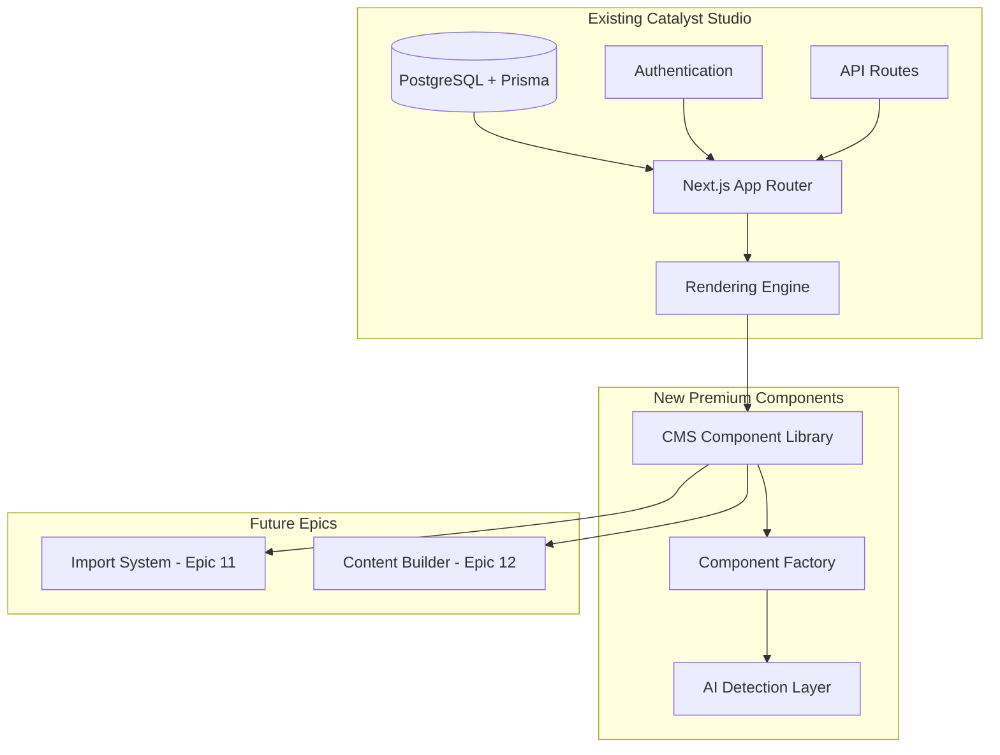
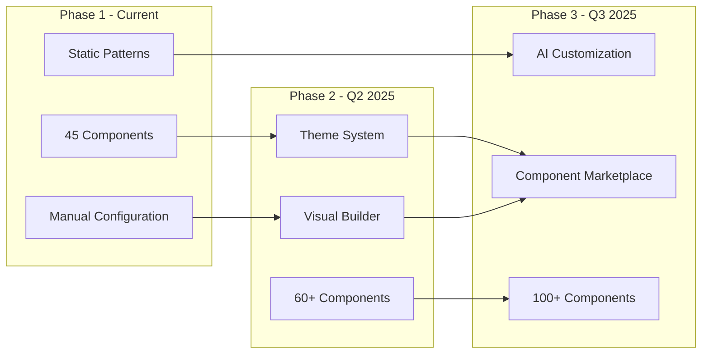

# Technical Architecture Document
# CMS Component Library Foundation - Epic 10

## Document Metadata
- **Version**: 1.0
- **Status**: Final Draft
- **Created**: December 2024
- **Architect**: Winston
- **Type**: Brownfield System Enhancement - **PREMIUM FEATURE**
- **Repository**: catalyst-studio-premium (Private Only)
- **Architecture Pattern**: Component-Based Modular System

> ⚠️ **CRITICAL: PREMIUM FEATURE** - All components MUST reside under `/lib/premium/components/cms/` per CLAUDE.md repository rules. This architecture is for the private repository only.

---

## 1. Executive Summary

### 1.1 Architecture Vision
Design a scalable, performant, and maintainable **PREMIUM** component library architecture that seamlessly integrates with the existing Catalyst Studio infrastructure while enabling AI-powered website import capabilities. The architecture prioritizes modularity, type safety, and developer experience while maintaining strict performance budgets.

### 1.2 Key Architectural Decisions
- **Monorepo Structure**: Leverage existing Next.js monorepo with premium segregation
- **Component Pattern**: Atomic design with composition-based architecture
- **State Management**: Context API for component state, existing app state unchanged
- **Performance Strategy**: Code splitting, lazy loading, and React Server Components
- **Type Safety**: Full TypeScript coverage with strict mode
- **Testing Architecture**: Component-level unit tests with visual regression testing
- **Build System**: Leverage existing Next.js build pipeline with Turbopack

### 1.3 Architecture Principles
1. **Separation of Concerns**: Clear boundaries between premium and common code
2. **Progressive Enhancement**: Components work without JavaScript where possible
3. **Performance First**: Sub-50ms render target for all components
4. **Developer Experience**: Self-documenting code with TypeScript and JSDoc
5. **Accessibility by Default**: WCAG 2.1 AA built into component architecture

---

## 2. System Context & Constraints

### 2.1 Current System Architecture



### 2.2 Technical Constraints

#### Existing Technology Stack
- **Framework**: Next.js 14+ with App Router
- **Language**: TypeScript 5.0+
- **Styling**: Tailwind CSS + CSS Modules
- **Database**: PostgreSQL with Prisma ORM
- **State Management**: React Context + Zustand (existing)
- **Testing**: Jest + React Testing Library
- **CI/CD**: GitHub Actions

#### Performance Constraints
- **Initial Load**: < 3s on 4G networks
- **Component Render**: < 50ms per component
- **Bundle Size**: < 10KB per component (gzipped)
- **Memory Usage**: < 100MB for full component set
- **Lighthouse Score**: > 90 across all metrics

#### Integration Constraints
- Must maintain backward compatibility with existing 4 components
- Cannot modify existing database schema (only additions)
- Must work within current authentication system
- Cannot break existing rendering pipeline

### 2.3 Organizational Constraints
- **Team Size**: 2-3 frontend engineers
- **Timeline**: 5-week implementation
- **Budget**: $140,000 total project cost
- **Maintenance**: Must be maintainable by existing team post-launch

---

## 3. Architectural Design

### 3.1 Component Architecture

#### Directory Structure
```
lib/premium/components/cms/
├── _core/                    # Core utilities and abstractions
│   ├── base-component.tsx    # Base component class
│   ├── types.ts              # Shared TypeScript interfaces
│   ├── constants.ts          # Component constants
│   └── utils.ts              # Utility functions
├── _factory/                 # Component factory system
│   ├── factory.ts            # Component factory implementation
│   ├── registry.ts           # Component registration
│   └── renderer.tsx          # Dynamic component renderer
├── _ai/                      # AI detection layer
│   ├── detector.ts           # Pattern detection logic
│   ├── patterns.ts           # Component patterns database
│   └── confidence.ts         # Confidence scoring
├── navigation/               # Navigation components (5)
│   ├── nav-bar/
│   │   ├── index.tsx        # Component implementation
│   │   ├── nav-bar.types.ts # TypeScript interfaces
│   │   ├── nav-bar.test.tsx # Unit tests
│   │   └── nav-bar.ai.ts    # AI detection metadata
│   ├── footer/
│   ├── mobile-menu/
│   ├── breadcrumbs/
│   └── search-bar/
├── heroes/                   # Hero components (4)
├── content/                  # Content display (8)
├── features/                 # Features & services (4)
├── cta/                      # Call-to-actions (3)
├── social-proof/             # Social proof (4)
├── contact/                  # Contact & forms (4)
├── about/                    # About & team (3)
├── blog/                     # Blog & articles (5)
├── pricing/                  # Pricing (2)
└── data/                     # Data display (3)
```

#### Component Interface Standard
```typescript
// lib/premium/components/cms/_core/types.ts

export interface CMSComponentProps {
  // Identity
  id: string
  type: ComponentType
  category: ComponentCategory
  
  // Content
  content: ComponentContent
  
  // Styling
  className?: string
  style?: React.CSSProperties
  theme?: 'light' | 'dark' | 'auto'
  variant?: ComponentVariant
  
  // Behavior
  loading?: 'eager' | 'lazy'
  priority?: boolean
  interactive?: boolean
  
  // Accessibility
  ariaLabel?: string
  role?: string
  
  // Analytics
  analyticsId?: string
  trackingEvents?: TrackingEvent[]
  
  // AI Metadata
  aiMetadata?: AIComponentMetadata
}

export interface AIComponentMetadata {
  keywords: string[]
  patterns: RegExp[]
  commonNames: string[]
  pageLocation: PageLocation
  confidence: number
  alternativeComponents?: ComponentType[]
}

export interface ComponentContent {
  [key: string]: any // Flexible content structure
}

export type PageLocation = 'header' | 'hero' | 'body' | 'sidebar' | 'footer'
```

### 3.2 Component Factory Pattern

```typescript
// lib/premium/components/cms/_factory/factory.ts

export class CMSComponentFactory {
  private static instance: CMSComponentFactory
  private registry: ComponentRegistry
  private cache: ComponentCache
  
  private constructor() {
    this.registry = new ComponentRegistry()
    this.cache = new ComponentCache()
  }
  
  static getInstance(): CMSComponentFactory {
    if (!CMSComponentFactory.instance) {
      CMSComponentFactory.instance = new CMSComponentFactory()
    }
    return CMSComponentFactory.instance
  }
  
  register<T extends CMSComponentProps>(
    type: ComponentType,
    component: React.FC<T>,
    metadata: AIComponentMetadata
  ): void {
    this.registry.register(type, component, metadata)
  }
  
  async render(config: ComponentConfig): Promise<React.ReactElement> {
    const cacheKey = this.getCacheKey(config)
    
    if (this.cache.has(cacheKey)) {
      return this.cache.get(cacheKey)
    }
    
    const Component = await this.loadComponent(config.type)
    const element = <Component {...config.props} />
    
    this.cache.set(cacheKey, element)
    return element
  }
  
  private async loadComponent(type: ComponentType): Promise<React.FC> {
    // Dynamic import for code splitting
    const module = await import(`../${type.category}/${type.name}`)
    return module.default
  }
}
```

### 3.3 Performance Architecture

#### Code Splitting Strategy
```typescript
// lib/premium/components/cms/_core/lazy-loader.ts

export const lazyLoadComponent = (
  category: string,
  component: string
) => {
  return lazy(() => 
    import(`../${category}/${component}`).then(module => ({
      default: withPerformanceTracking(module.default)
    }))
  )
}

// Performance wrapper
const withPerformanceTracking = (Component: React.FC) => {
  return (props: any) => {
    const startTime = performance.now()
    
    useEffect(() => {
      const renderTime = performance.now() - startTime
      if (renderTime > 50) {
        console.warn(`Component rendered in ${renderTime}ms`)
      }
      trackComponentPerformance(Component.name, renderTime)
    }, [])
    
    return <Component {...props} />
  }
}
```

#### React Server Components Integration
```typescript
// lib/premium/components/cms/navigation/nav-bar/index.tsx

import { Suspense } from 'react'
import { NavBarClient } from './nav-bar.client'
import { NavBarServer } from './nav-bar.server'

export default async function NavBar(props: NavBarProps) {
  // Server Component - data fetching
  const navigationData = await fetchNavigationData()
  
  return (
    <Suspense fallback={<NavBarSkeleton />}>
      <NavBarServer data={navigationData}>
        <NavBarClient {...props} />
      </NavBarServer>
    </Suspense>
  )
}
```

---

## 4. Data Architecture

### 4.1 Database Schema Extensions

```prisma
// prisma/schema.prisma additions

model CMSComponent {
  id            String   @id @default(cuid())
  
  // Component Identity
  type          String   // e.g., "nav-bar"
  category      String   // e.g., "navigation"
  version       String   @default("1.0.0")
  
  // Component Configuration
  props         Json     // Component properties
  content       Json     // Component content
  styles        Json?    // Custom styles
  
  // AI Metadata
  aiMetadata    Json     // Detection patterns and keywords
  confidence    Float    @default(0)
  
  // Relationships
  websiteId     String
  website       Website  @relation(fields: [websiteId], references: [id])
  pageId        String?
  page          Page?    @relation(fields: [pageId], references: [id])
  
  // Audit
  createdAt     DateTime @default(now())
  updatedAt     DateTime @updatedAt
  createdBy     String?
  updatedBy     String?
  
  // Indexing
  @@index([websiteId, type])
  @@index([category])
  @@index([pageId])
}

model ComponentAnalytics {
  id              String   @id @default(cuid())
  componentId     String
  componentType   String
  
  // Performance Metrics
  renderCount     Int      @default(0)
  avgRenderTime   Float    @default(0)
  errorCount      Int      @default(0)
  
  // Usage Metrics
  impressions     Int      @default(0)
  interactions    Int      @default(0)
  conversionRate  Float?
  
  // Device Breakdown
  mobileViews     Int      @default(0)
  tabletViews     Int      @default(0)
  desktopViews    Int      @default(0)
  
  // Time-based
  date            DateTime @default(now())
  
  @@index([componentId])
  @@index([componentType])
  @@index([date])
}
```

### 4.2 Migration Strategy

#### Database Migration Approach
- **Zero Downtime**: All migrations deployable without service interruption
- **Backward Compatible**: Maintain compatibility during transition
- **Data Preservation**: Never lose existing component data
- **Rollback Ready**: Every migration has tested rollback procedure

#### Migration Sequence
1. **Schema Extension**: Add CMSComponent table (non-breaking)
2. **Data Migration**: Copy existing 4 components with transformation
3. **Compatibility Layer**: Map old component types to new
4. **Deprecation Period**: 6-month backward compatibility
5. **Cleanup**: Remove deprecated components after transition

#### Rollback Procedures
- Feature flags control component visibility
- Database rollback scripts for each migration
- Component-level rollback (disable individual components)
- Full rollback to previous version tested

### 4.3 State Management Architecture

```typescript
// lib/premium/components/cms/_core/state.ts

interface ComponentState {
  components: Map<string, CMSComponent>
  loading: Set<string>
  errors: Map<string, Error>
}

export const ComponentContext = createContext<{
  state: ComponentState
  dispatch: Dispatch<ComponentAction>
}>()

export const useComponentState = (componentId: string) => {
  const { state, dispatch } = useContext(ComponentContext)
  
  const component = state.components.get(componentId)
  const isLoading = state.loading.has(componentId)
  const error = state.errors.get(componentId)
  
  return {
    component,
    isLoading,
    error,
    updateComponent: (updates: Partial<CMSComponent>) => {
      dispatch({ type: 'UPDATE_COMPONENT', id: componentId, updates })
    }
  }
}
```

---

## 5. Integration Architecture

### 5.1 AI Detection Integration

```typescript
// lib/premium/components/cms/_ai/detector.ts

export class ComponentDetector {
  private patterns: Map<ComponentType, DetectionPattern>
  
  async detectComponent(element: HTMLElement): Promise<DetectionResult> {
    const results: DetectionResult[] = []
    
    for (const [type, pattern] of this.patterns) {
      const confidence = await this.calculateConfidence(element, pattern)
      
      if (confidence > 0.5) {
        results.push({
          type,
          confidence,
          extractedContent: this.extractContent(element, pattern)
        })
      }
    }
    
    return results.sort((a, b) => b.confidence - a.confidence)[0]
  }
  
  private calculateConfidence(
    element: HTMLElement,
    pattern: DetectionPattern
  ): number {
    let score = 0
    const weights = {
      structure: 0.4,
      content: 0.3,
      styling: 0.2,
      semantics: 0.1
    }
    
    // Structure matching
    if (pattern.structure.matches(element)) {
      score += weights.structure
    }
    
    // Content pattern matching
    const contentMatch = pattern.content.test(element.textContent || '')
    if (contentMatch) {
      score += weights.content
    }
    
    // Style analysis
    const styles = window.getComputedStyle(element)
    if (pattern.styles.matches(styles)) {
      score += weights.styling
    }
    
    // Semantic HTML analysis
    if (pattern.semantics.includes(element.tagName.toLowerCase())) {
      score += weights.semantics
    }
    
    return score
  }
}
```

### 5.2 Import System Bridge (Epic 11 Integration)

```typescript
// lib/premium/components/cms/_core/import-bridge.ts

export interface ImportBridge {
  detectComponents(html: string): Promise<ComponentMapping[]>
  mapToComponents(mappings: ComponentMapping[]): CMSComponent[]
  validateMapping(mapping: ComponentMapping): ValidationResult
  generatePreview(components: CMSComponent[]): string
}

export class CMSImportBridge implements ImportBridge {
  private detector: ComponentDetector
  private factory: CMSComponentFactory
  
  async detectComponents(html: string): Promise<ComponentMapping[]> {
    const doc = new DOMParser().parseFromString(html, 'text/html')
    const elements = doc.querySelectorAll('[data-component], header, nav, footer, main, section, article')
    
    const mappings: ComponentMapping[] = []
    
    for (const element of elements) {
      const detection = await this.detector.detectComponent(element as HTMLElement)
      
      if (detection.confidence > 0.7) {
        mappings.push({
          sourceElement: element,
          targetComponent: detection.type,
          confidence: detection.confidence,
          content: detection.extractedContent
        })
      }
    }
    
    return mappings
  }
}
```

### 5.3 Content Builder Bridge (Epic 12 Integration)

```typescript
// lib/premium/components/cms/_core/builder-bridge.ts

export interface BuilderBridge {
  getComponentCatalog(): ComponentDefinition[]
  createComponent(type: ComponentType, props: any): CMSComponent
  updateComponent(id: string, updates: Partial<CMSComponent>): void
  deleteComponent(id: string): void
  reorderComponents(componentIds: string[]): void
}

export class CMSBuilderBridge implements BuilderBridge {
  getComponentCatalog(): ComponentDefinition[] {
    return Array.from(this.registry.getAll()).map(([type, definition]) => ({
      type,
      category: definition.category,
      name: definition.name,
      description: definition.description,
      icon: definition.icon,
      defaultProps: definition.defaultProps,
      propSchema: definition.propSchema,
      previewImage: definition.previewImage
    }))
  }
}
```

---

## 5.4 Epic 11/12 Integration API Specifications

### Import System Integration Points (Epic 11)

#### Detection API
- **Endpoint**: `/api/premium/components/detect`
- **Purpose**: Identify CMS components from HTML
- **Performance**: <100ms per detection
- **Accuracy Target**: 80% confidence threshold

#### Content Extraction API  
- **Endpoint**: `/api/premium/components/extract`
- **Purpose**: Map HTML content to component props
- **Data Flow**: HTML → Parser → Props Mapper → Component Config

#### Batch Import API
- **Endpoint**: `/api/premium/components/batch`
- **Purpose**: Create multiple components efficiently
- **Transaction**: Atomic with rollback support
- **Performance**: <50ms per component

### Builder System Integration Points (Epic 12)

#### Component Catalog API
- **Endpoint**: `/api/premium/components/catalog`
- **Response**: All 45 components with metadata
- **Filtering**: By category, search, tags
- **Caching**: 5-minute TTL

#### Live Preview API
- **Endpoint**: `/api/premium/components/preview`
- **Rendering**: Real-time with <50ms target
- **Viewports**: Mobile, tablet, desktop
- **Themes**: Light, dark, auto

#### Property Schema API
- **Endpoint**: `/api/premium/components/schema/{type}`
- **Purpose**: Dynamic property panels in builder
- **Validation**: Real-time prop validation
- **UI Hints**: Component-specific input types

### Shared Services

#### Component Factory
- Singleton pattern for consistency
- Dynamic component loading
- Performance monitoring built-in
- Error boundaries for stability

#### AI Metadata Service
- Pattern matching algorithms
- Confidence scoring system
- Machine learning ready structure
- Fallback strategies for low confidence

---

## 6. Security Architecture

### 6.1 Security Layers

```
┌─────────────────────────────────────────┐
│         Input Validation Layer          │
│    Sanitize all user-provided content   │
├─────────────────────────────────────────┤
│        Component Security Layer         │
│   XSS prevention, CSP headers, CSRF     │
├─────────────────────────────────────────┤
│         Data Security Layer            │
│   No PII in props, encrypted storage    │
├─────────────────────────────────────────┤
│        Network Security Layer          │
│   HTTPS only, rate limiting, DDoS       │
└─────────────────────────────────────────┘
```

### 6.2 Input Sanitization

```typescript
// lib/premium/components/cms/_core/security.ts

import DOMPurify from 'isomorphic-dompurify'

export class SecurityManager {
  sanitizeContent(content: any): any {
    if (typeof content === 'string') {
      return DOMPurify.sanitize(content, {
        ALLOWED_TAGS: ['b', 'i', 'em', 'strong', 'a', 'p', 'br'],
        ALLOWED_ATTR: ['href', 'target', 'rel']
      })
    }
    
    if (typeof content === 'object') {
      return Object.keys(content).reduce((acc, key) => {
        acc[key] = this.sanitizeContent(content[key])
        return acc
      }, {} as any)
    }
    
    return content
  }
  
  validateProps(props: any, schema: PropSchema): ValidationResult {
    // Validate against schema
    const errors: string[] = []
    
    for (const [key, validator] of Object.entries(schema)) {
      if (!validator.validate(props[key])) {
        errors.push(`Invalid prop: ${key}`)
      }
    }
    
    return {
      valid: errors.length === 0,
      errors
    }
  }
}
```

---

## 7. Testing Architecture

### 7.1 Testing Strategy

```typescript
// lib/premium/components/cms/navigation/nav-bar/nav-bar.test.tsx

describe('NavBar Component', () => {
  // Rendering Tests
  it('renders with required props', () => {
    render(<NavBar {...requiredProps} />)
    expect(screen.getByRole('navigation')).toBeInTheDocument()
  })
  
  // Accessibility Tests
  it('meets WCAG 2.1 AA standards', async () => {
    const { container } = render(<NavBar {...requiredProps} />)
    const results = await axe(container)
    expect(results).toHaveNoViolations()
  })
  
  // Performance Tests
  it('renders within performance budget', () => {
    const startTime = performance.now()
    render(<NavBar {...requiredProps} />)
    const renderTime = performance.now() - startTime
    expect(renderTime).toBeLessThan(50)
  })
  
  // Responsive Tests
  it('collapses on mobile breakpoint', () => {
    window.innerWidth = 375
    render(<NavBar {...requiredProps} />)
    expect(screen.getByRole('button', { name: /menu/i })).toBeInTheDocument()
  })
  
  // AI Detection Tests
  it('provides correct AI metadata', () => {
    const metadata = NavBar.aiMetadata
    expect(metadata.keywords).toContain('navigation')
    expect(metadata.pageLocation).toBe('header')
  })
})
```

### 7.2 Visual Regression Testing

```typescript
// lib/premium/components/cms/_tests/visual-regression.ts

import { test, expect } from '@playwright/test'

test.describe('Visual Regression - Navigation Components', () => {
  test('NavBar visual consistency', async ({ page }) => {
    await page.goto('/preview/nav-bar')
    await expect(page).toHaveScreenshot('nav-bar-desktop.png')
    
    await page.setViewportSize({ width: 375, height: 812 })
    await expect(page).toHaveScreenshot('nav-bar-mobile.png')
  })
})
```

---

## 8. Performance Architecture

### 8.1 Performance Optimization Strategies

#### Bundle Optimization
```javascript
// next.config.js
module.exports = {
  experimental: {
    optimizeCss: true,
    turbo: {
      rules: {
        '*.cms.tsx': {
          loaders: ['component-loader'],
          as: '*.js'
        }
      }
    }
  },
  
  webpack: (config) => {
    config.optimization.splitChunks = {
      chunks: 'all',
      cacheGroups: {
        cms: {
          name: 'cms-components',
          test: /[\\/]lib[\\/]premium[\\/]components[\\/]cms/,
          priority: 10,
          reuseExistingChunk: true
        }
      }
    }
    return config
  }
}
```

#### Component-Level Optimization
```typescript
// lib/premium/components/cms/_core/optimizations.ts

export const withOptimizations = (Component: React.FC) => {
  // Memoization
  const MemoizedComponent = React.memo(Component)
  
  // Lazy loading wrapper
  return (props: any) => {
    const [isVisible, setIsVisible] = useState(false)
    const ref = useRef(null)
    
    useEffect(() => {
      const observer = new IntersectionObserver(
        ([entry]) => {
          if (entry.isIntersecting) {
            setIsVisible(true)
            observer.disconnect()
          }
        },
        { rootMargin: '100px' }
      )
      
      if (ref.current) {
        observer.observe(ref.current)
      }
      
      return () => observer.disconnect()
    }, [])
    
    return (
      <div ref={ref}>
        {isVisible ? (
          <MemoizedComponent {...props} />
        ) : (
          <ComponentSkeleton type={Component.name} />
        )}
      </div>
    )
  }
}
```

### 8.2 Performance Monitoring

```typescript
// lib/premium/components/cms/_core/monitoring.ts

export class PerformanceMonitor {
  private metrics: Map<string, PerformanceMetric> = new Map()
  
  trackComponentRender(componentType: string, duration: number): void {
    const metric = this.metrics.get(componentType) || {
      count: 0,
      totalTime: 0,
      avgTime: 0,
      maxTime: 0
    }
    
    metric.count++
    metric.totalTime += duration
    metric.avgTime = metric.totalTime / metric.count
    metric.maxTime = Math.max(metric.maxTime, duration)
    
    this.metrics.set(componentType, metric)
    
    // Alert if performance degrades
    if (duration > 50) {
      this.reportPerformanceIssue(componentType, duration)
    }
  }
  
  getReport(): PerformanceReport {
    return {
      metrics: Array.from(this.metrics.entries()),
      summary: {
        totalComponents: this.metrics.size,
        averageRenderTime: this.calculateAverageTime(),
        slowestComponent: this.findSlowestComponent()
      }
    }
  }
}
```

---

## 9. Migration Architecture

### 9.1 Existing Component Migration Strategy

```typescript
// lib/premium/components/cms/_migration/migrator.ts

export class ComponentMigrator {
  async migrateExistingComponents(): Promise<MigrationResult> {
    const migrations = [
      this.migrateHero(),
      this.migrateHeader(),
      this.migrateFooter(),
      this.migrateCTA()
    ]
    
    const results = await Promise.all(migrations)
    
    return {
      success: results.every(r => r.success),
      migrated: results.filter(r => r.success).length,
      failed: results.filter(r => !r.success),
      report: this.generateReport(results)
    }
  }
  
  private async migrateHero(): Promise<SingleMigrationResult> {
    // Map old hero to new hero variants
    const oldHero = await this.loadOldComponent('hero')
    
    const variants = {
      'hero-banner': this.mapToHeroBanner(oldHero),
      'hero-split': this.mapToHeroSplit(oldHero),
      'hero-minimal': this.mapToHeroMinimal(oldHero),
      'hero-video': this.mapToHeroVideo(oldHero)
    }
    
    // Create new components
    for (const [type, config] of Object.entries(variants)) {
      await this.createNewComponent(type, config)
    }
    
    return { success: true, component: 'hero' }
  }
}
```

### 9.2 Backward Compatibility Layer

```typescript
// lib/premium/components/cms/_core/compatibility.ts

export class CompatibilityLayer {
  private legacyMappings = new Map<string, string>([
    ['header', 'navigation/nav-bar'],
    ['hero', 'heroes/hero-banner'],
    ['cta', 'cta/cta-banner'],
    ['footer', 'navigation/footer']
  ])
  
  async loadComponent(type: string): Promise<React.FC> {
    // Check if it's a legacy component
    if (this.legacyMappings.has(type)) {
      console.warn(`Legacy component "${type}" is deprecated. Use "${this.legacyMappings.get(type)}" instead.`)
      type = this.legacyMappings.get(type)!
    }
    
    return await this.factory.getComponent(type)
  }
  
  transformLegacyProps(type: string, props: any): any {
    // Transform old prop structure to new
    const transformer = this.propTransformers.get(type)
    
    if (transformer) {
      return transformer(props)
    }
    
    return props
  }
}
```

---

## 10. Deployment Architecture

### 10.1 Build & Deployment Pipeline

```yaml
# .github/workflows/cms-components.yml
name: CMS Components CI/CD

on:
  push:
    branches: [main]
    paths:
      - 'lib/premium/components/cms/**'
      - 'app/premium/demo/cms-components/**'

jobs:
  test:
    runs-on: ubuntu-latest
    steps:
      - uses: actions/checkout@v3
      
      - name: Install dependencies
        run: npm ci
      
      - name: Type checking
        run: npm run type-check:cms
      
      - name: Unit tests
        run: npm run test:cms -- --coverage
      
      - name: Performance tests
        run: npm run test:performance:cms
      
      - name: Visual regression tests
        run: npm run test:visual:cms

  build:
    needs: test
    runs-on: ubuntu-latest
    steps:
      - name: Build components
        run: npm run build:cms
      
      - name: Analyze bundle size
        run: npm run analyze:cms
      
      - name: Performance audit
        run: npm run audit:performance:cms

  deploy:
    needs: build
    runs-on: ubuntu-latest
    if: github.ref == 'refs/heads/main'
    steps:
      - name: Deploy to premium repository
        run: |
          git push premium main
          # Never push to public repository
```

### 10.2 Environment Configuration

```typescript
// lib/premium/components/cms/_core/config.ts

export const componentConfig = {
  development: {
    enableDevTools: true,
    verboseLogging: true,
    performanceBudget: 100, // ms
    strictMode: true,
    enableHotReload: true
  },
  
  staging: {
    enableDevTools: false,
    verboseLogging: true,
    performanceBudget: 75,
    strictMode: true,
    enableHotReload: false
  },
  
  production: {
    enableDevTools: false,
    verboseLogging: false,
    performanceBudget: 50,
    strictMode: false,
    enableHotReload: false
  }
}

export const getConfig = () => {
  const env = process.env.NODE_ENV || 'development'
  return componentConfig[env as keyof typeof componentConfig]
}
```

---

## 11. Monitoring & Observability

### 11.1 Component Analytics

```typescript
// lib/premium/components/cms/_core/analytics.ts

export class ComponentAnalytics {
  private queue: AnalyticsEvent[] = []
  private batchSize = 50
  private flushInterval = 5000
  
  track(event: ComponentEvent): void {
    const analyticsEvent: AnalyticsEvent = {
      timestamp: Date.now(),
      componentType: event.componentType,
      eventType: event.type,
      properties: event.properties,
      sessionId: this.getSessionId(),
      userId: this.getUserId()
    }
    
    this.queue.push(analyticsEvent)
    
    if (this.queue.length >= this.batchSize) {
      this.flush()
    }
  }
  
  private async flush(): Promise<void> {
    if (this.queue.length === 0) return
    
    const events = [...this.queue]
    this.queue = []
    
    try {
      await fetch('/api/analytics/components', {
        method: 'POST',
        headers: { 'Content-Type': 'application/json' },
        body: JSON.stringify({ events })
      })
    } catch (error) {
      console.error('Failed to send analytics', error)
      // Re-queue events on failure
      this.queue.unshift(...events)
    }
  }
}
```

### 11.2 Error Tracking

```typescript
// lib/premium/components/cms/_core/error-boundary.ts

export class ComponentErrorBoundary extends React.Component<
  ErrorBoundaryProps,
  ErrorBoundaryState
> {
  state = { hasError: false, error: null }
  
  static getDerivedStateFromError(error: Error) {
    return { hasError: true, error }
  }
  
  componentDidCatch(error: Error, errorInfo: ErrorInfo) {
    // Log to error tracking service
    this.logError({
      error,
      errorInfo,
      componentStack: errorInfo.componentStack,
      componentType: this.props.componentType,
      props: this.sanitizeProps(this.props),
      timestamp: new Date().toISOString()
    })
  }
  
  private logError(errorData: ErrorLog) {
    // Send to monitoring service
    if (typeof window !== 'undefined') {
      window.errorReporter?.report(errorData)
    }
    
    // Log to console in development
    if (process.env.NODE_ENV === 'development') {
      console.error('Component Error:', errorData)
    }
  }
  
  render() {
    if (this.state.hasError) {
      return <ComponentErrorFallback type={this.props.componentType} />
    }
    
    return this.props.children
  }
}
```

---

## 12. Documentation Architecture

### 12.1 Component Documentation System

```typescript
// lib/premium/components/cms/_docs/generator.ts

export class DocumentationGenerator {
  generateComponentDocs(componentPath: string): ComponentDocs {
    const component = this.parseComponent(componentPath)
    const props = this.extractProps(component)
    const examples = this.extractExamples(component)
    const aiMetadata = this.extractAIMetadata(component)
    
    return {
      name: component.name,
      description: component.description,
      category: component.category,
      props: this.documentProps(props),
      examples: this.formatExamples(examples),
      aiMetadata: this.documentAIMetadata(aiMetadata),
      usage: this.generateUsageGuide(component),
      accessibility: this.documentAccessibility(component),
      performance: this.documentPerformance(component)
    }
  }
  
  private documentProps(props: PropDefinition[]): PropDocumentation[] {
    return props.map(prop => ({
      name: prop.name,
      type: prop.type.toString(),
      required: prop.required,
      default: prop.defaultValue,
      description: prop.description,
      examples: prop.examples
    }))
  }
}
```

### 12.2 Storybook Integration

```typescript
// lib/premium/components/cms/navigation/nav-bar/nav-bar.stories.tsx

import type { Meta, StoryObj } from '@storybook/react'
import { NavBar } from './index'

const meta: Meta<typeof NavBar> = {
  title: 'Premium/CMS/Navigation/NavBar',
  component: NavBar,
  parameters: {
    layout: 'fullscreen',
    docs: {
      description: {
        component: 'Premium navigation bar component with mobile responsiveness and AI detection support.'
      }
    }
  },
  argTypes: {
    theme: {
      control: 'select',
      options: ['light', 'dark', 'auto']
    }
  }
}

export default meta
type Story = StoryObj<typeof meta>

export const Default: Story = {
  args: {
    logo: { src: '/logo.svg', alt: 'Company' },
    items: [
      { label: 'Home', href: '/' },
      { label: 'About', href: '/about' },
      { label: 'Services', href: '/services' }
    ],
    cta: { label: 'Get Started', href: '/signup' }
  }
}

export const Mobile: Story = {
  parameters: {
    viewport: { defaultViewport: 'mobile1' }
  },
  args: Default.args
}
```

---

## 13. Future Considerations

### 13.1 Scalability Path



### 13.2 Technical Debt Management

| Debt Item | Priority | Mitigation Strategy | Timeline |
|-----------|----------|-------------------|----------|
| Legacy component removal | High | Gradual deprecation with warnings | Q2 2025 |
| Performance optimization | Medium | Incremental improvements | Ongoing |
| Test coverage gaps | Medium | Add tests with each PR | Ongoing |
| Documentation updates | Low | Quarterly documentation sprints | Quarterly |

### 13.3 Technology Evolution

- **React 19 Readiness**: Prepare for Server Components improvements
- **Next.js 15**: Leverage new App Router features
- **TypeScript 6**: Adopt new type features as they stabilize
- **AI Model Updates**: Integrate improved detection models

---

## 14. Architecture Decision Records (ADRs)

### ADR-001: Component Architecture Pattern
**Status**: Accepted  
**Context**: Need scalable component architecture  
**Decision**: Atomic design with composition pattern  
**Consequences**: More flexible but requires discipline  

### ADR-002: State Management
**Status**: Accepted  
**Context**: Need component-level state management  
**Decision**: React Context API with local state  
**Consequences**: Simpler but may need Redux later  

### ADR-003: Performance Strategy
**Status**: Accepted  
**Context**: 50ms render budget per component  
**Decision**: Code splitting + lazy loading + RSC  
**Consequences**: Complex but meets performance goals  

### ADR-004: Testing Approach
**Status**: Accepted  
**Context**: Need comprehensive testing strategy  
**Decision**: Unit + Integration + Visual + Performance  
**Consequences**: High confidence but slower development  

---

## 15. Risk Mitigation Architecture

### 15.1 Technical Risks

| Risk | Impact | Probability | Mitigation Architecture |
|------|--------|-------------|------------------------|
| Performance Degradation | High | Medium | Performance monitoring, budgets, automated alerts |
| Bundle Size Growth | High | High | Code splitting, tree shaking, dynamic imports |
| Browser Compatibility | Medium | Low | Polyfills, progressive enhancement |
| Security Vulnerabilities | High | Medium | Input sanitization, CSP, security audits |

### 15.2 Architectural Safeguards

```typescript
// lib/premium/components/cms/_core/safeguards.ts

export class ArchitecturalSafeguards {
  // Performance safeguard
  @performanceBudget(50)
  async renderComponent(config: ComponentConfig) {
    // Auto-fails if exceeds 50ms
  }
  
  // Bundle size safeguard
  @bundleSizeLimit(10000) // 10KB
  class Component {
    // Build fails if component exceeds limit
  }
  
  // Security safeguard
  @sanitizeInputs()
  @validateProps()
  handleUserInput(input: any) {
    // Auto-sanitized and validated
  }
}
```

---

## Appendix A: Component Catalog

[Detailed listing of all 45 components with specifications]

## Appendix B: API Reference

[Complete API documentation for all public interfaces]

## Appendix C: Migration Guide

[Step-by-step guide for migrating from existing components]

## Appendix D: Performance Benchmarks

[Detailed performance metrics and benchmarks]

---

## Document Sign-off

| Role | Name | Approval | Date |
|------|------|----------|------|
| System Architect | Winston | ✅ | Dec 2024 |
| Lead Engineer | Pending | | |
| DevOps Lead | Pending | | |
| Security Lead | Pending | | |

---

*End of Architecture Document - Version 1.0*