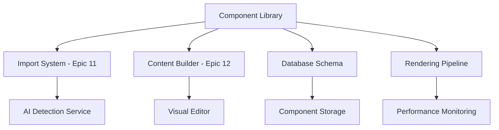

# Product Requirements Document (PRD)
# CMS Component Library Foundation - Epic 10

## Document Metadata
- **Version**: 1.1 (Post-PO Review)
- **Status**: Final - Ready for Development
- **Created**: December 2024
- **Last Updated**: December 2024
- **Author**: John (Product Manager)
- **Reviewed By**: Sarah (Product Owner)
- **Type**: Brownfield Enhancement - **PREMIUM FEATURE**
- **Repository**: catalyst-studio-premium (Private Only)
- **Epic**: Epic 10
- **Dependencies**: Epic 11 (Import System), Epic 12 (Content Builder)

> ⚠️ **CRITICAL: This is a PREMIUM FEATURE** - ALL components MUST be placed under `/lib/premium/components/cms/` as per CLAUDE.md repository rules. Never place in common components directory.

---

## 1. Executive Summary

### 1.1 Product Vision
Transform Catalyst Studio from a basic website builder into a comprehensive CMS platform by establishing a **PREMIUM** foundational library of 45 essential components that enable automatic website import and reconstruction capabilities. This is a **PREMIUM FEATURE** that will be implemented exclusively in the private repository under `/lib/premium/components/cms/`.

### 1.2 Business Opportunity
- **Market Gap**: Only 15% component coverage (4 components) prevents effective website migration
- **User Pain**: Cannot import existing sites, forcing manual rebuilds
- **Competitive Disadvantage**: Competitors offer 30-50+ components
- **Revenue Impact**: Migration barrier prevents 60%+ of potential enterprise adoptions

### 1.3 Strategic Impact
This component library unlocks:
- Epic 11: AI-powered website import system (requires 80%+ pattern coverage)
- Epic 12: Visual content builder (needs comprehensive component selection)
- Market positioning as enterprise-ready CMS solution
- 10x faster website migration vs. manual rebuild

---

## 2. Problem Statement

### 2.1 Current State Analysis

#### Existing System Capabilities
- **Current Components**: 4 basic components (hero, header, footer, CTA)
- **Coverage**: ~15% of typical CMS website patterns
- **Architecture**: Basic component structure exists in `/lib/premium/components/`
- **Rendering**: Functional pipeline for current components
- **Database**: Schema supports component storage

#### System Limitations
- **Import Blocker**: Cannot map 85% of website content patterns
- **Builder Limitations**: Users cannot create complete sites
- **Migration Barrier**: No path from existing CMS platforms
- **Support Burden**: High volume of "missing component" requests

#### Technical Debt
- No standardized component interface
- Inconsistent prop patterns across existing components
- Limited AI detection metadata
- No performance optimization strategy

### 2.2 Root Cause Analysis

**Why only 4 components?**
- Initial MVP focused on proof-of-concept
- Prioritized infrastructure over component breadth
- Underestimated component variety requirements

**Why is this blocking adoption?**
- Real websites use 15-30 different component patterns
- Import system needs 80%+ pattern matching to be useful
- Users expect feature parity with existing CMS

### 2.3 User Impact

#### Primary User Segments Affected
1. **Content Managers** (40% of users)
   - Cannot migrate existing sites
   - Limited to basic layouts
   - Forced workarounds reduce efficiency

2. **Agencies** (35% of users)
   - Cannot deliver client requirements
   - Lose deals to competitors
   - Higher development costs

3. **Enterprise Teams** (25% of users)
   - Governance requirements unmet
   - Cannot standardize on platform
   - Integration limitations

---

## 3. Solution Overview

### 3.1 Proposed Solution
Implement a **PREMIUM** comprehensive library of 45 strategically selected CMS components covering 90% of content website patterns. As a **PREMIUM FEATURE**, all components will be located under `/lib/premium/components/cms/` (per CLAUDE.md rules), with each component featuring:
- Mobile-responsive design (320px-1440px+)
- AI detection helpers for automatic mapping
- Standardized prop interfaces
- Performance optimization
- Accessibility compliance
- Premium-only access in private repository

### 3.2 Success Criteria
- **Coverage**: 90% of CMS website patterns supported
- **Performance**: All components render <50ms
- **Quality**: <5% defect rate post-launch
- **Adoption**: 70% component reuse across projects
- **Import Success**: 80% automatic content mapping accuracy

### 3.3 Out of Scope
- E-commerce components (product catalogs, carts, checkout)
- Advanced interactive widgets (calculators, configurators)
- Third-party service integrations beyond basic embeds
- Component theming system (future epic)
- Visual component builder interface

---

## 4. User Stories & Requirements

### 4.1 Epic-Level User Story
**As a** content manager migrating an existing website  
**I want** comprehensive component options that match my current site's patterns  
**So that** I can successfully import and recreate my site in Catalyst Studio

### 4.2 Key User Stories by Persona

#### Content Manager Stories
```
US-CM-01: As a content manager, I want navigation components (navbar, footer, mobile menu) 
          so I can maintain site structure during import

US-CM-02: As a content manager, I want diverse hero options (banner, split, video) 
          so I can match my brand's presentation style

US-CM-03: As a content manager, I want flexible content layouts (columns, grids, accordions)
          so I can organize information effectively
```

#### Developer Stories
```
US-DEV-01: As a developer, I want standardized component APIs
           so I can integrate components programmatically

US-DEV-02: As a developer, I want AI detection metadata
           so the import system can automatically map content

US-DEV-03: As a developer, I want TypeScript interfaces
           so I have type safety when using components
```

#### Designer Stories
```
US-DES-01: As a designer, I want responsive components
           so layouts work across all devices

US-DES-02: As a designer, I want customizable styling props
           so I can match brand guidelines

US-DES-03: As a designer, I want accessibility compliance
           so all users can access content
```

### 4.3 Functional Requirements

#### Component Categories & Specifications

**FR-001: Navigation Components (5)**
- Nav Bar: Logo, menu items, CTA, mobile collapse
- Footer: Multi-column links, social, legal
- Mobile Menu: Hamburger trigger, slide panel
- Breadcrumbs: Hierarchical navigation
- Search Bar: Site-wide content search

**FR-002: Hero Components (4)**
- Banner: Full-width with overlay text
- Split: Content/media side-by-side
- Minimal: Centered text focus
- Video: Background video support

**FR-003: Content Display Components (8)**
- Text Block: Rich text with formatting
- Two-Column: Flexible text/media layout
- Image Gallery: Grid/carousel views
- Video Player: Multiple source support
- Accordion: Expandable sections
- Tabs: Switchable content panels
- Card Grid: Versatile content cards
- Quote Block: Highlighted callouts

**[Additional categories FR-004 through FR-011 follow same pattern for Features, CTAs, Social Proof, Contact, About, Blog, Pricing, and Data Display]**

### 4.4 Non-Functional Requirements

**NFR-001: Performance**
- Component render time <50ms
- Lazy loading for below-fold components
- Code splitting by category
- Bundle size <10KB per component

**NFR-002: Accessibility**
- WCAG 2.1 AA compliance
- Keyboard navigation support
- Screen reader optimization
- Focus management

**NFR-003: Responsiveness**
- Mobile-first approach
- Breakpoints: 320px, 768px, 1024px, 1440px
- Touch-friendly interactions
- Viewport optimization

**NFR-004: Developer Experience**
- TypeScript definitions
- JSDoc documentation
- Storybook examples
- Unit test coverage >80%

---

## 5. Technical Architecture

### 5.1 System Integration

> **PREMIUM FEATURE IMPLEMENTATION** - Following CLAUDE.md repository rules

#### Existing System Components
```
catalyst-studio-premium/  (PRIVATE REPOSITORY ONLY)
├── lib/
│   ├── premium/                  <- PREMIUM FEATURES ONLY
│   │   ├── components/
│   │   │   ├── cms/             <- NEW: PREMIUM Component library location
│   │   │   └── existing/        <- Current 4 components (to migrate)
│   └── utils/
├── app/
│   ├── premium/                  <- PREMIUM DEMOS ONLY
│   │   └── demo/
│   │       └── cms-components/  <- PREMIUM Component showcase
└── prisma/
    └── schema/                   <- Existing component storage
```

**CRITICAL**: As a **PREMIUM FEATURE**, all CMS components MUST be placed under `/lib/premium/components/cms/`. Never place in common `components/` directory.

#### Database Schema Extensions
```prisma
model CMSComponent {
  id            String   @id @default(cuid())
  category      String   // navigation, heroes, content, etc.
  type          String   // nav-bar, footer, hero-banner, etc.
  props         Json     // Component configuration
  aiMetadata    Json     // Detection helpers
  version       String   // Component version
  websiteId     String
  website       Website  @relation(fields: [websiteId])
  createdAt     DateTime @default(now())
  updatedAt     DateTime @updatedAt
}
```

### 5.2 Component Architecture

#### Standard Component Interface
```typescript
interface CMSComponentBase {
  // Required props
  id: string
  type: ComponentType
  category: ComponentCategory
  
  // Content props
  content: ComponentContent
  
  // Styling props
  className?: string
  style?: React.CSSProperties
  theme?: ThemeVariant
  
  // Behavior props
  interactive?: boolean
  loading?: 'eager' | 'lazy'
  
  // AI Detection
  aiMetadata?: {
    keywords: string[]
    patterns: string[]
    commonNames: string[]
    pageLocation: 'header' | 'hero' | 'body' | 'footer'
  }
}
```

#### Component Factory Pattern (PREMIUM)
```typescript
// lib/premium/components/cms/factory.ts  <- PREMIUM FEATURE LOCATION
// ⚠️ NEVER place in common components/ directory
export class CMSComponentFactory {
  private components = new Map<string, React.FC<any>>()
  
  register(type: string, component: React.FC<any>) {
    this.components.set(type, component)
  }
  
  render(config: CMSComponentConfig) {
    const Component = this.components.get(config.type)
    if (!Component) {
      return <FallbackComponent />
    }
    return <Component {...config.props} />
  }
}
```

### 5.3 Import System Integration

#### AI Detection Helpers
```typescript
interface AIDetectionHelper {
  // Pattern matching
  matchPatterns: RegExp[]
  
  // Semantic analysis
  semanticKeywords: string[]
  
  // Structural analysis
  expectedStructure: {
    minChildren?: number
    maxChildren?: number
    requiredElements?: string[]
    optionalElements?: string[]
  }
  
  // Confidence scoring
  calculateConfidence(element: HTMLElement): number
}
```

### 5.4 Performance Strategy

#### Optimization Techniques
1. **Code Splitting**: Separate bundles per category
2. **Lazy Loading**: Dynamic imports for below-fold
3. **Memoization**: React.memo for pure components
4. **Virtual Scrolling**: For large lists/grids
5. **Image Optimization**: Next.js Image component
6. **CSS-in-JS**: Emotion for runtime optimization

---

## 6. Data & Analytics

### 6.1 Success Metrics

#### Primary KPIs
| Metric | Current | Target | Measurement |
|--------|---------|--------|-------------|
| Component Coverage | 15% | 90% | Pattern analysis tool |
| Import Success Rate | N/A | 80% | Successful imports/attempts |
| Render Performance | N/A | <50ms | Performance monitoring |
| Component Reuse | N/A | 70% | Usage analytics |
| Support Tickets | 25% | <5% | Related to missing components |

#### Secondary Metrics
- Time to build complete site: Target <2 hours
- Developer satisfaction: NPS >40
- Component defect rate: <5%
- Mobile performance score: >90

### 6.2 Analytics Implementation

#### Component Usage Tracking
```typescript
interface ComponentAnalytics {
  componentType: string
  renderCount: number
  averageRenderTime: number
  errorRate: number
  customizationRate: number
  deviceBreakdown: {
    mobile: number
    tablet: number
    desktop: number
  }
}
```

#### Import Success Tracking
```typescript
interface ImportAnalytics {
  sourceUrl: string
  detectedComponents: number
  mappedComponents: number
  unmappedPatterns: string[]
  confidenceScore: number
  importDuration: number
}
```

---

## 7. Migration Strategy

### 7.1 Existing Component Migration

#### Current Components Enhancement
1. **Hero Component**
   - Split into 4 variants (banner, split, minimal, video)
   - Add AI detection metadata
   - Standardize prop interface

2. **Header Component**
   - Rename to NavBar for clarity
   - Add mobile menu support
   - Enhance with search integration

3. **Footer Component**
   - Add multi-column layout
   - Social media integration
   - Legal links section

4. **CTA Component**
   - Create 3 variants (banner, newsletter, button group)
   - Add conversion tracking
   - A/B testing support

### 7.2 Database Migration

```sql
-- Migration script for component storage
ALTER TABLE Components 
ADD COLUMN category VARCHAR(50),
ADD COLUMN ai_metadata JSONB,
ADD COLUMN version VARCHAR(10) DEFAULT '1.0.0';

-- Migrate existing components
UPDATE Components 
SET category = CASE
  WHEN type = 'hero' THEN 'heroes'
  WHEN type IN ('header', 'footer') THEN 'navigation'
  WHEN type = 'cta' THEN 'call-to-action'
END;
```

### 7.3 Backward Compatibility

- Maintain legacy component APIs for 6 months
- Provide migration guide for existing implementations
- Automated migration tool for component updates
- Deprecation warnings in development mode

---

## 8. Security & Compliance

### 8.1 Security Considerations

#### Input Validation
- Sanitize all user-provided content
- XSS prevention in rich text components
- CSP headers for embedded content
- CSRF protection for forms

#### Data Privacy
- No PII storage in component props
- Cookie consent for tracking
- GDPR compliance for EU users
- Data retention policies

### 8.2 Accessibility Compliance

#### WCAG 2.1 AA Requirements
- Color contrast ratios >4.5:1
- Keyboard navigation for all interactive elements
- ARIA labels and roles
- Focus indicators
- Screen reader testing

### 8.3 Performance Security
- Rate limiting for API calls
- CDN for static assets
- DDoS protection
- Resource usage monitoring

---

## 9. Testing Strategy

### 9.1 Test Coverage Requirements

#### Unit Testing (Target: 85%)
- Component render tests
- Prop validation tests
- Event handler tests
- Accessibility tests

#### Integration Testing (Target: 70%)
- Component composition
- Data flow testing
- API integration
- Import system compatibility

#### E2E Testing (Critical Paths)
- Component selection and configuration
- Import flow with component mapping
- Mobile responsiveness
- Performance benchmarks

### 9.2 Test Implementation

```typescript
// Example test structure
describe('CMSComponent: NavBar', () => {
  it('renders with required props', () => {})
  it('collapses on mobile breakpoint', () => {})
  it('handles keyboard navigation', () => {})
  it('meets accessibility standards', () => {})
  it('performs within 50ms threshold', () => {})
})
```

---

## 10. Documentation Requirements

### 10.1 Developer Documentation

#### Component API Reference
- Props documentation with types
- Usage examples
- Code snippets
- Common patterns
- Troubleshooting guide

#### Integration Guide
- Import system integration
- Database schema
- Performance optimization
- Security best practices

### 10.2 User Documentation

#### Component Catalog (PREMIUM)
- Visual preview for each **PREMIUM** component
- Use case descriptions
- Configuration options  
- Best practices
- Real-world examples
- **Access restricted to premium users only**
- **Location**: `/lib/premium/components/cms/` per CLAUDE.md

#### Migration Guide
- Step-by-step import process
- Pattern mapping explanations
- Customization options
- FAQ section

---

## 11. Release Strategy

### 11.1 Phased Rollout (Aligned with Priority Matrix)

#### Phase 1: Core PREMIUM Components (Weeks 1-2) - P0 Priority
**22 PREMIUM Components - Critical Foundation**
- All navigation components (5) - `/lib/premium/components/cms/navigation/` [P0]
- Core heroes (3) - `/lib/premium/components/cms/heroes/` [P0]
- Essential content displays (6) - `/lib/premium/components/cms/content/` [P0]
- Primary CTAs (3) - `/lib/premium/components/cms/cta/` [P0]
- Core features (2) - `/lib/premium/components/cms/features/` [P0]
- Contact forms (3) - `/lib/premium/components/cms/contact/` [P0]

**Success Criteria**: 55% pattern coverage, all P0 components complete

#### Phase 2: Extended Set (Weeks 3-4) - P1 Priority
**15 Components - Enhancement**
- Feature grids & showcases (2) - `/lib/premium/components/cms/features/` [P1]
- Social proof/testimonials (4) - `/lib/premium/components/cms/social-proof/` [P1]
- Blog components (5) - `/lib/premium/components/cms/blog/` [P1]
- Team/About sections (3) - `/lib/premium/components/cms/about/` [P1]
- Advanced hero (1) - `/lib/premium/components/cms/heroes/` [P1]

**Success Criteria**: 75% pattern coverage, all P1 components complete

#### Phase 3: Specialized Components (Week 5) - P2 Priority
**8 Components - Completion**
- Pricing tables & cards (2) - `/lib/premium/components/cms/pricing/` [P2]
- Data visualizations (3) - `/lib/premium/components/cms/data/` [P2]
- Advanced content displays (2) - `/lib/premium/components/cms/content/` [P2]
- Advanced forms (1) - `/lib/premium/components/cms/contact/` [P2]

**Success Criteria**: 90% pattern coverage, all P2 components complete

### 11.2 Quality Gates

Each phase must pass:
1. Code review approval
2. 80% test coverage
3. Performance benchmarks
4. Accessibility audit
5. Security review
6. Documentation complete

---

## 12. Epic & Story Breakdown

### 12.1 Epic Overview
- **Epic ID**: EPIC-10
- **Total Story Points**: 89
- **Number of Stories**: 20
- **Timeline**: 5-6 weeks
- **Critical Dependencies**: Must complete before Epic 11 (Import) and Epic 12 (Builder)

### 12.2 Story Breakdown Summary

| Story | Title | Points | Priority | Dependencies |
|-------|-------|--------|----------|--------------|
| 10.1 | Development Environment Setup | 5 | P0-BLOCKER | None |
| 10.2 | Database Schema & Migration | 5 | P0-BLOCKER | None |
| 10.3 | Migrate Existing 4 Components | 8 | P0-BLOCKER | 10.2 |
| 10.4 | Navigation Components (5) | 8 | P0 | 10.1, 10.3 |
| 10.5 | Hero Components (4) | 5 | P0 | 10.1, 10.3 |
| 10.6 | Content Display Part 1 (4) | 5 | P0 | 10.1 |
| 10.7 | Content Display Part 2 (4) | 5 | P1 | 10.1 |
| 10.8 | Features & CTA (7) | 8 | P0 | 10.1 |
| 10.9 | Social Proof (4) | 5 | P1 | 10.1 |
| 10.10 | Contact & Forms (4) | 8 | P0 | 10.1 |
| 10.11 | About & Team (3) | 3 | P1 | 10.1 |
| 10.12 | Blog Components (5) | 8 | P1 | 10.1 |
| 10.13 | Pricing & Data (5) | 5 | P2 | 10.1 |
| 10.14 | Epic 11 Import Integration | 8 | P0-BLOCKER | 10.4-10.13 |
| 10.15 | Epic 12 Builder Integration | 5 | P0-BLOCKER | 10.4-10.13 |
| 10.16 | Performance Optimization | 5 | P0 | 10.4-10.13 |
| 10.17 | Documentation & Training | 3 | P0 | All |
| 10.18 | Security Audit | 3 | P0 | 10.4-10.13 |
| 10.19 | QA & Bug Fixes | 5 | P0 | All |
| 10.20 | Deployment & Release | 3 | P0 | 10.19 |

### 12.3 Critical Path Stories

#### Story 10.1: Development Environment Setup
**Purpose**: Establish premium component development infrastructure  
**Acceptance Criteria**:
- Premium folder structure at `/lib/premium/components/cms/` created
- Git hooks enforce premium placement rules
- ESLint configuration validates import paths
- Webpack performance budgets configured (<10KB per component)
- Storybook configured for premium components
- Visual regression testing infrastructure ready

#### Story 10.2: Database Schema & Migration
**Purpose**: Extend database to support CMS components  
**Acceptance Criteria**:
- CMSComponent table created with all required fields
- Migration scripts include rollback procedures
- Existing component data preserved
- Performance indexes added
- Zero-downtime migration strategy documented

#### Story 10.3: Migrate Existing 4 Components
**Purpose**: Transform current components to new architecture  
**Acceptance Criteria**:
- Hero split into 4 variants (banner, split, minimal, video)
- Header becomes NavBar with mobile support
- Footer enhanced with multi-column layout
- CTA split into 3 variants
- Backward compatibility maintained for 6 months
- Zero breaking changes for current users

### 12.4 Component Development Stories

Each component story includes:
- TypeScript interface definition
- Component implementation
- AI detection metadata
- Unit tests (>80% coverage)
- Visual regression tests
- Performance validation (<50ms render)
- Accessibility compliance (WCAG 2.1 AA)
- Storybook story
- Documentation

### 12.5 Integration Stories

#### Story 10.14: Epic 11 Import Integration
**Purpose**: Enable import system to use component library  
**Acceptance Criteria**:
- Detection API exposes component patterns
- Extraction API maps HTML to props
- Batch import API creates multiple components
- AI metadata accessible to import system
- 80% detection accuracy achieved
- Performance <100ms per detection

#### Story 10.15: Epic 12 Builder Integration
**Purpose**: Enable builder to use component library  
**Acceptance Criteria**:
- Catalog API returns all 45 components
- Preview API renders in real-time
- Property schemas exposed for builder UI
- CRUD operations supported
- Undo/redo capability ready
- Performance <50ms for preview

---

## 13. Risk Analysis & Mitigation

### 12.1 High-Priority Risks

| Risk | Impact | Probability | Mitigation |
|------|--------|-------------|------------|
| Scope Creep | High | High | Hard limit 45 components, defer additions |
| Performance Degradation | High | Medium | Performance budget, lazy loading |
| Import Compatibility | High | Medium | Coordinate with Epic 11 team |
| Over-Engineering | Medium | High | Start simple, iterate based on usage |

### 12.2 Technical Risks

**Browser Compatibility**
- Risk: Components break in older browsers
- Mitigation: Polyfills, progressive enhancement, browser testing

**Mobile Performance**
- Risk: Poor performance on low-end devices
- Mitigation: Mobile-first development, performance budgets

**Component Conflicts**
- Risk: Style/behavior conflicts between components
- Mitigation: CSS modules, isolated component scope

---

## 13. Resource Planning

### 13.1 Team Composition

| Role | Allocation | Responsibilities |
|------|------------|------------------|
| Frontend Engineers | 2-3 FTE | Component development |
| UI/UX Designer | 1 FTE | Design system, component specs |
| Product Owner | 1 FTE | Requirements, prioritization |
| QA Engineer | 0.5 FTE | Testing, quality assurance |
| DevOps Engineer | 0.25 FTE | Performance, deployment |

### 13.2 Timeline & Milestones

```
Week 0: Setup & Planning
- PREMIUM environment setup at /lib/premium/components/cms/
- Design system alignment for PREMIUM features
- Team onboarding on CLAUDE.md repository rules
- POC development (5 PREMIUM components)

Weeks 1-2: Phase 1 (Core 20 PREMIUM)
- PREMIUM Navigation components in /lib/premium/components/cms/navigation/
- Essential PREMIUM content displays
- Basic testing & documentation

Weeks 3-4: Phase 2 (Extended 15 PREMIUM)
- Advanced PREMIUM components
- Integration testing
- Performance optimization

Week 5: Phase 3 (Final 10 PREMIUM)
- Specialized PREMIUM components
- Import system integration
- Final testing & polish

Week 6: Launch Preparation
- PREMIUM documentation finalization
- Training on PREMIUM feature access
- Deployment to private repository only
- Stakeholder demos of PREMIUM components
```

### 13.3 Budget Estimate

| Category | Cost |
|----------|------|
| Development (22.5 person-weeks) | $112,500 |
| Design Resources | $15,000 |
| Testing Infrastructure | $5,000 |
| Documentation | $7,500 |
| **Total** | **$140,000** |

---

## 14. Success Criteria & Acceptance

### 14.1 Definition of Done

Component is complete when:
- [ ] Code implemented and reviewed
- [ ] Unit tests passing (>80% coverage)
- [ ] Responsive across breakpoints
- [ ] Accessibility audit passed
- [ ] Performance <50ms render
- [ ] Documentation complete
- [ ] AI metadata defined
- [ ] Storybook example created

### 14.2 Acceptance Criteria

Epic is complete when:
- [ ] All 45 components implemented
- [ ] 90% pattern coverage verified
- [ ] Import system integration tested
- [ ] Performance benchmarks met
- [ ] Documentation published
- [ ] Team training completed
- [ ] Stakeholder sign-off received

---

## 15. Post-Launch Considerations

### 15.1 Maintenance Plan
- Weekly component updates
- Monthly performance reviews
- Quarterly accessibility audits
- Bi-annual architecture review

### 15.2 Enhancement Roadmap
- **Q2 2025**: Theme system implementation
- **Q3 2025**: Advanced animations
- **Q4 2025**: AI-powered customization
- **Q1 2026**: Component marketplace

### 15.3 Success Monitoring
- Weekly usage analytics review
- Monthly performance reports
- Quarterly user satisfaction surveys
- Component adoption tracking

---

## 16. Critical Clarifications & Amendments (Post-PO Review)

### 16.1 Performance Testing Framework

**Testing Tools & Methodology:**
- **Primary Tool**: React DevTools Profiler for component render timing
- **CI Integration**: Playwright performance tests with budget assertions
- **Monitoring**: Custom performance wrapper tracking all renders
- **Benchmarking**: Lighthouse CI with component-specific thresholds

**Performance Validation Process:**
```typescript
// Each component must pass:
1. Unit perf test: Jest with performance.now() assertions
2. Integration test: Full page render < 50ms per component
3. E2E test: Real browser metrics via Playwright
4. Production monitoring: Real User Monitoring (RUM) data
```

### 16.2 Database Migration Rollback Procedures

**Rollback Strategy:**
```sql
-- Forward Migration (to be created in Story 10.2)
BEGIN TRANSACTION;
  -- Create new CMSComponent table
  CREATE TABLE CMSComponent (...);
  -- Copy existing component data
  INSERT INTO CMSComponent SELECT * FROM Components;
  -- Create rollback checkpoint
  SAVEPOINT cms_component_migration;
COMMIT;

-- Rollback Procedure (tested before production)
BEGIN TRANSACTION;
  -- Restore from checkpoint
  ROLLBACK TO SAVEPOINT cms_component_migration;
  -- Or full rollback if needed
  DROP TABLE IF EXISTS CMSComponent;
  -- Restore original state
  UPDATE Components SET migrated = FALSE;
COMMIT;
```

**Rollback Testing Requirements:**
- Dry run in staging environment
- Automated rollback tests in CI
- Manual verification checklist
- Data integrity validation post-rollback

### 16.3 AI Detection Confidence Thresholds

**Component-Specific Confidence Levels:**
| Component Type | Min Confidence | Auto-Map Threshold | Manual Review |
|----------------|---------------|-------------------|---------------|
| Navigation | 0.85 | 0.90 | < 0.85 |
| Hero/Header | 0.80 | 0.85 | < 0.80 |
| Content Block | 0.75 | 0.80 | < 0.75 |
| Form/Contact | 0.90 | 0.95 | < 0.90 |
| Generic | 0.70 | 0.75 | < 0.70 |

### 16.4 Component Naming Conventions

**Standard Naming Structure:**
```
/lib/premium/components/cms/{category}/{component-name}/
  ├── index.tsx                 // Main component export
  ├── {component-name}.types.ts // TypeScript interfaces  
  ├── {component-name}.test.tsx // Unit tests
  ├── {component-name}.ai.ts    // AI detection metadata
  └── {component-name}.stories.tsx // Storybook stories

Naming Rules:
- Kebab-case for folders: nav-bar, hero-banner
- PascalCase for components: NavBar, HeroBanner
- Prefix with category: NavigationNavBar, HerosBanner
```

### 16.5 Epic 11/12 Integration Handoff Process

**Formal Handoff Protocol:**
1. **Week 4 Checkpoint**: Component API freeze
2. **Integration Testing**: Joint Epic 10/11/12 team sessions
3. **Documentation Handoff**:
   - API specifications document
   - Integration test suite
   - Known limitations & workarounds
4. **Support Period**: 2-week overlap with Epic 11/12 teams

**Integration Test Scenarios:**
- Import 10 real websites using component library
- Builder creates 5 complete page layouts
- Performance remains under 50ms with full integration
- Rollback procedures work with integrated systems

### 16.6 Error Handling Strategies

**Component-Level Error Handling:**
```typescript
// Standard error boundary for each component
interface ComponentError {
  component: string
  error: Error
  fallbackStrategy: 'default' | 'skeleton' | 'message' | 'hide'
  userMessage?: string
}

// Error Recovery Strategies:
1. Graceful Degradation: Show simplified version
2. Skeleton Fallback: Display loading skeleton
3. Error Message: User-friendly error display
4. Silent Recovery: Log error, show default content
```

**Error Categories & Responses:**
| Error Type | Strategy | User Impact | Recovery |
|------------|----------|-------------|----------|
| Props Validation | Default props | None | Auto-recover |
| Render Error | Error boundary | Minimal | Show fallback |
| Data Loading | Skeleton | Visual only | Retry with backoff |
| Network Error | Cached version | Degraded | Use stale data |
| Permission Error | Hide component | Feature loss | Show message |

**Monitoring & Alerting:**
- Sentry integration for production errors
- Component-specific error rates dashboard
- Automated alerts for error rate spikes
- Weekly error report reviews

---

## Appendix A: Component Priority Matrix

| Priority | Component | Usage Frequency | Import Critical | Complexity |
|----------|-----------|-----------------|-----------------|------------|
| P0 | Navigation Bar | 100% | Yes | Medium |
| P0 | Footer | 100% | Yes | Medium |
| P0 | Hero Banner | 87% | Yes | Low |
| P0 | Text Block | 95% | Yes | Low |
| P0 | Contact Form | 78% | Yes | High |
| P1 | Feature Grid | 65% | Yes | Medium |
| P1 | Testimonials | 62% | Yes | Medium |
| P2 | Pricing Table | 35% | No | High |
| P2 | Timeline | 15% | No | Medium |

---

## Appendix B: Technical Dependencies



---

## Appendix C: Competitive Analysis

| Platform | Components | Strengths | Gaps |
|----------|------------|-----------|------|
| WordPress Gutenberg | 50+ | Extensive ecosystem | Performance issues |
| Webflow | 40+ | Visual design focus | Limited customization |
| Squarespace | 30+ | User-friendly | Not developer-friendly |
| **Catalyst Studio** | **45 (target)** | **AI-powered, Performance** | **Currently only 4** |

---

## Document Sign-off

| Stakeholder | Role | Approval | Date |
|-------------|------|----------|------|
| Product Lead | Product | ✅ Revised | Dec 2024 |
| Product Owner | PO Review | ✅ Reviewed | Dec 2024 |
| Engineering Lead | Technical | Pending | |
| Design Lead | UX/UI | Pending | |
| QA Lead | Quality | Pending | |
| Business Owner | Executive | Pending | |

**Revision Notes:**
- v1.1: Addressed PO feedback - added Section 16 with critical clarifications
- Aligned component phasing with priority matrix
- Added performance testing framework, rollback procedures, and error handling
- Defined AI confidence thresholds and naming conventions

---

*End of PRD - Version 1.1*