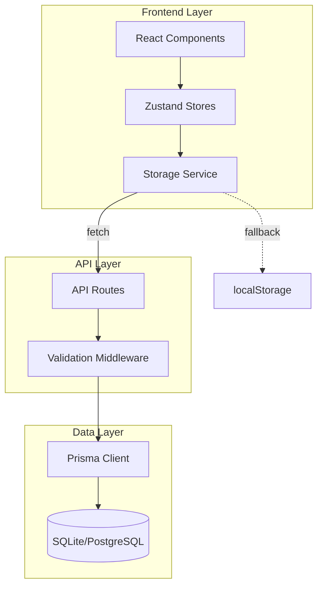

# Catalyst Studio Storage Migration Brownfield Enhancement Architecture

## Introduction

This document outlines the architectural approach for enhancing Catalyst Studio with a complete storage layer migration from browser-based storage to server-side SQL database. Its primary goal is to serve as the guiding architectural blueprint for AI-driven development of new features while ensuring seamless integration with the existing system.

**Relationship to Existing Architecture:**
This document supplements existing project architecture by defining how new components will integrate with current systems. Where conflicts arise between new and existing patterns, this document provides guidance on maintaining consistency while implementing enhancements.

### Existing Project Analysis

#### Current Project State
- **Primary Purpose:** Web application for creating and managing digital projects with content management capabilities
- **Current Tech Stack:** Next.js 15.4.5 (App Router), React 19.1.0, TypeScript 5, Zustand for state management, Tailwind CSS
- **Architecture Style:** Modular React component architecture with App Router, client-side storage, feature-based organization
- **Deployment Method:** Next.js application with integrated development environment, likely deployable to Vercel or self-hosted

#### Available Documentation
- ✓ Epic 1-3 documentation with completion summaries
- ✓ Front-end specifications and testing guide
- ✓ Local storage usage documentation
- ✓ Data storage requirements
- ✓ Epic 4 PRD and brief
- ⚠️ Missing: Complete API documentation, database design standards

#### Identified Constraints
- Browser storage limitations (5-10MB typical limit)
- No existing backend infrastructure - pure client-side application
- Zustand persistence currently tied to localStorage
- Multiple storage strategies (localStorage, sessionStorage, IndexedDB) in use
- Need to maintain existing user workflows during migration
- Monorepo structure must be preserved

### Change Log

| Change | Date | Version | Description | Author |
|--------|------|---------|-------------|--------|
| Initial Draft | 2025-08-12 | 1.0 | Created brownfield architecture for Epic 4 | Winston (Architect) |

## Enhancement Scope and Integration Strategy

### Enhancement Overview
**Enhancement Type:** Technology Stack Upgrade + Major Feature Modification  
**Scope:** Complete migration of all browser storage mechanisms to server-side SQL database  
**Integration Impact:** High - Affects entire data persistence layer

### Integration Approach

**Code Integration Strategy:** Gradual module-by-module migration maintaining dual compatibility during transition. Replace Zustand persistence layer with API-backed storage while keeping store interfaces unchanged.

**Database Integration:** New SQLite database for development, PostgreSQL/MySQL for production. Prisma ORM for database operations with automatic migration management.

**API Integration:** Next.js API routes in `/app/api/` following RESTful patterns. Each module gets dedicated route handlers with TypeScript type sharing between frontend and backend.

**UI Integration:** Minimal UI changes - replace storage calls with API calls wrapped in React Query for caching and optimistic updates. Maintain existing component interfaces.

### Compatibility Requirements
- **Existing API Compatibility:** N/A - No existing APIs, establishing first API patterns
- **Database Schema Compatibility:** New schema must accommodate all existing data structures from browser storage
- **UI/UX Consistency:** Zero visible changes to user workflows - same interactions, better reliability
- **Performance Impact:** Target sub-200ms response times for typical CRUD operations

## Tech Stack Alignment

### Existing Technology Stack

| Category | Current Technology | Version | Usage in Enhancement | Notes |
|----------|-------------------|---------|---------------------|-------|
| Framework | Next.js | 15.4.5 | Full-stack framework with API routes | Use App Router API routes |
| UI Library | React | 19.1.0 | Frontend components | No changes |
| Language | TypeScript | 5.x | Type safety across stack | Share types between frontend/backend |
| State Management | Zustand | 5.0.7 | Client state | Modify persistence layer only |
| Validation | Zod | 3.25.76 | Schema validation | Use for API request/response validation |
| Build Tool | Turbopack | Latest | Development server | Handles API routes automatically |

### New Technology Additions

| Technology | Version | Purpose | Rationale | Integration Method |
|------------|---------|---------|-----------|-------------------|
| Prisma | Latest | ORM for database operations | Reduces boilerplate, type-safe queries, automatic migrations | Install as dev dependency, generate client |
| SQLite | 3.x | Development database | Zero-config local development | File-based in project root |
| React Query | 5.x | API state management | Caching, optimistic updates, background refetching | Wrap API calls, integrate with Zustand |
| PostgreSQL | 15.x | Production database | Scalable, reliable, feature-rich | Environment-based configuration |

## Data Models and Schema Changes

### New Data Models

#### Website Model
**Purpose:** Store website/project metadata previously in localStorage  
**Integration:** Root entity for all project-specific data

**Key Attributes:**
- `id`: String (UUID) - Unique identifier
- `name`: String - Website/project name  
- `description`: String? - Optional description
- `category`: String - Project category
- `createdAt`: DateTime - Creation timestamp
- `updatedAt`: DateTime - Last update timestamp
- `metadata`: JSON - Flexible metadata storage

**Relationships:**
- **With Existing:** Maps to current website storage keys
- **With New:** Parent to ContentTypes, ContentItems, Settings

#### ContentType Model
**Purpose:** Store content type definitions  
**Integration:** Replaces localStorage content type storage

**Key Attributes:**
- `id`: String - Unique identifier
- `websiteId`: String - Foreign key to Website
- `name`: String - Content type name
- `fields`: JSON - Field definitions array
- `settings`: JSON - Type-specific settings
- `createdAt`: DateTime - Creation timestamp
- `updatedAt`: DateTime - Last update timestamp

**Relationships:**
- **With Existing:** Maps to current content type structure
- **With New:** Parent to ContentItems, belongs to Website

#### ContentItem Model
**Purpose:** Store actual content instances  
**Integration:** Replaces localStorage content storage

**Key Attributes:**
- `id`: String - Unique identifier
- `contentTypeId`: String - Foreign key to ContentType
- `websiteId`: String - Foreign key to Website
- `data`: JSON - Actual content data
- `status`: String - Draft/Published status
- `createdAt`: DateTime - Creation timestamp
- `updatedAt`: DateTime - Last update timestamp

**Relationships:**
- **With Existing:** Maps to current content item structure
- **With New:** Belongs to ContentType and Website

### Schema Integration Strategy

**Database Changes Required:**
- **New Tables:** websites, content_types, content_items, chat_sessions, chat_messages, settings
- **Modified Tables:** N/A (all new)
- **New Indexes:** websiteId indexes, contentTypeId indexes, composite indexes for queries
- **Migration Strategy:** Prisma migrations with seed data from localStorage export

**Backward Compatibility:**
- Migration script to export localStorage data before cutover
- Rollback script to restore localStorage if needed
- Feature flag to toggle between storage backends during transition

## Component Architecture

### New Components

#### Database Client Component
**Responsibility:** Singleton database connection management  
**Integration Points:** All API routes, shared connection pool

**Key Interfaces:**
- `getClient()`: Returns Prisma client instance
- `disconnect()`: Cleanup for hot reload

**Dependencies:**
- **Existing Components:** None (infrastructure layer)
- **New Components:** Used by all API routes

**Technology Stack:** Prisma Client, singleton pattern

#### API Route Handlers
**Responsibility:** CRUD operations for each data model  
**Integration Points:** Frontend services, Zustand stores

**Key Interfaces:**
- Standard REST endpoints (GET, POST, PUT, DELETE)
- Consistent error response format
- TypeScript types shared with frontend

**Dependencies:**
- **Existing Components:** Called by existing React components
- **New Components:** Database Client, validation schemas

**Technology Stack:** Next.js API routes, Zod validation

#### Storage Service Adapter
**Responsibility:** Abstract storage backend from application code  
**Integration Points:** Zustand stores, existing storage service

**Key Interfaces:**
- `save()`, `load()`, `remove()` matching existing interface
- Backend selection based on feature flag
- Transparent migration support

**Dependencies:**
- **Existing Components:** Replaces current localStorage implementation
- **New Components:** API client layer

**Technology Stack:** TypeScript, fetch API, React Query

### Component Interaction Diagram



## API Design and Integration

### API Integration Strategy
**API Integration Strategy:** RESTful API using Next.js App Router conventions  
**Authentication:** None in Phase 1, prepare for JWT in Phase 2  
**Versioning:** URL path versioning if needed (/api/v1/)

### New API Endpoints

#### Website CRUD
- **Method:** GET, POST, PUT, DELETE
- **Endpoint:** /api/websites, /api/websites/[id]
- **Purpose:** Manage website/project entities
- **Integration:** Replace website context localStorage

**Request:**
```json
{
  "name": "string",
  "description": "string?",
  "category": "string",
  "metadata": {}
}
```

**Response:**
```json
{
  "id": "string",
  "name": "string",
  "description": "string?",
  "category": "string",
  "metadata": {},
  "createdAt": "datetime",
  "updatedAt": "datetime"
}
```

#### Content Type CRUD
- **Method:** GET, POST, PUT, DELETE
- **Endpoint:** /api/content-types, /api/content-types/[id]
- **Purpose:** Manage content type definitions
- **Integration:** Replace content type localStorage

**Request:**
```json
{
  "websiteId": "string",
  "name": "string",
  "fields": [],
  "settings": {}
}
```

**Response:**
```json
{
  "id": "string",
  "websiteId": "string",
  "name": "string",
  "fields": [],
  "settings": {},
  "createdAt": "datetime",
  "updatedAt": "datetime"
}
```

#### Content Item CRUD
- **Method:** GET, POST, PUT, DELETE
- **Endpoint:** /api/content-items, /api/content-items/[id]
- **Purpose:** Manage content instances
- **Integration:** Replace content item localStorage

**Request:**
```json
{
  "contentTypeId": "string",
  "websiteId": "string",
  "data": {},
  "status": "draft|published"
}
```

**Response:**
```json
{
  "id": "string",
  "contentTypeId": "string",
  "websiteId": "string",
  "data": {},
  "status": "string",
  "createdAt": "datetime",
  "updatedAt": "datetime"
}
```

## Source Tree Integration

### Existing Project Structure
```plaintext
catalyst-studio/
├── app/
│   ├── (dashboard)/
│   ├── api/           # Existing API folder
│   ├── studio/
│   └── ...
├── components/
├── lib/
│   ├── storage/       # Existing storage services
│   ├── stores/        # Zustand stores
│   └── ...
├── prisma/            # New: Prisma folder
└── package.json
```

### New File Organization
```plaintext
catalyst-studio/
├── app/
│   └── api/                        # Existing API folder
│       ├── websites/               # New: Website CRUD
│       │   └── route.ts
│       ├── websites/[id]/          # New: Website by ID
│       │   └── route.ts
│       ├── content-types/          # New: Content Type CRUD
│       │   └── route.ts
│       ├── content-items/          # New: Content Item CRUD
│       │   └── route.ts
│       └── chat/                   # Existing chat API
├── lib/
│   ├── db/                        # New: Database utilities
│   │   ├── client.ts              # Prisma client singleton
│   │   └── seed.ts                # Seed data script
│   ├── api/                       # New: API client layer
│   │   ├── websites.ts
│   │   ├── content-types.ts
│   │   └── content-items.ts
│   └── storage/                   # Existing, modified
│       └── api-storage.ts         # New: API-backed storage
├── prisma/                        # New: Prisma configuration
│   ├── schema.prisma              # Database schema
│   ├── migrations/                # Migration files
│   └── seed.ts                    # Seed script
└── types/                         # Existing, expanded
    └── api.ts                     # New: Shared API types
```

### Integration Guidelines
- **File Naming:** Follow existing kebab-case convention for files
- **Folder Organization:** Group by feature in app/api/, utilities in lib/
- **Import/Export Patterns:** Named exports for utilities, default for components

## Infrastructure and Deployment Integration

### Existing Infrastructure
**Current Deployment:** Next.js application, likely Vercel or self-hosted  
**Infrastructure Tools:** npm scripts, Next.js build system  
**Environments:** Development (local), Production

### Enhancement Deployment Strategy
**Deployment Approach:** Seamless integration with existing Next.js deployment  
**Infrastructure Changes:** Add database connection string to environment variables  
**Pipeline Integration:** Add Prisma generate and migrate to build scripts

### Rollback Strategy
**Rollback Method:** Feature flag to revert to localStorage, database backup restore  
**Risk Mitigation:** Gradual module migration, comprehensive testing at each step  
**Monitoring:** API response time monitoring, error rate tracking

## Coding Standards and Conventions

### Existing Standards Compliance
**Code Style:** ESLint + Prettier configuration (existing)  
**Linting Rules:** Next.js recommended rules with TypeScript  
**Testing Patterns:** Jest for unit tests, Playwright for E2E  
**Documentation Style:** JSDoc/TSDoc comments

### Critical Integration Rules
- **Existing API Compatibility:** All API responses must include status and data/error fields
- **Database Integration:** Always use Prisma transactions for multi-table operations
- **Error Handling:** Consistent error format: `{ error: { message, code, details? } }`
- **Logging Consistency:** Use existing console patterns, prepare for structured logging

## Testing Strategy

### Integration with Existing Tests
**Existing Test Framework:** Jest + React Testing Library + Playwright  
**Test Organization:** `__tests__` folders, `.test.ts` suffix  
**Coverage Requirements:** Maintain existing coverage levels

### New Testing Requirements

#### Unit Tests for New Components
- **Framework:** Jest (existing)
- **Location:** `app/api/*/__tests__/`, `lib/db/__tests__/`
- **Coverage Target:** 80% for new API code
- **Integration with Existing:** Mock Prisma client for unit tests

#### Integration Tests
- **Scope:** API endpoints with test database
- **Existing System Verification:** Ensure Zustand stores work with new backend
- **New Feature Testing:** Full CRUD cycle tests for each module

#### Regression Testing
- **Existing Feature Verification:** All existing E2E tests must pass
- **Automated Regression Suite:** Extend Playwright tests for API-backed features
- **Manual Testing Requirements:** Cross-browser storage migration verification

## Security Integration

### Existing Security Measures
**Authentication:** None currently implemented  
**Authorization:** Client-side only  
**Data Protection:** Browser storage, no encryption  
**Security Tools:** None specific

### Enhancement Security Requirements
**New Security Measures:** Input validation with Zod, SQL injection prevention via Prisma  
**Integration Points:** API route validation, database query parameterization  
**Compliance Requirements:** Prepare for future auth implementation

### Security Testing
**Existing Security Tests:** None specific  
**New Security Test Requirements:** API input validation tests, SQL injection tests  
**Penetration Testing:** Not required in Phase 1

## Migration Strategy and Implementation Sequence

### Phase 1: Foundation (Story 4.1-4.3)
1. Storage audit and migration planning
2. Database and ORM setup with Prisma
3. API route pattern implementation

### Phase 2: Core Modules (Story 4.4-4.6)
1. Content Types module migration
2. Content Items module migration
3. Website/Project settings migration

### Phase 3: Secondary Modules
1. Chat persistence migration
2. Settings and preferences migration
3. Any additional modules identified in audit

### Phase 4: Validation and Cleanup (Story 4.7-4.8)
1. Complete testing and validation
2. Remove browser storage code
3. Development environment optimization

## Risk Assessment and Mitigation

### Technical Risks
- **Data Loss During Migration:** Mitigated by backup/restore scripts and gradual migration
- **Performance Degradation:** Mitigated by React Query caching and optimistic updates
- **API Size Limits:** Mitigated by pagination and chunked uploads

### Integration Risks
- **Zustand Persistence Break:** Mitigated by adapter pattern maintaining same interface
- **Development Workflow Disruption:** Mitigated by seamless npm run dev integration
- **Type Safety Loss:** Mitigated by shared TypeScript types between frontend/backend

## Success Criteria

1. All browser storage replaced with API-backed storage
2. No visible changes to user workflows
3. Data persists across devices and sessions
4. All existing tests pass
5. Sub-200ms response times for typical operations
6. Zero data loss during migration

## Next Steps

### Story Manager Handoff
To begin implementation of Epic 4 Storage Migration:
- Reference this architecture document for all technical decisions
- Start with Story 4.1 (Storage Audit) to map all browser storage usage
- Key integration requirement: Maintain existing Zustand store interfaces
- Existing system constraint: Must work within Next.js App Router structure
- First implementation story: Set up Prisma with SQLite after audit complete
- Critical: Test each module migration thoroughly before proceeding to next

### Developer Handoff
For developers implementing this migration:
- Architecture document: `/docs/epic4-architecture.md`
- Follow existing Next.js App Router patterns for API routes
- Integration requirement: All APIs must be callable from existing React components
- Key decision: Prisma ORM for all database operations
- Compatibility requirement: Run `npm run dev` must start everything
- Implementation sequence: Audit → Foundation → Modules → Validation

## Appendix: Quick Reference

### Environment Variables
```env
# .env.local
DATABASE_URL="file:./dev.db"

# .env.production
DATABASE_URL="postgresql://..."
```

### Package.json Scripts
```json
{
  "scripts": {
    "dev": "next dev --turbopack",
    "db:generate": "prisma generate",
    "db:migrate": "prisma migrate dev",
    "db:seed": "tsx prisma/seed.ts"
  }
}
```

### Prisma Schema Example
```prisma
model Website {
  id          String   @id @default(cuid())
  name        String
  description String?
  category    String
  metadata    Json?
  createdAt   DateTime @default(now())
  updatedAt   DateTime @updatedAt
  
  contentTypes ContentType[]
  contentItems ContentItem[]
}
```