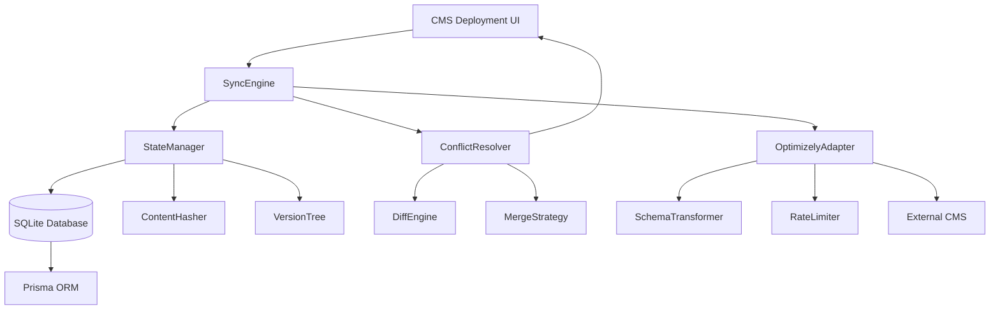
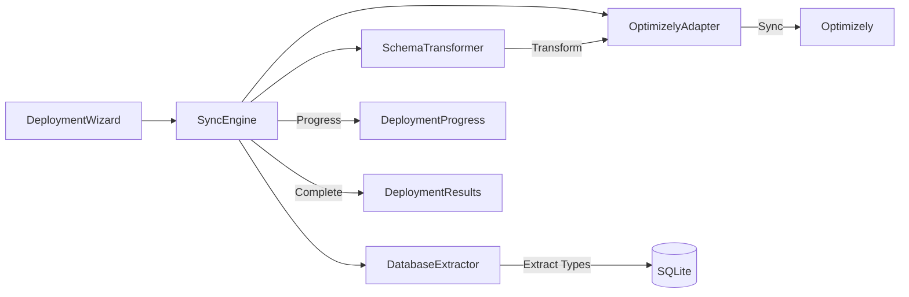

# Catalyst Studio Content Type Synchronization System Brownfield Enhancement Architecture

## Introduction

This document outlines the architectural approach for enhancing Catalyst Studio with a production-ready content type synchronization system. Its primary goal is to serve as the guiding architectural blueprint for AI-driven development of new features while ensuring seamless integration with the existing system.

**Relationship to Existing Architecture:**
This document supplements existing project architecture by defining how the PoC synchronization components will integrate with the current Catalyst Studio application. Where conflicts arise between new and existing patterns, this document provides guidance on maintaining consistency while implementing enhancements.

### Existing Project Analysis

#### Current Project State
- **Primary Purpose:** Content management studio for designing and deploying content structures
- **Current Tech Stack:** Next.js 14, React, TypeScript, SQLite, Prisma ORM, TailwindCSS
- **Architecture Style:** Component-based UI with API routes, service layer, and SQLite persistence
- **Deployment Method:** Vercel deployment with edge functions

#### Available Documentation
- Epic 6 Brownfield PRD (production requirements and phases)
- Epic 6 Content Sync Requirements (technical specifications)
- Proof of Concept implementation in `/proof-of-concept/` directory
- Gap Analysis and Solutions Architecture documents

#### Identified Constraints
- PoC exists as separate JavaScript application, not integrated with main TypeScript app
- CMS Deployment feature in main app uses mock data, ready for real integration
- Must maintain backward compatibility with existing SQLite schema
- OAuth 2.0 authentication already implemented in PoC
- Optimizely API version locked to preview3 for stability

### Change Log
| Change | Date | Version | Description | Author |
|--------|------|---------|-------------|--------|
| Initial Creation | 2025-01-15 | 1.0 | Brownfield architecture for Epic 6 | System |

---

## Enhancement Scope and Integration Strategy

### Enhancement Overview
**Enhancement Type:** System Integration & Feature Evolution  
**Scope:** Merge PoC into main app, add state management, conflict resolution, and data protection  
**Integration Impact:** Medium - Replaces mock service with real implementation

### Integration Approach
**Code Integration Strategy:** Move PoC JavaScript modules into TypeScript service layer with proper typing  
**Database Integration:** Extend existing SQLite schema with versioning and sync state tables  
**API Integration:** Replace mock CMS deployment service with real sync engine  
**UI Integration:** Connect existing CMS Deployment UI to new sync engine backend

### Compatibility Requirements
- **Existing API Compatibility:** All current API routes remain functional
- **Database Schema Compatibility:** Additive changes only, no breaking modifications
- **UI/UX Consistency:** Use existing UI components and patterns
- **Performance Impact:** <100ms additional latency for sync operations

---

## Tech Stack Alignment

### Existing Technology Stack
| Category | Current Technology | Version | Usage in Enhancement | Notes |
|----------|-------------------|---------|---------------------|-------|
| Runtime | Node.js | 18.x LTS | Continue using | Required for sync engine |
| Framework | Next.js | 14.x | API routes for sync | Existing app framework |
| Language | TypeScript | 5.x | Convert PoC to TS | Type safety required |
| Database | SQLite | 3.x | Store sync state | Add versioning tables |
| ORM | Prisma | 5.x | Schema migrations | Manage new tables |
| UI Framework | React | 18.x | Sync UI components | Use existing components |
| Styling | TailwindCSS | 3.x | Style sync UI | Maintain consistency |
| Testing | Jest/React Testing | Latest | Test sync features | Extend existing suite |

### New Technology Additions
| Technology | Version | Purpose | Rationale | Integration Method |
|------------|---------|---------|-----------|-------------------|
| crypto (built-in) | Node.js native | SHA-256 checksums | Already in Node.js | Direct import |
| Zod | 3.x | Schema validation | Type-safe validation | npm install |
| p-queue | 8.x | Parallel sync ops | Performance optimization | npm install |

---

## Data Models and Schema Changes

### New Data Models

#### ContentTypeVersion
**Purpose:** Track version history of content types with Git-like versioning  
**Integration:** Links to existing content_types table via type_key

**Key Attributes:**
- `id`: INTEGER PRIMARY KEY - Unique version identifier
- `type_key`: TEXT NOT NULL - Reference to content type
- `version_hash`: TEXT UNIQUE - SHA-256 hash of content
- `parent_hash`: TEXT - Link to parent version(s)
- `content_snapshot`: JSON - Full content type at this version
- `change_source`: TEXT - UI, AI, or SYNC
- `created_at`: TIMESTAMP - Version creation time

**Relationships:**
- **With Existing:** Foreign key to content_types.key
- **With New:** Parent-child relationships via parent_hash

#### SyncState
**Purpose:** Maintain synchronization state between Catalyst and external systems  
**Integration:** Tracks sync status for each content type

**Key Attributes:**
- `type_key`: TEXT PRIMARY KEY - Content type identifier
- `local_hash`: TEXT - Current Catalyst hash
- `remote_hash`: TEXT - Current external system hash
- `last_synced_hash`: TEXT - Hash at last successful sync
- `sync_status`: TEXT - new/modified/conflict/in_sync
- `last_sync_at`: TIMESTAMP - Last sync timestamp

**Relationships:**
- **With Existing:** References content_types.key
- **With New:** Links to sync_history records

#### SyncHistory
**Purpose:** Audit trail of all synchronization operations  
**Integration:** Records every sync attempt with results

**Key Attributes:**
- `id`: INTEGER PRIMARY KEY - Unique sync record
- `type_key`: TEXT - Content type synced
- `version_hash`: TEXT - Version that was synced
- `target_platform`: TEXT - External system name
- `sync_direction`: TEXT - PUSH or PULL
- `pushed_data`: JSON - Data sent to external system
- `sync_status`: TEXT - SUCCESS/FAILED/PARTIAL

**Relationships:**
- **With Existing:** References content_types.key
- **With New:** Links to content_type_versions via hash

### Schema Integration Strategy
**Database Changes Required:**
- **New Tables:** content_type_versions, sync_state, sync_history, conflict_log
- **Modified Tables:** None (existing schema untouched)
- **New Indexes:** idx_type_versions, idx_version_hash, idx_sync_history
- **Migration Strategy:** Prisma migrations with rollback support

**Backward Compatibility:**
- All new tables are additive, no modifications to existing schema
- Existing queries continue to work unchanged
- New features gracefully degrade if tables missing

---

## Component Architecture

### New Components

#### SyncEngine
**Responsibility:** Orchestrates the entire synchronization process  
**Integration Points:** ContentTypeService, DatabaseExtractor, APIClient, ConflictResolver

**Key Interfaces:**
- `synchronize(options: SyncOptions): Promise<SyncResult>`
- `detectChanges(): Promise<ChangeSet>`
- `resolveConflicts(conflicts: Conflict[]): Promise<Resolution[]>`

**Dependencies:**
- **Existing Components:** ContentTypeService, DatabaseService
- **New Components:** StateManager, ConflictDetector, VersionManager

**Technology Stack:** TypeScript, async/await patterns, event emitters for progress

#### StateManager
**Responsibility:** Manages persistent sync state and version history  
**Integration Points:** Database layer via Prisma, SyncEngine for state queries

**Key Interfaces:**
- `trackChange(typeKey: string, hash: string, source: ChangeSource)`
- `getStatus(typeKey: string): SyncStatus`
- `recordSync(typeKey: string, result: SyncResult)`

**Dependencies:**
- **Existing Components:** Prisma client, Database service
- **New Components:** ContentHasher, VersionTree

**Technology Stack:** TypeScript, Prisma ORM, SHA-256 hashing

#### ConflictResolver
**Responsibility:** Detects and resolves synchronization conflicts  
**Integration Points:** StateManager for version history, UI for manual resolution

**Key Interfaces:**
- `detectConflicts(local: ContentType, remote: ContentType): Conflict[]`
- `autoResolve(conflict: Conflict, strategy: ResolutionStrategy): Resolution`
- `requestManualResolution(conflict: Conflict): Promise<Resolution>`

**Dependencies:**
- **Existing Components:** None (standalone logic)
- **New Components:** DiffEngine, MergeStrategy

**Technology Stack:** TypeScript, diff algorithms, three-way merge

#### OptimizelyAdapter
**Responsibility:** Handles all communication with Optimizely CMS API  
**Integration Points:** SyncEngine, transforms content types to/from Optimizely format

**Key Interfaces:**
- `fetchContentTypes(): Promise<OptimizelyContentType[]>`
- `createContentType(type: ContentType): Promise<void>`
- `updateContentType(id: string, type: ContentType): Promise<void>`
- `deleteContentType(id: string): Promise<void>`

**Dependencies:**
- **Existing Components:** None (uses fetch API)
- **New Components:** SchemaTransformer, APIRateLimiter

**Technology Stack:** TypeScript, OAuth 2.0, REST API client

### Component Interaction Diagram


---

## Existing CMS Deployment System Integration

### Current Mock Deployment Process
The existing system has a fully functional CMS deployment UI with the following components:

**Key Components:**
- **DeploymentWizard**: 4-step wizard (Provider → Mapping → Deploy → Complete)
- **MockDeploymentService**: Simulates deployment with progress tracking, logs, and error handling
- **DeploymentProgress**: Real-time progress display with step-by-step status
- **DeploymentHistory**: Stores and displays past deployments in localStorage

**Current Flow:**
1. User selects CMS provider (Optimizely, Contentful, Strapi)
2. Content mapping step (currently mocked)
3. Deployment execution with simulated progress
4. Results display with metrics and logs

### Integration Strategy

The sync engine will **replace the MockDeploymentService** while maintaining the existing UI components:

```typescript
// Current: mockDeploymentService.startDeployment()
// New: syncEngine.startDeployment() with real sync operations
```

**Key Integration Points:**

1. **Replace Mock Service**: The `SyncEngine` will implement the same interface as `MockDeploymentService`
2. **Maintain UI Contract**: Keep the same `DeploymentJob` structure for UI compatibility
3. **Enhance Content Mapping**: Replace mock mapping with real content type synchronization
4. **Real Progress Updates**: Use actual sync progress instead of simulated steps

### Modified Deployment Flow



### Service Integration Code Changes

**1. Replace MockDeploymentService with SyncEngine:**

```typescript
// lib/deployment/sync-engine.ts
export class SyncEngine {
  // Implements same interface as MockDeploymentService
  startDeployment(
    job: DeploymentJob,
    provider: CMSProvider,
    onUpdate: (job: DeploymentJob) => void
  ): { cancel: () => void } {
    // Real sync implementation
    return this.executeSyncTransaction(job, provider, onUpdate);
  }
  
  private async executeSyncTransaction(job, provider, onUpdate) {
    const transaction = new SyncTransaction(job.id);
    
    // Step 1: Extract content types
    onUpdate({ ...job, progress: 10, logs: [...job.logs, 
      { message: "Extracting content types from database..." }]});
    const contentTypes = await this.databaseExtractor.extract();
    
    // Step 2: Detect changes
    onUpdate({ ...job, progress: 20, logs: [...job.logs,
      { message: `Found ${contentTypes.length} content types to sync...` }]});
    const changes = await this.stateManager.detectChanges(contentTypes);
    
    // Step 3: Transform and sync each type
    for (let i = 0; i < changes.length; i++) {
      const type = changes[i];
      const progress = 20 + (60 * (i / changes.length));
      
      onUpdate({ ...job, progress, logs: [...job.logs,
        { message: `Syncing ${type.name} (${i+1} of ${changes.length})...` }]});
      
      try {
        const transformed = await this.transformer.transform(type);
        await this.optimizelyAdapter.sync(transformed);
        transaction.markSuccess(type.key);
      } catch (error) {
        transaction.markFailed(type.key, error.message);
        // Continue with next type (partial sync)
      }
    }
    
    // Step 4: Complete
    const results = transaction.getResults();
    onUpdate({ 
      ...job, 
      progress: 100, 
      status: results.hasFailures ? 'partial' : 'completed',
      logs: [...job.logs, { 
        message: `Sync completed: ${results.successful} succeeded, ${results.failed} failed` 
      }]
    });
  }
}
```

**2. Update DeploymentProgress Component:**

```typescript
// components/deployment/deployment-progress.tsx
// Minimal changes - just import SyncEngine instead of mockDeploymentService
import { syncEngine } from '@/lib/deployment/sync-engine';

// In startDeployment function:
const deployment = syncEngine.startDeployment(job, provider, onUpdate);
```

**3. Environment Configuration:**

```env
# .env.local
OPTIMIZELY_CLIENT_ID=your_client_id
OPTIMIZELY_CLIENT_SECRET=your_client_secret
OPTIMIZELY_API_URL=https://api.cms.optimizely.com/preview3
```

### UI/UX Adjustments

**Step 2 - Content Mapping Enhancement:**
Instead of mock mapping, display:
- List of actual content types from database
- Sync status for each type (new/modified/in-sync/failed)
- Field mapping preview
- Conflict indicators if any
- **Partial sync status** - show which types succeeded/failed from previous attempts

**Step 3 - Deployment Progress Enhancement:**
Replace mock steps with real operations:
```typescript
// Current mock steps
const steps = [
  "Initializing deployment...",
  "Validating configuration...",
  "Uploading content..."
];

// New real steps with granular progress
const steps = [
  "Extracting content types from database...",
  "Detecting changes (5 new, 3 modified, 2 failed last sync)...",
  "Transforming to Optimizely schema...",
  "Creating new content types (1 of 5)...",  // Shows individual progress
  "Updating modified types (1 of 3)...",      // Can continue from failures
  "Retrying failed types (1 of 2)...",        // Automatic retry of failures
  "Verifying synchronization..."
];
```

### Transaction Management & Partial Sync Recovery

**Problem:** If sync fails midway, some content types are synced while others aren't, leaving the system in an inconsistent state.

**Solution:** Implement transaction-like behavior with partial sync support:

#### 1. Transaction Strategy
```typescript
interface SyncTransaction {
  id: string;
  startedAt: Date;
  contentTypes: {
    typeKey: string;
    status: 'pending' | 'syncing' | 'success' | 'failed';
    error?: string;
    retryCount: number;
  }[];
  canResume: boolean;
}
```

#### 2. Partial Sync Implementation

**Per-Type Transaction Tracking:**
- Each content type syncs independently
- Track success/failure per type
- Allow resuming from last successful type
- Automatic retry for failed types (up to 3 attempts)

```typescript
class SyncEngine {
  async syncContentTypes(types: ContentType[], options: SyncOptions) {
    const transaction = this.createTransaction(types);
    
    for (const type of types) {
      try {
        // Update UI: "Syncing BlogPost (3 of 10)..."
        await this.syncSingleType(type);
        transaction.markSuccess(type.key);
      } catch (error) {
        transaction.markFailed(type.key, error);
        
        if (options.stopOnError) {
          break; // Stop but keep successful syncs
        }
        // Continue with next type (partial sync)
      }
    }
    
    return transaction.getResults();
  }
}
```

#### 3. Recovery Options for Users

**When Sync Partially Fails:**
1. **Continue from Failure**: Resume syncing only failed types
2. **Retry Failed Only**: Re-attempt just the failed types
3. **Force Full Sync**: Start over with all types
4. **Manual Fix**: Show errors, let user fix issues, then retry

**UI Recovery Dialog:**
```typescript
// After partial failure
{
  message: "Sync partially completed",
  successful: 7,
  failed: 3,
  errors: [
    { type: "BlogPost", error: "Invalid field mapping" },
    { type: "Article", error: "API rate limit" },
    { type: "Product", error: "Timeout" }
  ],
  actions: [
    "Retry Failed Types",
    "View Error Details",
    "Continue Later",
    "Manual Fix"
  ]
}
```

#### 4. Rollback Strategy

**Safe Rollback Options:**
- **No Rollback** (Default): Keep successful syncs, mark failures
- **Type-Level Rollback**: Revert individual failed types only
- **Full Rollback**: Complex - requires DELETE operations (Phase 2+)

```typescript
interface RollbackStrategy {
  mode: 'none' | 'failed-only' | 'full';
  preserveData: boolean;  // Keep local changes even if sync fails
}
```

#### 5. State Persistence for Recovery

Store transaction state in database for recovery:
```sql
CREATE TABLE sync_transactions (
  id TEXT PRIMARY KEY,
  started_at TIMESTAMP,
  completed_at TIMESTAMP,
  total_types INTEGER,
  successful_types INTEGER,
  failed_types INTEGER,
  transaction_state JSON,  -- Full state for resume
  can_resume BOOLEAN
);
```

---

## External API Integration

### Optimizely CMS API
- **Purpose:** Synchronize content types with Optimizely CMS SaaS platform
- **Documentation:** Internal specification at `/docs/requirements/content-sync/opti-cms-sass-api-spec.json`
- **Base URL:** `https://api.cms.optimizely.com/preview3`
- **Authentication:** OAuth 2.0 Client Credentials flow (already implemented in PoC)
- **Integration Method:** Direct REST API calls

**Key Endpoints Used:**
- `GET /contenttypes` - Fetch all content types
- `POST /contenttypes` - Create new content type
- `PUT /contenttypes/{id}` - Update existing type (Phase 2)
- `DELETE /contenttypes/{id}` - Remove content type (Phase 2)

**Error Handling:** Simple retry with error reporting to user for MVP

---

## Source Tree Integration

### Existing Project Structure
```plaintext
catalyst-studio/
├── app/              # Next.js app directory
├── components/       # React components
├── lib/              # Utilities and services
├── prisma/           # Database schema
├── public/           # Static assets
├── proof-of-concept/ # Existing PoC (to be integrated)
└── docs/             # Documentation
```

### New File Organization
```plaintext
catalyst-studio/
├── app/
│   └── api/
│       └── v1/
│           └── sync/         # New sync API endpoints
│               ├── start/
│               ├── [syncId]/
│               └── conflicts/
├── lib/
│   ├── sync/                 # Core sync engine (from PoC)
│   │   ├── engine/
│   │   │   ├── SyncEngine.ts
│   │   │   └── StateManager.ts
│   │   ├── adapters/         # Platform adapters
│   │   │   └── OptimizelyAdapter.ts
│   │   ├── resolvers/        # Conflict resolution
│   │   │   ├── ConflictResolver.ts
│   │   │   └── MergeStrategy.ts
│   │   └── utils/            # Sync utilities
│   │       ├── ContentHasher.ts
│   │       └── VersionTree.ts
│   └── services/             # Existing services
│       └── contentType/      # Extend with sync hooks
├── components/
│   └── sync/                 # New sync UI components
│       ├── SyncStatus.tsx
│       ├── ConflictDialog.tsx
│       └── ChangePreview.tsx
├── prisma/
│   └── migrations/           # New migration files
│       └── xxx_add_sync_tables.sql
└── tests/
    └── sync/                 # Sync feature tests
```

### Integration Guidelines
- **File Naming:** Follow existing camelCase for files, PascalCase for components
- **Folder Organization:** Group by feature within existing structure
- **Import/Export Patterns:** Use named exports, absolute imports via `@/` alias

---

## Infrastructure and Deployment Integration

### Existing Infrastructure
**Current Deployment:** Vercel platform with automatic deployments  
**Infrastructure Tools:** GitHub Actions, Vercel CLI  
**Environments:** Development, Staging, Production

### Enhancement Deployment Strategy
**Deployment Approach:** Progressive rollout with feature flags  
**Infrastructure Changes:** None - uses existing Vercel infrastructure  
**Pipeline Integration:** Extend existing CI/CD with sync tests

### Deployment Strategy (MVP)
**Deployment Method:** Direct deployment to Vercel (non-production environment)  
**Risk Mitigation:** Test locally before deploying, fix issues as they arise  
**Monitoring:** Basic console logging, can add analytics post-MVP

---

## Coding Standards and Conventions

### Existing Standards Compliance
**Code Style:** ESLint + Prettier configuration already in project  
**Linting Rules:** Next.js recommended + custom rules  
**Testing Patterns:** Jest for unit tests, React Testing Library for components  
**Documentation Style:** JSDoc comments for public APIs

### Critical Integration Rules
- **Existing API Compatibility:** All new endpoints under `/api/v1/sync/` namespace
- **Database Integration:** Use Prisma for all database operations
- **Error Handling:** Follow existing error response format with status codes
- **Logging Consistency:** Use existing logger service for all sync operations

---

## Testing Strategy

### Integration with Existing Tests
**Existing Test Framework:** Jest + React Testing Library  
**Test Organization:** Tests adjacent to source files in `__tests__` folders  
**Coverage Requirements:** Maintain >80% coverage

### New Testing Requirements

#### Unit Tests for New Components
- **Framework:** Jest with TypeScript
- **Location:** Adjacent to sync components in `__tests__` folders
- **Coverage Target:** 90% for sync engine, 80% for UI
- **Integration with Existing:** Extend existing test utilities

#### Integration Tests
- **Scope:** End-to-end sync scenarios with mock Optimizely API
- **Existing System Verification:** Ensure no regression in content type CRUD
- **New Feature Testing:** Full sync cycle with conflict resolution

#### Regression Testing
- **Existing Feature Verification:** Run full existing test suite
- **Automated Regression Suite:** Add sync tests to CI pipeline
- **Manual Testing Requirements:** UAT for conflict resolution UI

---

---

## Phase Implementation Plan

### Phase 1: Integration (Week 1)
- Move PoC code into main application structure
- Convert JavaScript to TypeScript with proper typing
- Replace mock CMS deployment service with real sync engine
- Connect existing UI to new backend

### Phase 2: State Management (Weeks 2-3)
- Implement centralized hash system for change detection
- Add sync state persistence with Prisma
- Create version history tracking system
- Implement UPDATE and DELETE operations

### Phase 3: Conflict Resolution (Weeks 4-6)
- Build conflict detection engine
- Implement automatic resolution strategies
- Create manual conflict resolution UI
- Add three-way merge capabilities

### Phase 4: Data Protection (Weeks 7-8)
- Add validation layer for content types
- Implement backup before destructive operations
- Create rollback mechanism
- Add comprehensive audit logging

### Phase 5: Advanced Features (Weeks 9-11)
- Performance optimization with caching
- Semantic versioning support
- Incremental synchronization
- Batch operations

### Phase 6: Production Hardening (Weeks 12-14)
- Comprehensive error handling
- Monitoring and alerting setup
- Documentation completion
- Performance testing and optimization

---

## Simplified Risk Management (MVP - Non-Production)

### Context: MVP with No Production System
**Important:** This is an MVP enhancement with no production users. The existing system only has mock deployment data, so traditional rollback and risk mitigation strategies are unnecessary.

### Key Risks & Simple Mitigations
| Risk | Simple Mitigation | MVP Approach |
|------|-------------------|--------------|
| PoC integration issues | Keep PoC code mostly as-is, wrap with TypeScript interfaces | Test locally, fix forward |
| Partial sync failures | Allow manual retry, show clear error messages | Log errors, continue development |
| Data inconsistency | Track sync status per content type, allow resuming | Accept in MVP, refine later |
| API errors | Display errors to user, allow retry | Simple error display sufficient |

### What We DON'T Need for MVP:
- ❌ **Rollback procedures** - No production to roll back from
- ❌ **Feature flags** - Unnecessary complexity, just deploy when ready
- ❌ **Blue-green deployment** - Overkill for non-production
- ❌ **Automated recovery** - Manual intervention fine for MVP
- ❌ **Performance monitoring** - Can add after MVP proves value

---

## Success Metrics

### Technical Metrics
- Synchronization success rate: >99.9%
- Average sync time: <1 second per content type
- Conflict resolution accuracy: 80% automatic, 20% manual
- Zero data loss incidents

### Business Metrics
- User adoption rate: 80% within 3 months
- Time saved: 15-30 minutes per content type
- Error reduction: 75% fewer sync-related issues

---

## Next Steps

### MVP Integration Guide for Developers

#### Quick Start (Phase 1 - Week 1)
1. **Copy PoC code** from `/proof-of-concept/` to `/lib/sync/`
2. **Wrap with TypeScript interfaces** - don't rewrite everything
3. **Replace mock service** in `deployment-progress.tsx`:
   ```typescript
   // Change this:
   import { mockDeploymentService } from '@/lib/deployment/mock-deployment-service';
   // To this:
   import { syncEngine } from '@/lib/sync/sync-engine';
   ```
4. **Test locally** - Verify sync works with real Optimizely API
5. **Deploy to Vercel** - No rollback needed, just fix forward

#### Error Handling (Simple MVP Approach)
```typescript
try {
  await syncEngine.sync(contentType);
} catch (error) {
  console.error('Sync failed:', error);
  // Show error to user
  setError(`Failed to sync ${contentType.name}: ${error.message}`);
  // Allow retry
  setCanRetry(true);
}
```

#### Testing Checklist
- [ ] Mock deployment UI still works if sync disabled
- [ ] Real sync creates content types in Optimizely
- [ ] Errors display clearly to user
- [ ] Partial sync continues after single failure
- [ ] Transaction state persists for resume

### What NOT to Worry About (MVP)
- ❌ Perfect TypeScript types - use `any` where needed initially
- ❌ 100% test coverage - focus on critical paths
- ❌ Performance optimization - make it work first
- ❌ Complex error recovery - manual retry is fine
- ❌ Rollback procedures - no production users affected

### Story Manager Handoff
For Story Manager to work with this brownfield enhancement:
- This is an MVP with no production impact
- Focus on getting basic sync working
- First story: "Integrate PoC sync engine into main Catalyst Studio application"
- Accept technical debt, document for later cleanup

---

*This brownfield architecture document defines the path from PoC to production-ready content type synchronization system. The phased approach ensures safe integration with the existing Catalyst Studio application while delivering enterprise-grade synchronization capabilities.*

**Document Status:** Complete and Ready for Implementation  
**Next Action:** Begin Phase 1 integration with Story Manager guidance