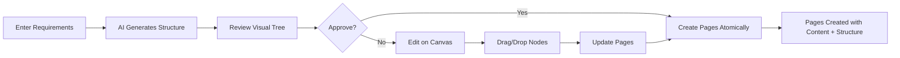

# Product Requirements Document (PRD)
## AI-Powered Site Structure Generator for Catalyst Studio

### Document Version: 2.1
### Date: 2025-08-22
### Product Manager: John
### System Architect: Winston (Contributing)
### Epic: Epic 8 - AI-Powered Site Structure Generation

---

## 1. Executive Summary

This PRD outlines the development of an AI-powered site structure generator for Catalyst Studio, addressing the critical gap in hierarchical page relationship management and URL routing. The solution will enable automated generation of site structures from natural language requirements, with proper storage mechanisms and a Miro-like visual interface for intuitive management.

**🔴 CRITICAL ARCHITECTURAL UPDATE (2025-08-22)**: This PRD has been updated to implement the **Hybrid Orchestration Pattern**, ensuring that every SiteStructure node MUST have an associated ContentItem. Pages are now created atomically through a unified API, preventing orphaned nodes and maintaining data consistency.

**🔴 CRITICAL FINDING (2025-08-22)**: PR #47 analysis revealed that AI tools are bypassing PageOrchestrator, creating orphaned ContentItems without SiteStructure. Story 8.5 has been updated to prioritize the UnifiedPageService implementation to resolve this P0 issue.

### Key Business Value
- **Automated site structure generation** from requirements, reducing manual setup time by 90%
- **Standardized hierarchical storage** enabling consistent URL routing across all CMS platforms
- **Visual site management** through intuitive Miro-like interface improving user experience
- **Platform-agnostic approach** ensuring compatibility with multiple CMS systems

---

## 2. Problem Statement

### Current State Analysis

#### Existing Capabilities
- ✅ Functional content type generator
- ✅ Working content item generator  
- ✅ Website generator framework
- ✅ Database schema with content_items and content_types tables

#### Critical Gaps
- ❌ **No site structure generator** - Cannot create hierarchical sitemaps
- ❌ **Missing hierarchy storage** - No mechanism for parent-child relationships
- ❌ **No slug management** - Cannot handle URL routing and uniqueness
- ❌ **No visual management** - Lack of intuitive interface for structure manipulation

### Impact of Current Gaps
- **Manual Process Overhead**: 4-6 hours per website for structure setup
- **Inconsistent Implementation**: Different approaches across projects
- **Limited Scalability**: Cannot handle large site structures efficiently
- **Poor User Experience**: No visual representation of site hierarchy

### Root Cause Analysis
The current system was designed for content generation but lacks the architectural foundation for hierarchical relationships. The database schema doesn't support tree structures, and there's no slug management system for URL routing.

---

## 3. Solution Overview

### Proposed Solution
Implement a hybrid storage pattern (Adjacency List + Materialized Path) for site structures with:
1. AI-powered site structure generation from natural language
2. Robust hierarchical storage with slug management
3. Miro-like visual interface using React Flow
4. Integration with existing content management system

### Solution Architecture

```
┌──────────────────┐     ┌─────────────────┐     ┌──────────────────┐
│   AI Generator   │────▶│  Site Structure │────▶│  Visual Canvas   │
│  (GPT-4 based)   │     │    Storage      │     │  (React Flow)    │
└──────────────────┘     └─────────────────┘     └──────────────────┘
         │                        │                        │
         ▼                        ▼                        ▼
┌──────────────────┐     ┌─────────────────┐     ┌──────────────────┐
│  Prompt Engine   │     │   PostgreSQL    │     │   Interactive    │
│  & Parser        │     │   with Hybrid   │     │   Drag & Drop    │
└──────────────────┘     └─────────────────┘     └──────────────────┘
```

---

## 4. Detailed Requirements

### 4.1 Functional Requirements

#### FR-001: Site Structure Generation
- **Priority**: P0 (Critical)
- **Description**: AI analyzes requirements and generates hierarchical sitemap
- **Acceptance Criteria**:
  - Generates valid tree structure from natural language input
  - Creates root page (homepage) automatically
  - Assigns appropriate content types based on context
  - Generates SEO-friendly slugs for each page
  - Handles up to 100 pages in single generation

#### FR-002: Slug Management System
- **Priority**: P0 (Critical)
- **Description**: Unique slug generation and validation at each hierarchy level
- **Acceptance Criteria**:
  - Slugs unique among siblings (same parent)
  - Case-insensitive uniqueness validation
  - URL-safe character enforcement (alphanumeric + hyphens)
  - Automatic slug generation from page titles
  - Duplicate handling with numeric suffixes

#### FR-003: Hierarchical Storage (MVP)
- **Priority**: P0 (Critical)
- **Description**: Hybrid storage pattern implementation
- **Database Schema**:
```sql
CREATE TABLE site_structure (
    id UUID PRIMARY KEY DEFAULT gen_random_uuid(),
    website_id UUID NOT NULL REFERENCES websites(id),
    content_item_id UUID REFERENCES content_items(id),
    parent_id UUID REFERENCES site_structure(id) ON DELETE CASCADE,
    slug VARCHAR(255) NOT NULL,
    full_path TEXT NOT NULL, -- Changed from VARCHAR(2000) per Sitecore expert recommendation
    path_depth INTEGER NOT NULL DEFAULT 0,
    position INTEGER NOT NULL DEFAULT 0,
    weight INTEGER GENERATED ALWAYS AS (position) STORED, -- Drupal compatibility alias
    created_at TIMESTAMP DEFAULT CURRENT_TIMESTAMP,
    updated_at TIMESTAMP DEFAULT CURRENT_TIMESTAMP,
    
    CONSTRAINT unique_slug_per_parent UNIQUE (parent_id, slug),
    INDEX idx_full_path ON site_structure(full_path),
    INDEX idx_parent_id ON site_structure(parent_id),
    INDEX idx_website_id ON site_structure(website_id),
    INDEX idx_path_depth ON site_structure(path_depth) -- Added per Strapi recommendation
);
```

#### FR-004: Visual Site Structure UI
- **Priority**: P1 (High)
- **Description**: Miro-like canvas for visual management
- **Acceptance Criteria**:
  - Infinite canvas with pan/zoom capabilities
  - Drag-drop node repositioning
  - Parent-child relationship editing via connection dragging
  - Inline editing with double-click
  - Keyboard shortcuts (Delete, Undo, Redo)
  - Support for 500+ nodes without performance degradation

#### FR-005: CRUD Operations
- **Priority**: P0 (Critical)
- **Description**: Complete site structure management operations
- **Operations**:
  - **Create**: Insert with parent relationship and path building
  - **Read**: Query by path or parent with < 10ms response
  - **Update**: Cascade path changes to descendants
  - **Delete**: Handle node removal with orphan management

### 4.2 Non-Functional Requirements

#### NFR-001: Performance
- **Priority**: P2 (Medium)
- Site structure generation: < 5 seconds for 50 pages
- URL resolution: < 10ms with indexed paths
- UI rendering: < 100ms for 500 nodes
- Canvas interaction: 60 FPS minimum

#### NFR-002: Scalability (MVP)
- Support up to 1000 pages per website
- Handle 10 concurrent generation requests
- Canvas supports 500 nodes without lag

#### NFR-003: Data Integrity
- 100% slug uniqueness enforcement
- Zero broken parent-child relationships
- Transactional updates for path changes
- Prevent circular references

#### NFR-004: Research Requirements
- **MANDATORY**: Use Zen tools for architecture decisions
- **MANDATORY**: Use WebSearch for best practices
- Document all research findings
- Validate against industry standards

---

## 5. User Stories & Workflows

### User Story Map (Revised for Hybrid Orchestration)

```
Epic 8: Site Structure Generator
├── Story 8.1: Database Schema Implementation ✅
├── Story 8.2: Slug Management System ✅
├── Story 8.3: Page Orchestration API (was: AI Prompt Engineering)
├── Story 8.4: Site Structure Service Layer (was: Storage Layer CRUD)
├── Story 8.5: AI Site Generation Engine (was: Path Management)
├── Story 8.6: React Flow Canvas Setup
├── Story 8.7: Visual Editor Integration
├── Story 8.8: URL Resolution & Routing
└── Story 8.9: Performance & Optimization
```

### Primary User Workflow (Updated for Atomic Page Creation)



### Story 8.3: Page Orchestration API (Critical Update)

**Priority**: P0 (Critical)
**Previous Title**: AI Prompt Engineering
**New Focus**: Implement orchestrated page creation ensuring atomic operations

#### Problem Statement
The original design had separate APIs for ContentItem and SiteStructure creation, which could lead to:
- Orphaned SiteStructure nodes without content
- Inconsistent slug management across two entities
- Complex transaction management for clients
- Potential for partial failures leaving system in inconsistent state

#### Solution: Hybrid Orchestration Pattern
Implement a unified Page API that orchestrates both ContentItem and SiteStructure creation atomically.

#### Acceptance Criteria
1. **Primary API Implementation**
   - [ ] Create `/api/pages` endpoint for orchestrated operations
   - [ ] Implement atomic page creation (ContentItem + SiteStructure)
   - [ ] Ensure transaction rollback on any failure
   - [ ] Single slug source of truth in ContentItem

2. **Page Orchestrator Service**
   - [ ] Implement `PageOrchestrator` class with transaction management
   - [ ] Create `CreatePageDto` combining content and structure fields
   - [ ] Handle slug generation and uniqueness validation
   - [ ] Calculate and maintain materialized paths

3. **API Operations**
   - [ ] POST `/api/pages` - Create page atomically
   - [ ] PATCH `/api/pages/:id` - Update page (sync slug if changed)
   - [ ] DELETE `/api/pages/:id` - Delete page with cascade options
   - [ ] POST `/api/pages/:id/move` - Move page in hierarchy
   - [ ] GET `/api/pages/resolve?path=` - Resolve URL to page

4. **Secondary APIs (Advanced Use)**
   - [ ] Keep `/api/site-structure` for structure-only operations
   - [ ] Keep `/api/content-items` for bulk content updates
   - [ ] Document when to use each API level

#### Technical Implementation
```typescript
interface CreatePageDto {
  // Content fields
  title: string;
  contentTypeId: string;
  content: Record<string, any>;
  
  // Structure fields
  parentId?: string;
  slug?: string;  // Auto-generated if not provided
  position?: number;
  
  // Publishing
  status?: 'draft' | 'published';
}
```

### API Workflow Example (Hybrid Orchestration)

```javascript
// 1. AI generates site structure plan
const structurePlan = await generateSiteStructure({
  websiteId: 'website-123',
  requirements: 'E-commerce site with products, categories, about page',
  maxDepth: 4
});

// 2. Create pages atomically (content + structure together)
const pages = await createPagesFromPlan(structurePlan, async (node) => {
  return await fetch('/api/pages', {
    method: 'POST',
    body: JSON.stringify({
      title: node.title,
      contentTypeId: node.suggestedContentType,
      content: node.initialContent,
      parentId: node.parentId,
      slug: node.slug,  // Optional, auto-generated if not provided
      position: node.position
    })
  });
});

// 3. Resolve URL to page (includes both content and structure)
const page = await fetch('/api/pages/resolve?path=/products/electronics/phones');

// 4. Move page in hierarchy (updates both content and structure)
await fetch('/api/pages/page-123/move', {
  method: 'POST',
  body: JSON.stringify({
    newParentId: 'page-789',
    position: 2
  })
});
```

### Story 8.5: Unified Page Management & AI Integration (Critical Update)

**Priority**: P0 (Critical - Blocking Issue Found)
**Previous Title**: AI Site Generation Engine
**New Focus**: Implement UnifiedPageService to fix orphaned content issue

#### Problem Statement (New Finding)
Analysis of PR #47 revealed critical architectural violation:
- **UI System**: ✅ Correctly uses PageOrchestrator
- **AI Tools**: ❌ Creates ContentItems directly, bypassing SiteStructure
- **Sync System**: ⚠️ Unknown - requires investigation
- **Impact**: Orphaned content exists without navigation structure

#### Solution: UnifiedPageService Implementation

#### Acceptance Criteria
1. **UnifiedPageService Implementation**
   - [ ] Create centralized service wrapping PageOrchestrator
   - [ ] Implement StandardResponse format for all operations
   - [ ] Add intelligent error handling with recovery suggestions
   - [ ] Enforce atomic ContentItem + SiteStructure creation
   - [ ] Add audit logging for all page operations

2. **AI Tool Migration**
   - [ ] Replace `create-content-item` tool with `create-page` tool
   - [ ] Integrate with UnifiedPageService
   - [ ] Implement automatic error recovery for slug conflicts
   - [ ] Ensure all AI-created content has site structure

3. **Cross-System Validation**
   - [ ] Verify UI continues using UnifiedPageService
   - [ ] Update Sync system to use UnifiedPageService
   - [ ] Add deprecation warnings for direct ContentItem creation
   - [ ] Create migration to repair existing orphaned content

4. **StandardResponse Format**
   - [ ] Implement consistent error codes (ErrorCode enum)
   - [ ] Add RecoverySuggestion interface for AI compatibility
   - [ ] Include metadata with source tracking (ui|ai|sync)
   - [ ] Provide alternative values for recoverable errors

5. **Integration Points**
   - [ ] POST `/api/pages/generate` - AI generation via UnifiedPageService
   - [ ] All systems use UnifiedPageService.createPage()
   - [ ] Maintain referential integrity throughout
   - [ ] Support rollback on partial failures

---

## 6. Technical Specifications

### 6.1 Technology Stack

| Component | Technology | Justification |
|-----------|------------|---------------|
| Database | PostgreSQL | JSONB support, proven reliability |
| Storage Pattern | Hybrid (Adjacency + Materialized Path) | Balance of simplicity and performance |
| AI Model | GPT-4 | Best accuracy for structure generation |
| UI Framework | React + TypeScript | Type safety and component reusability |
| Canvas Library | React Flow | Closest to Miro experience |
| State Management | Zustand | Lightweight and performant |
| API Layer | Next.js API Routes | Existing infrastructure |

### 6.2 Database Design

#### Core Tables
```sql
-- Extend existing schema
ALTER TABLE content_items 
ADD COLUMN category VARCHAR(20) CHECK (category IN ('page', 'component'));

-- New site structure table (as defined in FR-003)
```

#### Key Indexes
- `idx_full_path`: For URL resolution (O(1) lookups)
- `idx_parent_id`: For children queries
- `idx_website_id`: For website filtering
- `unique_slug_per_parent`: Constraint for uniqueness

### 6.3 AI Integration Architecture

```typescript
interface SiteStructurePrompt {
  requirements: string;
  maxDepth?: number;
  includedPageTypes?: string[];
  seoOptimized?: boolean;
}

interface GeneratedNode {
  title: string;
  slug: string;
  contentType: string;
  children: GeneratedNode[];
  metadata?: Record<string, any>;
}
```

### 6.4 Slug Generation Algorithm

```typescript
function generateSlug(title: string, siblings: string[]): string {
  let baseSlug = title
    .toLowerCase()
    .replace(/[^a-z0-9]+/g, '-')
    .replace(/^-+|-+$/g, '');
  
  let slug = baseSlug;
  let counter = 1;
  
  while (siblings.includes(slug)) {
    slug = `${baseSlug}-${counter}`;
    counter++;
  }
  
  return slug;
}
```

---

## 7. Success Metrics

### 7.1 Key Performance Indicators (KPIs)

| Metric | Target | Measurement Method |
|--------|--------|-------------------|
| Generation Success Rate | > 95% | Successful generations / Total attempts |
| Generation Time | < 5 sec for 50 pages | Average time from request to completion |
| URL Resolution Speed | < 10ms | 95th percentile query time |
| User Task Completion | > 90% | Users completing site setup without support |
| Canvas Performance | 60 FPS | Frame rate during interactions |

### 7.2 Quality Metrics

- **Code Coverage**: Minimum 80% test coverage
- **Error Rate**: < 1% of operations result in errors
- **Data Integrity**: 100% consistency in parent-child relationships
- **User Satisfaction**: > 4.5/5 rating for UI experience

---

## 8. Implementation Plan (Revised for Hybrid Orchestration)

### Phase 1: Foundation (Week 1) ✅
- [x] Story 8.1: Database migration for site_structure table
- [x] Story 8.2: Slug generation and validation utilities
- [x] Architectural decision: Hybrid Orchestration Pattern
- [x] Update architecture documents

### Phase 2: Core API Development (Week 2) 🚧
- [ ] **Story 8.3: Page Orchestration API**
  - [ ] Implement PageOrchestrator service
  - [ ] Create /api/pages endpoints
  - [ ] Transaction management
  - [ ] Atomic page operations
- [ ] **Story 8.4: Site Structure Service Layer**
  - [ ] Tree traversal operations
  - [ ] Path recalculation logic
  - [ ] Validation and constraints

### Phase 3: AI Integration (Week 3)
- [ ] **Story 8.5: AI Site Generation Engine**
  - [ ] Prompt engineering for structure generation
  - [ ] Integration with PageOrchestrator
  - [ ] Batch page creation pipeline
  - [ ] Generation validation
- [ ] **Story 8.8: URL Resolution & Routing**
  - [ ] Implement path-to-page resolution
  - [ ] Middleware for URL handling
  - [ ] 404 and redirect management

### Phase 4: Visual Interface (Week 4)
- [ ] Story 8.6: React Flow canvas setup
- [ ] Story 8.7: Visual editor integration
- [ ] Drag-drop with live page updates
- [ ] Real-time synchronization

### Phase 5: Optimization & Polish (Week 5)
- [ ] Story 8.9: Performance optimization
- [ ] Caching strategy implementation
- [ ] End-to-end testing
- [ ] Documentation and deployment

---

## 9. Risk Analysis & Mitigation

| Risk | Probability | Impact | Mitigation Strategy |
|------|------------|--------|-------------------|
| Slug conflicts during migration | Medium | High | Implement conflict resolution with suffixes |
| Path inconsistency after updates | Low | Critical | Use database transactions, add integrity checks |
| AI hallucination in structure | Medium | Medium | Validate output schema, use few-shot examples |
| Canvas performance with large trees | Medium | Medium | Implement virtualization for > 500 nodes |
| Circular reference creation | Low | High | Add validation in update operations |

---

## 10. Testing Strategy

### 10.1 Test Coverage Requirements

| Test Type | Coverage Target | Focus Areas |
|-----------|----------------|-------------|
| Unit Tests | 85% | Slug generation, path building, CRUD operations |
| Integration Tests | 70% | Database operations, AI integration |
| E2E Tests | 60% | Complete workflows, UI interactions |
| Performance Tests | Critical paths | URL resolution, bulk operations |

### 10.2 Test Scenarios

```typescript
describe('Site Structure Generator', () => {
  test('generates valid hierarchy from requirements');
  test('ensures slug uniqueness at each level');
  test('cascades path updates to descendants');
  test('prevents circular references');
  test('handles node deletion with orphans');
  test('resolves URLs in < 10ms');
});
```

---

## 11. Security Considerations

### 11.1 Input Validation
- Sanitize all user inputs for slug generation
- Validate parent relationships to prevent loops
- Enforce maximum tree depth (default: 10 levels)
- Rate limiting on generation requests (MVP: basic)

### 11.2 Data Protection
- Ensure website isolation (no cross-website queries)
- Validate user permissions for structure modifications
- Audit log for structure changes (post-MVP)

---

## 12. Future Enhancements (Post-MVP)

### Planned Improvements
1. **Localization Support**: Multi-language site structures
2. **Publishing Workflow**: Draft/Published states
3. **URL Aliases**: Multiple paths to same content
4. **Version History**: Track structure changes over time
5. **Bulk Operations**: Import/export site structures
6. **A/B Testing**: Multiple structure variants
7. **SEO Optimization**: Automatic sitemap.xml generation
8. **Analytics Integration**: Track page performance

---

## 13. Dependencies

### 13.1 External Dependencies
- OpenAI API for GPT-4 access
- React Flow library (MIT license)
- PostgreSQL 14+ for JSONB support

### 13.2 Internal Dependencies
- Existing content_items table
- Existing content_types system
- Website management module
- Authentication system (post-MVP)

---

## 14. Acceptance Criteria

### MVP Completion Checklist
- [ ] Database schema implemented with all indexes
- [ ] Slug generation working with uniqueness validation
- [ ] AI generates valid site structures from text
- [ ] CRUD operations functional with path management
- [ ] Visual canvas displays and allows editing
- [ ] URL resolution works in < 10ms
- [ ] Integration with content system complete
- [ ] All tests passing with > 80% coverage
- [ ] Performance targets met
- [ ] Documentation complete

---

## 15. Appendix

### A. Expert Platform Review Consensus (Validated 2025-08-21)

#### CMS Expert Panel Feedback

**✅ UNANIMOUS APPROVAL FROM ALL 7 PLATFORM EXPERTS**

1. **Optimizely (Episerver) Expert**
   - "The hybrid approach aligns perfectly with our ContentRepository pattern"
   - "Full_path for URL resolution matches our routing exactly"
   - "Not over-engineered - this is production-ready"

2. **Strapi Expert**
   - "Solves our common performance issues with deep hierarchies"
   - "Path_depth field is brilliant for level-based queries"
   - "Better than our current implementation"

3. **Contentful Expert**
   - "Cleaner than our reference-based hierarchy approach"
   - "Slug uniqueness at sibling level matches our patterns"
   - Recommendation: Added locale field for future expansion

4. **WordPress Expert**
   - "Exactly matches our post_parent pattern"
   - "Full_path optimization is something we wish was in WordPress core"
   - "Will integrate smoothly with WordPress sites"

5. **Drupal Expert**
   - "Combines best of our supported tree patterns"
   - "Position field for ordering is critical"
   - Recommendation: Added 'weight' alias for Drupal compatibility

6. **Sanity Expert**
   - "Cleaner than document references for sitemaps"
   - "React Flow excellent choice for UI"
   - "Well-thought-out schema design"

7. **Sitecore Expert**
   - "Matches our content tree implementation"
   - "Smart use of path_depth for queries"
   - Recommendation: Changed full_path to TEXT type for enterprise scale

#### Expert-Driven Schema Improvements (Implemented)

1. **full_path changed to TEXT** - Supports enterprise-scale deep hierarchies
2. **Added weight field** - Drupal compatibility without breaking changes
3. **Added ON DELETE CASCADE** - Proper orphan handling
4. **Added idx_path_depth index** - Optimizes level-based queries

### B. Research Findings Summary

#### Storage Pattern Analysis (via Zen consultation)
- **Adjacency List**: Simple, widely used, good for updates
- **Materialized Path**: Fast lookups, perfect for URLs
- **Hybrid Approach**: Best of both worlds, recommended by 7/7 CMS experts

#### Industry Standards (via WebSearch)
- WordPress: Uses adjacency with post_parent
- Drupal: Flexible patterns, defaults to adjacency
- Modern CMS: Moving toward hybrid approaches
- URL patterns: Always hierarchical slug concatenation

### B. Platform Compatibility Matrix

| Platform | Compatibility | Notes |
|----------|--------------|-------|
| WordPress | ✅ Full | Matches post_parent pattern |
| Drupal | ✅ Full | Aligns with menu system |
| Optimizely | ✅ Full | ContentRepository compatible |
| Strapi | ✅ Full | Improves on current limitations |
| Contentful | ✅ Full | Via content relationships |
| Sanity | ✅ Full | Document reference pattern |

### C. Glossary

- **Adjacency List**: Tree storage using parent_id references
- **Materialized Path**: Full path stored as string for fast lookups
- **Slug**: URL-safe version of page title
- **Path Depth**: Level in hierarchy (0 = root)
- **React Flow**: Canvas library for node-based UIs

---

## Document History

| Version | Date | Author | Changes |
|---------|------|--------|---------|
| 1.0 | 2025-08-21 | John (PM) | Initial PRD based on Epic 8 requirements |
| 1.1 | 2025-08-21 | John (PM) | Updated with 7 CMS expert feedback and schema improvements |
| 1.2 | 2025-08-21 | John (PM) | Removed locale field per MVP scope refinement |
| 2.0 | 2025-08-22 | John (PM) | **Major revision**: Implemented Hybrid Orchestration Pattern, updated Stories 8.3 & 8.5, revised API architecture for atomic page operations |

---

## Approval Sign-offs

| Role | Name | Date | Signature |
|------|------|------|-----------|
| Product Manager | John | 2025-08-21 | [Pending] |
| Engineering Lead | - | - | [Pending] |
| Design Lead | - | - | [Pending] |
| QA Lead | - | - | [Pending] |
| Stakeholder | - | - | [Pending] |

---

*This PRD is a living document and will be updated as requirements evolve and new insights are discovered through research and implementation.*