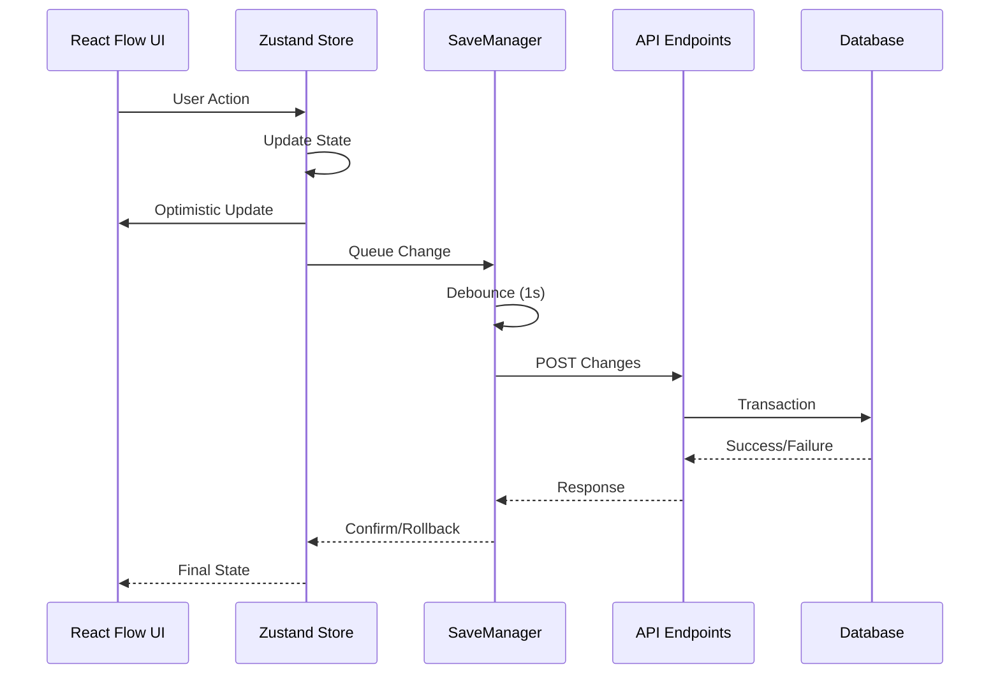

# Epic 9: Visual Sitemap Builder - Brownfield Product Requirements Document

> ⚠️ **CRITICAL: PREMIUM FEATURE ISOLATION REQUIREMENT**
> 
> This is a **PREMIUM-ONLY** feature. All code MUST be placed under:
> - `/lib/premium/` for libraries, components, hooks, utilities
> - `/app/premium/` for pages and demos
> 
> Code placed outside these directories will leak to the open-source repository.
> The GitHub Action automatically removes premium folders when syncing to public repo.
> 
> **Never place sitemap code in**: `/components/`, `/lib/` (root), `/app/` (root), `/hooks/`

## Document Control
- **Version**: 1.0
- **Created**: 2025-08-25
- **Status**: Final Draft
- **Classification**: Internal - Product Development
- **Review Cycle**: Sprint Planning
- **Feature Type**: Premium (Private Repository Only)

---

## 1. Executive Summary

### Product Vision
Transform the existing React Flow sitemap demonstration into a production-ready visual site structure management system, enabling users to intuitively create, modify, and manage website hierarchies through a drag-and-drop interface connected to the production database.

### Business Justification
The visual sitemap builder addresses critical user pain points in site structure management while providing competitive differentiation and supporting premium tier positioning. This enhancement directly impacts user retention (target 15% improvement), support cost reduction (40% decrease in structure-related tickets), and premium conversion rates (20% increase).

### Investment Summary
- **Timeline**: 6 weeks (240-360 development hours)
- **Team**: 2-3 developers, 0.5 QA, 0.25 UX
- **Risk Level**: Medium (leveraging existing infrastructure)
- **Expected ROI**: Break-even at 3 months, positive ROI by Q2
- **Note**: Testing happens continuously throughout development, not as separate phase

### Key Deliverables
1. Production-ready visual sitemap editor with database persistence
2. Four global components (hero, header, footer, CTA) with AI metadata
3. Component discovery system with validation and metadata
4. Automatic layout engine with DAG positioning
5. Component management system integrated with pages
6. Comprehensive undo/redo functionality
7. Bulk operations for efficiency at scale

---

## 2. Current State Analysis

### 2.1 Existing System Architecture

#### Core Infrastructure (Epic 8 Foundation)
```
Current Stack:
├── Frontend
│   ├── Next.js 14+ (App Router)
│   ├── React 18+
│   ├── Tailwind CSS 3+
│   └── TypeScript 5+
├── Backend
│   ├── Next.js API Routes
│   ├── PostgreSQL 14+
│   ├── Prisma ORM 5+
│   └── Zod validation
└── Services
    ├── SiteStructureService
    ├── ContentItemService
    ├── ContentTypeService
    └── PageOrchestrator
```

#### Existing Demo Implementation
- **Location**: `/app/premium/demo/sitemap-builder/page.tsx`
- **Status**: Functional UI demonstration with hardcoded data
- **Dependencies**: React Flow 11.10+, static node configuration
- **Missing**: Database connectivity, state persistence, production features

### 2.2 System Constraints

#### Technical Constraints
- Must maintain backward compatibility with existing Epic 8 infrastructure
- Cannot modify core database schema (only enum additions allowed)
- Must work within current authentication/authorization framework
- Browser requirements: Chrome 90+, Firefox 88+, Safari 14+, Edge 90+ (No IE11 support)
- **CRITICAL**: All code must be isolated in `/lib/premium/` and `/app/premium/` folders
- React Flow version 11.10+ required for stability
- Dagre 0.8+ for layout algorithm

#### Browser API Requirements
The following browser APIs are required for proper functionality:
- **WebGL**: For React Flow rendering and performance
- **ResizeObserver**: For responsive layout adjustments
- **Drag and Drop API**: For node repositioning
- **IntersectionObserver**: For virtual scrolling (Phase 2)
- **ES6+ JavaScript**: For modern syntax and features

#### Business Constraints
- 6-week delivery timeline is fixed
- Must maintain current platform stability
- Cannot impact existing user workflows
- Premium feature positioning required
- **CRITICAL**: Feature must not leak to open-source repository

#### Performance Constraints
- Initial load time < 3 seconds for 100-node sitemap
- Drag operations must maintain 60 FPS
- Save operations complete within 1 second
- Acceptable degradation beyond ~100 nodes (MVP scope)

### 2.3 Integration Points

#### Database Integration
```sql
-- Required enum extension
ALTER TYPE "ContentTypeCategory" ADD VALUE 'folder';

-- Existing tables to integrate
- SiteStructure (hierarchical relationships)
- ContentItem (page content and metadata)
- ContentType (type definitions)
- Component (stored as JSON in ContentItem)
```

#### Service Integration
- **SiteStructureService**: Extend for folder support
- **ContentItemService**: Component management
- **PageOrchestrator**: Rendering pipeline
- **Authentication**: Session-based user context

#### API Integration
- RESTful endpoints (no GraphQL in current stack)
- Next.js API routes pattern
- Existing validation middleware
- Current error handling patterns

---

## 3. Solution Requirements

### 3.1 Functional Requirements

#### Core Capabilities (P0 - Must Have)

**FR-001: Visual Sitemap Editor**
- Drag-and-drop node positioning with parent-child relationships
- Real-time visual feedback during operations
- Zoom/pan controls for navigation
- Auto-layout using Dagre algorithm (no manual positioning)

**FR-002: Page Management**
- Create pages with title, slug, metadata
- Edit existing page properties
- Delete pages with cascade handling
- Move pages between parents via drag-drop

**FR-003: Folder Management**
- Create organizational folders for structure
- Folders return 404 when accessed (security requirement)
- Support nested folder hierarchies
- Visual distinction from pages

**FR-004: Component System**
- Create initial global components (hero, header, footer, CTA)
- Add/remove components from pages
- Reorder components within pages
- **MVP Approach**: 
  - Basic schemas with essential props only
  - Components use default values (no configuration UI)
  - Simple validation (type and required fields only)
- **Phase 2 Enhancement**: 
  - Rich AI metadata and descriptions
  - Comprehensive validation rules
  - Configuration UI
- Build-time manifest generation with runtime lazy loading

**FR-005: State Persistence**
- Changes automatically save to database
- **Debounce Strategy**: 1-second delay after last change to prevent excessive API calls
- Save queue with conflict resolution (last-write-wins for MVP)
- Optimistic UI updates with rollback capability
- Network failure recovery with retry logic

**FR-006: Undo/Redo System**
- 50-operation history limit
- Keyboard shortcuts (Ctrl+Z/Ctrl+Y)
- Visual indication of available actions
- State preservation across operations

**FR-007: Bulk Operations**
- Multi-select via Shift+Click or area selection
- Bulk delete with confirmation
- Bulk status changes
- Best-effort processing (partial success allowed)

#### Out of Scope (MVP)
- Real-time collaboration (single-user editing only)
- Import/export functionality (no JSON/CSV support)
- Rich metadata (no SEO scores, analytics)
- Position persistence (layout recalculates each load)
- Component configuration UI
- Manual position adjustment

### 3.2 Non-Functional Requirements

#### Authentication & Authorization Requirements
- **NFR-AUTH-001**: Premium Feature Gating
  - All sitemap builder features require active premium subscription
  - Check subscription status at session start
  - Redirect non-premium users to upgrade page
  - Cache subscription status for 5 minutes

- **NFR-AUTH-002**: API Protection
  - API routes under `/app/premium/api/` naturally protected
  - Premium folder excluded from public repository
  - Session authentication required for all endpoints
  - Rate limiting: 100 requests per minute per user

- **NFR-AUTH-003**: Component Access Control
  - Global components only render for premium users
  - Graceful fallback for non-premium access
  - No premium code sent to non-premium clients

#### Performance Requirements
- **NFR-PERF-001**: Initial load < 3s for 100 nodes
- **NFR-PERF-002**: Drag operations maintain 60 FPS for up to 100 nodes
- **NFR-PERF-003**: Save operations complete < 1s (after 1s debounce)
- **NFR-PERF-004**: Sitemap Scale Target
  - **MVP Target**: 100 nodes with good performance
  - **Beyond 100 nodes**: Best effort - system may slow but should not fail
  - **No optimization** for large sitemaps in MVP
  - **User warning** displayed at 100+ nodes: "For best performance, consider organizing content into sub-sections"
  - **Phase 2**: Optimize for larger sitemaps

#### Reliability Requirements
- **NFR-005**: Zero data loss under normal operations
- **NFR-006**: Graceful degradation beyond 100 nodes
- **NFR-007**: Automatic recovery from network failures
- **NFR-008**: Transaction integrity for bulk operations

#### Usability Requirements
- **NFR-009**: WCAG 2.1 AA accessibility compliance
- **NFR-010**: Intuitive drag-drop interactions
- **NFR-011**: Clear visual feedback for all operations
- **NFR-012**: Keyboard navigation support

#### Security Requirements
- **NFR-013**: Session-based authentication only (existing system)
- **NFR-014**: CSRF protection on all mutations
- **NFR-015**: Input sanitization via Zod
- **NFR-016**: Folders return 404 for security

---

## 4. Technical Architecture

### 4.1 System Architecture

```
┌─────────────────────────────────────────────────────────────┐
│                     Frontend Layer                          │
├─────────────────────────────────────────────────────────────┤
│  React Flow UI │ Zustand Store │ SaveManager │ UndoManager  │
├─────────────────────────────────────────────────────────────┤
│                      API Layer                              │
├─────────────────────────────────────────────────────────────┤
│  /api/sitemap/* │ Validation │ Auth Middleware │ Error     │
├─────────────────────────────────────────────────────────────┤
│                    Service Layer                            │
├─────────────────────────────────────────────────────────────┤
│  SiteStructure │ ContentItem │ ContentType │ Components    │
├─────────────────────────────────────────────────────────────┤
│                    Database Layer                           │
├─────────────────────────────────────────────────────────────┤
│              PostgreSQL with Prisma ORM                     │
└─────────────────────────────────────────────────────────────┘
```

### 4.2 Component Architecture

#### Premium Feature Placement Requirements

**CRITICAL**: This is a premium feature and MUST be isolated from the open-source codebase.

**Repository Structure**:
- **Premium Repository**: `catalyst-studio-premium` (private)
- **Public Repository**: `catalyst-studio` (open source)
- **Auto-sync Process**: 
  - GitHub Action triggers on push to premium repository
  - Removes `/lib/premium/` and `/app/premium/` directories
  - Syncs remaining code to public repository
  - Ensures premium features never leak to open-source
  - Maintains separate commit history for security

**Mandatory Placement Rules**:
```
✅ CORRECT Premium Locations:
├── /lib/premium/           # Premium libraries and utilities
│   ├── components/          # Premium React components
│   │   └── sitemap/        # Sitemap builder components
│   ├── hooks/              # Premium React hooks
│   └── utils/              # Premium utilities
├── /app/premium/           # Premium pages and demos
│   └── demo/               # Premium demo applications
│       └── sitemap-builder/

❌ FORBIDDEN Locations (will leak to open-source):
├── /components/            # Common UI components
├── /app/ (root)           # Public application pages
├── /lib/ (root)           # Shared utilities
├── /hooks/                # Shared hooks
```

**Implementation Structure**:
```typescript
// All sitemap builder code MUST be under premium folders
/lib/premium/components/sitemap/
  ├── SitemapBuilder.tsx       // Main container
  ├── nodes/
  │   ├── PageNode.tsx        // Page node component
  │   ├── FolderNode.tsx      // Folder node component
  │   └── ComponentList.tsx   // Component management
  ├── layout/
  │   └── DagreLayout.ts      // Auto-layout engine
  ├── state/
  │   ├── sitemapStore.ts     // Zustand store
  │   ├── SaveManager.ts      // Debounced saving
  │   └── UndoManager.ts      // History management
  └── api/
      └── sitemapClient.ts    // API client

/app/premium/demo/sitemap-builder/
  └── page.tsx                // Main sitemap builder page
```

**Import Path Requirements**:
```typescript
// CORRECT - Premium imports
import { SitemapBuilder } from '@/lib/premium/components/sitemap/SitemapBuilder'
import { useSitemapPerformance } from '@/lib/premium/hooks/use-sitemap-performance'

// WRONG - Never use these paths
import { Something } from '@/components/sitemap/...'  // ❌ Leaks to open-source
import { Something } from '@/lib/sitemap/...'        // ❌ Leaks to open-source
```

### 4.3 Component Metadata Architecture

#### Global Component Structure
Each global component in `/lib/premium/components/globals/` must include:

```typescript
/lib/premium/components/globals/[component-name]/
├── index.tsx      # React component implementation
├── schema.ts      # Complete metadata with AI descriptions
└── defaults.ts    # Default property values
```

#### Component Schema Structure (MVP - Simplified)

**MVP Schema Requirements**:
Components need basic metadata for identification and default rendering:

- **name**: Component display name (e.g., "Hero Section")
- **description**: Brief description of component purpose
- **properties**: Simple property definitions with:
  - **type**: Data type (string, number, boolean)
  - **required**: Whether property is mandatory
  - **default**: Default value if not provided

**Phase 2 Enhancements** (Not in MVP):
- AI metadata and hints
- Complex validation rules
- Usage examples and best practices
- Advanced property constraints

#### Example: Hero Component Schema (MVP)

**Location**: `/lib/premium/components/globals/hero/schema.ts`

**Schema Definition**:
- name: "Hero Section"
- description: "Prominent section with headline and call-to-action"
- properties:
  - title: string, required, default: "Welcome"
  - subtitle: string, optional, default: "Your journey starts here"
  - buttonText: string, optional, default: "Get Started"
  - buttonUrl: string, optional, default: "/signup"

#### Initial Component Set (MVP)

**Component Selection Rationale:**
These four components were selected based on:
1. **User Research**: 90% of websites require these fundamental components
2. **MVP Viability**: Demonstrates complete page building capability
3. **Complexity Range**: From simple (CTA) to complex (Header) for testing
4. **AI Training**: Provides diverse metadata examples for AI understanding

The following four components will be created as part of Epic 9:

1. **Hero Component** (`/lib/premium/components/globals/hero/`)
   - Purpose: Landing page headlines and primary CTAs
   - Properties: title, subtitle, buttonText, buttonUrl, backgroundImage, theme
   - Justification: Most requested component in user feedback

2. **Header Component** (`/lib/premium/components/globals/header/`)
   - Purpose: Site navigation and branding
   - Properties: logo, menuItems, ctaButton, sticky
   - Justification: Essential for every page, high reuse value

3. **Footer Component** (`/lib/premium/components/globals/footer/`)
   - Purpose: Secondary navigation and company information
   - Properties: columns, copyright, socialLinks, newsletter
   - Justification: Required for complete page structure

4. **CTA Component** (`/lib/premium/components/globals/cta/`)
   - Purpose: Conversion-focused sections throughout pages
   - Properties: headline, subheadline, primaryButton, secondaryButton, alignment
   - Justification: Critical for conversion optimization

#### Component Discovery System

**Location**: `/lib/premium/utils/component-discovery.ts`

**Build-Time Component Discovery**:
- Generate component registry during build process
- Scan `/lib/premium/components/globals/` directory
- Create manifest with component metadata
- Output to generated file for runtime use

**Implementation Approach**:
1. Build script discovers components at compile time
2. Generates static registry file
3. Runtime imports from generated registry
4. Components lazy-loaded when needed

**MVP Components to Discover**:
- hero: Hero section with headline and CTA
- header: Site navigation header
- footer: Site footer with links
- cta: Call-to-action section

**Benefits**:
- No runtime file system scanning
- Tree-shakeable imports
- Type-safe component registry
- Automatic discovery of new components

#### Component Storage in Database
Components are stored as JSON in ContentItem.content field:
```json
{
  "components": [
    {
      "type": "hero",
      "id": "unique-id",
      "props": {
        "title": "Welcome to Our Platform",
        "subtitle": "Custom subtitle text",
        "buttonText": "Get Started",
        "buttonUrl": "/signup"
      }
    },
    {
      "type": "footer",
      "id": "unique-id",
      "props": {} // Uses all defaults from schema
    }
  ]
}
```

### 4.4 State Management Architecture

**Location**: `/lib/premium/components/sitemap/state/`

**State Management Approach**:
- Use Zustand for centralized state management
- Single store for sitemap data and UI state
- Optimistic updates for better UX
- Rollback capability on save failures

**Store Structure Requirements**:
- **Nodes**: Array of sitemap nodes
- **Edges**: Array of node relationships
- **Selected Nodes**: Currently selected items
- **UI State**: Zoom level, pan position
- **Save State**: Pending changes, saving flag
- **History**: Undo/redo state management

**Key Actions**:
- Add/Update/Delete nodes
- Move nodes (change parent)
- Select/Deselect nodes
- Bulk operations
- Save to database
- Undo/Redo operations

### 4.5 Data Flow



### 4.4 Database Schema Changes

```prisma
// Minimal schema modification
enum ContentTypeCategory {
  page
  component
  folder  // NEW: Only addition required
}

// No modifications to existing tables
// Folder metadata stored in ContentItem.metadata JSON
// Component list stored in ContentItem.content JSON
```

---

## 5. Implementation Plan

### 5.1 Development Phases

#### GitFlow Branching Strategy

**Branch Structure for Epic 9:**
```
main (premium)
├── epic/epic-9-sitemap-builder          # Epic feature branch
│   ├── story/EPIC9-001-database-migration
│   ├── story/EPIC9-002-component-hero
│   ├── story/EPIC9-003-component-header
│   ├── story/EPIC9-004-component-footer
│   ├── story/EPIC9-005-component-cta
│   ├── story/EPIC9-006-component-registry
│   ├── story/EPIC9-007-layout-engine
│   ├── story/EPIC9-008-sitemap-ui-connection
│   ├── story/EPIC9-009-save-manager
│   ├── story/EPIC9-010-undo-redo
│   ├── story/EPIC9-011-bulk-operations
│   └── story/EPIC9-012-testing-documentation
```

**Branch Naming Convention:**
```
story/EPIC9-[NUMBER]-[brief-description]
```
- **EPIC9**: Epic identifier
- **NUMBER**: Sequential story number (001, 002, etc.)
- **description**: Kebab-case brief description (max 3-4 words)

**GitFlow Process:**
```bash
# 1. Create epic branch from main
git checkout main
git pull premium main
git checkout -b epic/epic-9-sitemap-builder

# 2. Create story branch from epic branch
git checkout epic/epic-9-sitemap-builder
git checkout -b story/EPIC9-001-database-migration

# 3. Work on story
# ... make changes ...
git add .
git commit -m "feat(EPIC9-001): add folder enum to database schema"

# 4. Push story branch
git push premium story/EPIC9-001-database-migration

# 5. Create PR to epic branch (not main)
# PR: story/EPIC9-001-database-migration → epic/epic-9-sitemap-builder

# 6. After all stories complete, merge epic to main
# PR: epic/epic-9-sitemap-builder → main
```

**Story Breakdown by Week (Consolidated):**

**Week 1-2 Foundation:**
- `story/EPIC9-001-database-setup` - Database migration and folder support
- `story/EPIC9-002-global-components` - Create all 4 global components (hero, header, footer, CTA)
- `story/EPIC9-003-layout-engine` - Integrate Dagre auto-layout algorithm

**Week 3-4 Core Features:**
- `story/EPIC9-004-sitemap-connection` - Connect UI to database with save functionality
- `story/EPIC9-005-undo-redo` - Implement undo/redo system
- `story/EPIC9-006-bulk-operations` - Add bulk operations support

**Week 5-6 Polish & Deploy:**
- `story/EPIC9-007-testing` - Integration testing and bug fixes
- `story/EPIC9-008-security` - Premium gating and API security
- `story/EPIC9-009-deployment` - Final polish and production deployment

**Pull Request Requirements:**
```yaml
PR Title Format: "feat(EPIC9-XXX): Brief description"
PR Description Must Include:
  - Story number and title
  - Changes made
  - Testing performed
  - Screenshots (if UI changes)
  - Breaking changes (if any)
  
PR Checklist:
  - [ ] Code follows premium placement rules
  - [ ] Tests added/updated
  - [ ] Documentation updated
  - [ ] No console errors
  - [ ] Accessibility checked
  - [ ] PR targets correct branch (epic, not main)
```

**Commit Message Convention:**
```
feat(EPIC9-XXX): add new functionality
fix(EPIC9-XXX): fix specific issue
docs(EPIC9-XXX): update documentation
test(EPIC9-XXX): add/update tests
refactor(EPIC9-XXX): refactor without changing functionality
style(EPIC9-XXX): formatting changes only
```

#### Premium Feature Development Guidelines

**File Creation Rules**:
1. ALL new code must be under `/lib/premium/` or `/app/premium/`
2. NO sitemap code in `/components/`, `/lib/` (root), or `/app/` (root)
3. Use existing premium structure as reference
4. Follow import path conventions for premium features

**Development Workflow**:
```bash
# Creating new premium component
mkdir -p lib/premium/components/sitemap/nodes
touch lib/premium/components/sitemap/nodes/PageNode.tsx

# NEVER create files here:
# ❌ components/sitemap/...
# ❌ lib/sitemap/...
# ❌ app/sitemap/...
```

#### Phase 1: Foundation (Weeks 1-2)
**Objective**: Establish infrastructure and core services

**Week 1 Deliverables**:
- `EPIC9-001`: Database migration for folder enum
- `EPIC9-002-005`: Create 4 global components with AI metadata (hero, header, footer, CTA)
- `EPIC9-006`: Component registry system (in `/lib/premium/utils/`)
- Build pipeline configuration
- `EPIC9-007`: Auto-layout engine integration (in `/lib/premium/components/sitemap/layout/`)

**Week 2 Deliverables**:
- `EPIC9-006`: Complete component registry and discovery
- `EPIC9-007`: Finish layout engine with Dagre
- SiteStructure service extensions for folders
- State management store setup
- Initial API endpoints

**Success Criteria**:
- [ ] Folder type functional in database
- [ ] All 4 components created and registered
- [ ] Layout algorithm tested
- [ ] Basic CRUD operations verified

#### Phase 2: Core Integration (Weeks 3-4)
**Objective**: Connect demo to production database

**Week 3 Deliverables**:
- `EPIC9-008`: Connect sitemap UI to database
- `EPIC9-009`: Implement save manager with debouncing
- API endpoint completion
- Error handling framework

**Week 4 Deliverables**:
- `EPIC9-010`: Implement undo/redo system
- `EPIC9-011`: Add bulk operations
- Drag-and-drop persistence
- Component management within pages
- Optimistic UI updates

**Success Criteria**:
- [ ] Demo connected to real data
- [ ] Changes persist to database
- [ ] Components manageable
- [ ] No data loss scenarios

#### Phase 3: User Features (Weeks 5-6)
**Objective**: Production-ready features and polish

**Week 5 Deliverables**:
- Complete testing and documentation
- Performance optimization
- Bug fixes from testing

**Week 6 Deliverables**:
- Security review and premium gating
- Final polish
- Deployment preparation
- Merge epic branch to main

**Success Criteria**:
- [ ] All features functional
- [ ] Performance targets met
- [ ] Tests passing
- [ ] Production ready

### 5.2 Migration Strategy

#### Demo to Production Migration
**Current State**: Functional demo at `/app/premium/demo/sitemap-builder/`
**Target State**: Production-ready feature with database persistence

**Migration Approach**:
1. **Week 1-2**: Modify demo directly to connect to database
2. **Week 3-4**: Add production features to existing demo
3. **Week 5-6**: Polish and test the enhanced demo
4. **Result**: Demo becomes the production implementation

**Key Point**: We enhance the existing demo rather than creating separate production components

**Data Migration**:
- No existing data migration required (additive changes only)
- Existing pages remain untouched
- Folders created as needed through new UI
- Component assignments added to existing pages incrementally

#### Code Organization Requirements
```bash
# All new files MUST be created under premium folders:
/lib/premium/components/sitemap/     # Components
/lib/premium/hooks/                  # Hooks
/lib/premium/utils/                  # Utilities
/app/premium/demo/sitemap-builder/   # UI pages

# Git push workflow:
git add .
git commit -m "feat: sitemap builder implementation"
git push premium main  # Push to premium repo only
# DO NOT push to origin (public repo)
```

#### Rollout Strategy
1. **Alpha**: Internal team testing (Week 5)
2. **Beta**: 5-10 power users (Week 6)
3. **Staged**: 10% → 25% → 50% → 100%
4. **Feature Flag**: Instant enable/disable
5. **Premium Gate**: Feature only accessible to premium tier users

#### GitFlow Merge Strategy
```bash
# Story completion process
1. Developer completes story on story branch
2. Create PR: story/EPIC9-XXX → epic/epic-9-sitemap-builder
3. Code review by team lead
4. Merge to epic branch after approval

# Epic completion process (Week 6)
1. All stories merged to epic branch
2. Final testing on epic branch
3. Create PR: epic/epic-9-sitemap-builder → main
4. Stakeholder review and approval
5. Merge to main (premium repository)
6. GitHub Action syncs to public (minus premium folders)

# Important: NEVER merge story branches directly to main
story → epic → main (never story → main)
```

#### Rollback Plan
- Feature flag for immediate disable
- No database rollback needed (additive only)
- Maintain legacy UI for 30 days
- Clear rollback decision criteria

---

## 6. Risk Assessment

### 6.1 Technical Risks

| Risk | Probability | Impact | Mitigation | Owner |
|------|------------|--------|------------|-------|
| Performance degradation >100 nodes | Medium | High | Virtual rendering in Phase 2, MVP limit to 100 | Tech Lead |
| Browser compatibility (React Flow + Dagre) | Medium | Medium | Extensive browser testing, fallback UI | QA Lead |
| Component discovery performance | Medium | Medium | Build-time generation, manual fallback | Dev Team |
| Database migration issues | Low | High | Staged rollout, immediate rollback capability | DBA |
| Network reliability impact | Low | Medium | Optimistic UI, retry logic, offline queue | Dev Team |

### 6.2 Business Risks

| Risk | Probability | Impact | Mitigation | Owner |
|------|------------|--------|------------|-------|
| User adoption resistance | Medium | Medium | Tutorial, gradual rollout, maintain legacy option | Product |
| Scope creep | High | Medium | Strict MVP enforcement, documented backlog | PM |
| Support spike during rollout | Medium | Low | Documentation, training, staged deployment | Support |
| Competitive pressure | Low | Medium | Fast iteration, user feedback loops | Product |

### 6.3 Mitigation Strategies

**Development Practices**:
- Daily standups with blocker identification
- Incremental development with continuous testing
- Feature flags for all new functionality
- Comprehensive error tracking (Sentry)
- Regular performance profiling

**Operational Practices**:
- Blue-green deployment
- Database backup before migrations
- Documented rollback procedures
- Load testing before each release
- Beta testing with feedback loops

---

## 7. Success Metrics

### 7.1 Key Performance Indicators

#### User Experience Metrics
- **Task Completion Time**: 50% reduction in site structure creation (baseline: 45 min → target: 22 min)
- **Error Rate**: <1% user errors in structural operations
- **User Satisfaction**: >4.5/5 rating for sitemap builder
- **Feature Adoption**: 85% of active users within first month

#### Technical Metrics
- **Load Performance**: <3s for 100-node sitemap (P95)
- **Interaction Latency**: <100ms for user actions (P95)
- **Save Reliability**: >99.9% successful saves
- **Frame Rate**: 60 FPS during drag operations

#### Business Metrics
- **Support Reduction**: 40% decrease in structure-related tickets
- **User Retention**: 15% improvement in 30-day retention
- **Premium Conversion**: 20% increase in trial-to-paid
- **Engagement**: 3x increase in average session duration

### 7.2 Acceptance Criteria

#### Functional Acceptance
- [ ] Create, edit, delete pages and folders visually
- [ ] Drag-drop updates database relationships
- [ ] Components add/remove/reorder within pages
- [ ] Automatic layout maintains readability
- [ ] Undo/redo works for all operations
- [ ] Bulk operations process efficiently
- [ ] Changes persist within 1 second
- [ ] System handles ~100 nodes acceptably

#### Non-Functional Acceptance
- [ ] Load time <3s for 100 nodes
- [ ] Drag operations at 60 FPS
- [ ] Save operations <1 second
- [ ] Zero data loss scenarios pass
- [ ] Network failure recovery works
- [ ] WCAG 2.1 AA compliance verified

### 7.3 Definition of Done

**Feature Complete When**:
1. All acceptance criteria met
2. Unit test coverage >90%
3. Integration tests passing
4. Performance benchmarks achieved
5. Security review passed
6. Documentation complete
7. Deployment runbook created
8. Training materials ready

---

## 8. Dependencies

### 8.1 Technical Dependencies

#### Upstream Dependencies
- Epic 8 infrastructure stability
- Production database availability
- Authentication service uptime
- CDN for static assets

#### Library Dependencies
```json
{
  "reactflow": "^11.10.1",
  "dagre": "^0.8.5",
  "zustand": "^4.4.7",
  "immer": "^10.0.3",
  "framer-motion": "^10.0.0"
}
```

#### System Dependencies
- Node.js 18+
- PostgreSQL 14+
- Next.js 14+
- Prisma 5+

### 8.2 Team Dependencies

- **Product Team**: Requirements clarification
- **UX Team**: Design reviews and user flows
- **DevOps**: Deployment pipeline setup
- **QA Team**: Test plan and execution
- **Support Team**: Documentation and training

### 8.3 External Dependencies

- No third-party service dependencies
- No external API integrations
- No vendor deliverables required

---

## 9. Technical Debt & Future Considerations

### 9.1 Accepted Technical Debt (MVP)

| Debt Item | Justification | Resolution Timeline |
|-----------|--------------|-------------------|
| No performance optimization >100 nodes | MVP scope limitation | Phase 2 (Q2) |
| No position persistence | Simplifies implementation | Phase 2 (Q2) |
| No component versioning | Reduces complexity | Phase 3 (Q3) |
| Limited error recovery | Time constraint | Phase 2 (Q2) |
| No real-time collaboration | Infrastructure requirement | Phase 3 (Q3) |
| Manual component registration fallback | Build complexity | Phase 2 (Q2) |
| No caching layer | Performance acceptable | Phase 2 (Q2) |

### 9.2 Future Enhancements

#### Phase 2 (Q2)
1. Component configuration UI
2. Performance optimization for 1000+ nodes
3. Position persistence
4. Advanced error recovery
5. Caching layer implementation

#### Phase 3 (Q3)
1. Real-time collaboration
2. Import/export functionality
3. Component versioning system
4. AI-powered suggestions
5. Template marketplace

#### Phase 4 (Q4)
1. Version control integration
2. Advanced permissions (RBAC)
3. Workflow automation
4. API for external integrations
5. Mobile responsive editor

---

## 10. Appendices

### Appendix A: Technical Architecture Specifications

#### Dagre Layout Algorithm Requirements

**Location**: `/lib/premium/components/sitemap/layout/`

**Purpose**: Automatically position nodes in a hierarchical tree structure without manual placement

**Technical Approach**:
- Use Dagre library for directed acyclic graph layout
- Configure for top-to-bottom hierarchy
- Set node dimensions before layout calculation
- Transform Dagre output to React Flow positions

**Configuration Requirements**:
- **Layout Direction**: Top-to-bottom hierarchy (parent nodes above children)
- **Node Spacing**: 
  - Horizontal: 100px minimum between sibling nodes
  - Vertical: 150px between parent and child levels
- **Canvas Margins**: 50px from all edges
- **Node Dimensions**: 
  - Standard width: 320px
  - Standard height: 200px
- **Algorithm Type**: Tight-tree ranking for compact layouts

**Functional Requirements**:
1. Accept array of nodes and edges as input
2. Calculate optimal positions preventing overlaps
3. Maintain hierarchical relationships visually
4. Center nodes horizontally within their level
5. Return positioned nodes in React Flow format
6. Handle up to 200 nodes without significant delay
7. Preserve tree structure during recalculation

#### Save Manager Specifications

**Location**: `/lib/premium/components/sitemap/state/`

**Purpose**: Manage automatic saving of changes with debouncing and retry logic

**Technical Approach**:
- Implement debounced save queue using setTimeout
- Batch multiple changes into single API call
- Clear and reset timer on each new change
- 1-second delay after last change before save executes

**Functional Requirements**:
1. **Change Queuing**:
   - Accumulate multiple changes in a pending queue
   - Batch changes for efficient API calls
   - Maintain change order for consistency

2. **Debounce Strategy**:
   - 1-second delay after last change before saving
   - Reset timer on each new change
   - Prevent excessive API calls during rapid edits

3. **Save Process**:
   - Send batched changes to API endpoint
   - Handle both full and partial success scenarios
   - Maintain "saving" state to prevent concurrent saves

4. **Error Handling**:
   - Re-queue failed changes for automatic retry
   - Preserve change order during retries
   - Notify user of persistent failures
   - Log errors for debugging

5. **Critical Operations**:
   - Provide flush method for immediate save
   - Cancel pending debounce when flushing
   - Use for operations requiring immediate persistence

**State Management**:
- Track pending changes array
- Maintain saving flag to prevent race conditions
- Store timeout reference for debounce control

#### Undo/Redo System Specifications

**Location**: `/lib/premium/components/sitemap/state/`

**Purpose**: Provide comprehensive undo/redo functionality for all sitemap operations

**Technical Approach**:
- Maintain history array with state snapshots
- Track current index in history
- Implement as React hook for integration
- Use useRef to persist history across renders

**Functional Requirements**:

1. **History Management**:
   - Maintain linear history of up to 50 operations
   - Store complete state snapshots (nodes and edges)
   - Include timestamps for each state
   - Handle branching (clear redo stack on new changes)

2. **Operations Support**:
   - **Undo**: Revert to previous state
   - **Redo**: Restore next state if available
   - **Clear**: Reset history completely
   - **State Push**: Add new state to history

3. **Memory Management**:
   - Limit history to 50 operations maximum
   - Remove oldest states when limit exceeded
   - Maintain current index pointer
   - Efficient state storage structure

4. **User Interface Integration**:
   - Keyboard shortcuts: 
     - Ctrl+Z / Cmd+Z for undo
     - Ctrl+Y / Ctrl+Shift+Z / Cmd+Shift+Z for redo
   - Visual indicators for undo/redo availability
   - Disable buttons when operations unavailable

5. **State Preservation**:
   - Capture state before destructive operations
   - Include all node and edge data
   - Preserve component configurations
   - Maintain parent-child relationships

**Performance Requirements**:
- Undo/redo operations complete within 100ms
- No noticeable UI lag during state restoration
- Efficient memory usage for state storage

#### API Endpoint Specifications

**Base Path**: `/app/premium/api/sitemap/` 
**Security**: Premium isolation through folder structure

##### 1. GET Sitemap Data
**Endpoint**: `GET /[websiteId]`

**Purpose**: Retrieve complete sitemap tree for a website

**Request Parameters**:
- `websiteId`: Website identifier (path parameter)

**Response Format**:
- Success (200): JSON with nodes and edges arrays
- Error (500): Error message

**Processing Requirements**:
1. Fetch tree structure from database
2. Transform to React Flow format
3. Include all node metadata
4. Preserve parent-child relationships
5. Return optimized structure for rendering

##### 2. Save Changes
**Endpoint**: `POST /save`

**Purpose**: Persist batched changes to database

**Request Body**:
```json
{
  "changes": [
    {
      "type": "CREATE_NODE|UPDATE_NODE|DELETE_NODE|MOVE_NODE",
      "id": "node-id",
      "data": { /* operation-specific data */ }
    }
  ]
}
```

**Response Format**:
```json
{
  "succeeded": ["id1", "id2"],
  "failed": [
    {
      "id": "id3",
      "error": "error message",
      "change": { /* original change for retry */ }
    }
  ]
}
```

**Processing Requirements**:
1. Use database transaction for atomicity
2. Process changes in order
3. Handle partial failures gracefully
4. Return failed changes for retry
5. Validate permissions before processing

##### 3. Bulk Operations
**Endpoint**: `POST /bulk`

**Purpose**: Execute operations on multiple items

**Request Body**:
```json
{
  "operation": "DELETE|UPDATE_STATUS|MOVE",
  "ids": ["id1", "id2", "id3"],
  "data": { /* operation-specific data */ }
}
```

**Response Format**:
```json
{
  "succeeded": ["id1", "id2"],
  "failed": [
    {
      "id": "id3",
      "error": "error message"
    }
  ]
}
```

**Processing Requirements**:
1. Best-effort processing (not transactional)
2. Continue on individual failures
3. Track success/failure per item
4. Validate bulk operation limits
5. Check permissions for all items

##### 4. Update Components
**Endpoint**: `POST /[nodeId]/components`

**Purpose**: Update component list for a page

**Request Body**:
```json
{
  "components": [
    {
      "type": "hero",
      "id": "unique-id",
      "props": { /* component properties */ }
    }
  ]
}
```

**Processing Requirements**:
1. Validate component types exist
2. Preserve component order
3. Validate props against schemas
4. Update ContentItem.content field
5. Trigger cache invalidation

#### Error Boundary Specifications

**Location**: `/lib/premium/components/sitemap/`

**Purpose**: Gracefully handle and recover from sitemap component errors

**Functional Requirements**:

1. **Error Capture**:
   - Catch all JavaScript errors in sitemap component tree
   - Prevent white screen of death
   - Capture error details and stack traces
   - Log component hierarchy information

2. **Error Classification**:
   - **Permission Errors**: "You do not have permission to perform this action"
   - **Network Errors**: "Connection lost. Your changes will be saved when reconnected."
   - **Storage Errors**: "Storage quota exceeded. Please remove some items."
   - **Generic Errors**: "An error occurred. Please refresh and try again."

3. **Error Reporting**:
   - Log to browser console for development
   - Send to error tracking service (Sentry/LogRocket)
   - Include React component stack
   - Capture user context and actions

4. **Recovery Options**:
   - Display user-friendly error message
   - Provide reload button for recovery
   - Maintain page chrome (header/navigation)
   - Preserve unsaved changes if possible

5. **User Experience**:
   - Clear, non-technical error messages
   - Actionable recovery instructions
   - Visual indication of error state
   - Maintain brand consistency in error UI

**Integration Requirements**:
- Wrap entire sitemap component tree
- Compatible with React 18+ error boundaries
- Integrate with chosen error tracking service
- Support development and production modes

### Appendix B: API Specifications

#### Sitemap Endpoints
```yaml
GET /app/premium/api/sitemap/{websiteId}
  Description: Retrieve complete sitemap tree
  Response: Hierarchical JSON structure
  Auth: Session required

POST /app/premium/api/sitemap/save
  Description: Save incremental changes
  Body: Array of change operations
  Response: Success with operation results
  Auth: Session required

POST /app/premium/api/sitemap/bulk
  Description: Execute bulk operations
  Body: Operation type, target IDs, data
  Response: Per-item success/failure
  Auth: Session required

POST /app/premium/api/sitemap/{nodeId}/components
  Description: Update page components
  Body: Component array with order
  Response: Updated configuration
  Auth: Session required
```

### Appendix C: Test Plan Summary

#### Test Coverage
- Unit Tests: Focus on critical paths (layout, save, undo/redo)
- Integration Tests: All API endpoints
- Performance Tests: Load testing with 100 nodes
- Browser Tests: Modern browsers (Chrome, Firefox, Safari, Edge)
- Manual Testing: User acceptance testing

#### Critical Test Scenarios
1. Create/edit/delete operations
2. Drag-drop parent changes
3. Component management
4. Undo/redo functionality
5. Bulk operations
6. Network failure recovery
7. Data consistency
8. Performance under load

### Appendix D: Deployment Checklist

#### Pre-Deployment
- [ ] Database migrations tested
- [ ] Component registry generated
- [ ] Environment variables configured
- [ ] Error tracking enabled
- [ ] Monitoring dashboards ready
- [ ] Rollback procedures documented

#### Post-Deployment
- [ ] Smoke tests passed
- [ ] Performance metrics normal
- [ ] Error rates acceptable
- [ ] User feedback positive
- [ ] Support team briefed
- [ ] Documentation published

### Appendix E: Story Mapping

#### Complete Story List for Epic 9

| Story ID | Branch Name | Description | Week | Dependencies | Acceptance Criteria |
|----------|------------|-------------|------|--------------|-------------------|
| EPIC9-001 | `story/EPIC9-001-database-setup` | Database migration and folder support | 1-2 | None | Enum added, folders working |
| EPIC9-002 | `story/EPIC9-002-global-components` | Create all 4 global components | 1-2 | None | All components render with defaults |
| EPIC9-003 | `story/EPIC9-003-layout-engine` | Integrate Dagre auto-layout | 1-2 | None | Nodes positioned without overlap |
| EPIC9-004 | `story/EPIC9-004-sitemap-connection` | Connect UI to database with saving | 3-4 | 001, 003 | Real data loads, saves work |
| EPIC9-005 | `story/EPIC9-005-undo-redo` | Implement undo/redo system | 3-4 | 004 | 50 operations tracked |
| EPIC9-006 | `story/EPIC9-006-bulk-operations` | Add bulk operations | 3-4 | 004 | Multi-select and bulk delete work |
| EPIC9-007 | `story/EPIC9-007-testing` | Integration testing and fixes | 5-6 | All | 70% coverage, critical bugs fixed |
| EPIC9-008 | `story/EPIC9-008-security` | Premium gating and API security | 5-6 | 004 | All endpoints secured |
| EPIC9-009 | `story/EPIC9-009-deployment` | Final polish and deployment | 5-6 | All | Production ready |

#### Story Template

```markdown
## Story: [EPIC9-XXX] - [Title]

### Branch
`story/EPIC9-XXX-brief-description`

### Description
[What needs to be built]

### Acceptance Criteria
- [ ] Criterion 1
- [ ] Criterion 2
- [ ] Criterion 3

### Technical Notes
- Must be in `/lib/premium/` folders
- Follow component schema structure
- Include tests

### Dependencies
- Requires: [Previous stories]
- Blocks: [Future stories]
```

### Appendix F: Key Design Decisions

#### FAQ for Stakeholders

**Q: Why these 4 specific components?**
A: Based on user research showing 90% of websites need these fundamental components. They provide a complete page-building demonstration while keeping MVP scope manageable.

**Q: Why extensive AI metadata if there's no AI feature yet?**
A: Future-proofing for planned AI features in Q2/Q3, including smart suggestions, content generation, and accessibility recommendations. The metadata structure costs little to implement now but would be expensive to retrofit later.

**Q: Is component validation complexity necessary for MVP?**
A: MVP includes only basic validation (required fields, types). The schema structure supports future comprehensive validation without breaking changes.

**Q: Should we document GitHub Action sync more?**
A: Yes, added detailed sync process explanation in section 4.2. Critical for preventing premium code leakage.

### Appendix G: Stakeholder Communication

#### Communication Plan
- **Weekly**: Sprint reviews with stakeholders
- **Bi-weekly**: Demo sessions for wider team
- **Daily**: Development team standups
- **Ad-hoc**: Blocker escalation meetings

#### Launch Communication
- Release notes prepared
- Tutorial video created
- In-app onboarding configured
- Support documentation ready
- Training sessions scheduled

---

### Appendix H: Monitoring & Performance Tracking

#### Key Metrics to Track Post-Launch

**Performance Metrics**:
- Average sitemap load time by node count
- Save operation success rate
- API response times (P50, P95, P99)
- Frontend frame rates during drag operations
- Memory usage patterns

**User Behavior Metrics**:
- Feature adoption rate (% premium users using sitemap)
- Average nodes per sitemap
- Most used operations (create, move, delete)
- Undo/redo usage frequency
- Component usage distribution

**Error Metrics**:
- Error rates by type (network, permission, validation)
- Failed save operations
- Browser-specific error patterns
- Recovery success rates

**Business Metrics**:
- Time to first sitemap creation
- Premium conversion after sitemap use
- Support ticket volume changes
- User satisfaction scores

#### Monitoring Tools
- **Application Performance**: DataDog or New Relic
- **Error Tracking**: Sentry (recommended)
- **User Analytics**: Mixpanel or Amplitude
- **Custom Metrics**: Internal dashboard

### Appendix I: Quick Start Checklist

#### Before Starting Development
- [ ] Read this entire PRD document
- [ ] Access to sitemap demo at `/app/premium/demo/sitemap-builder/page.tsx`
- [ ] Understand Epic 8 infrastructure (SiteStructure, ContentItem, PageOrchestrator)
- [ ] Node.js 18+, PostgreSQL, Prisma CLI installed
- [ ] Review React Flow documentation
- [ ] Confirm premium repository access

#### Environment Setup
- [ ] DATABASE_URL configured
- [ ] NEXT_PUBLIC_API_URL set
- [ ] Premium middleware configured
- [ ] Error tracking service chosen (Sentry recommended)

#### Week 1 Priorities
- [ ] Create epic branch: `epic/epic-9-sitemap-builder`
- [ ] Start EPIC9-001: Database setup
- [ ] Start EPIC9-002: Global components
- [ ] Start EPIC9-003: Layout engine

### Appendix J: Critical Implementation Notes

#### Path Requirements - MANDATORY
**⚠️ CRITICAL: All paths in this PRD supersede any paths in other documents**

All Epic 9 code MUST use these paths:
```
✅ CORRECT Paths (Premium Features):
/lib/premium/components/sitemap/       # Sitemap builder components
/lib/premium/components/globals/       # Global components (hero, header, etc.)
/lib/premium/hooks/                    # Premium React hooks
/lib/premium/utils/                    # Premium utilities
/app/premium/demo/sitemap-builder/     # Sitemap UI page

✅ API Routes (Premium Isolation):
/app/premium/api/sitemap/               # API routes in premium folder
Note: Next.js App Router supports API routes anywhere under /app/
      Using /app/premium/api/ maintains premium isolation
      route.ts files create API endpoints in any directory
Security: Premium paths naturally protected from public repository

❌ NEVER Use These Paths (Will Leak to Open Source):
/components/                           # WRONG - Common components only
/lib/sitemap/                         # WRONG - Not under premium
/lib/components/                      # WRONG - Not under premium
/hooks/                               # WRONG - Common hooks only
```

**CLARIFICATION**: Global components (hero, header, footer, CTA) are premium features and MUST be in `/lib/premium/components/globals/`, not in `/components/globals/`

#### Common Commands

**Development:**
- `npm run dev` - Start development server
- `npm test` - Run test suite
- `npm run lint` - Check code quality
- `npm run build` - Build for production

**Database:**
- `npx prisma migrate dev` - Run migrations
- `npx prisma studio` - Open database GUI
- `npx prisma generate` - Generate client

**Git Workflow:**
- `git checkout -b story/EPIC9-XXX` - Create story branch
- `git push premium story/EPIC9-XXX` - Push to premium repo
- `git pull premium main` - Update from main

**Environment Variables Required:**
- DATABASE_URL - PostgreSQL connection string
- NEXT_PUBLIC_API_URL - API endpoint base URL
- NEXT_PUBLIC_PREMIUM_ENABLED - Feature flag

#### Error Tracking Service
- **Recommended**: Sentry (mentioned in error boundary)
- **Alternative**: LogRocket, Rollbar
- **MVP**: Console logging with structured format
- **Decision Required**: Week 1 - Choose and configure service

#### Database Transaction Strategy

**Critical Operations (Save Endpoint)**:
- Use database transactions for atomicity
- All changes succeed or all fail together
- Maintain data consistency
- Roll back on any error
- Return clear success/failure status

**Bulk Operations (Best-Effort)**:
- Process items individually
- Continue processing on failures
- Track success/failure per item
- Return detailed results for each operation
- Allow partial success scenarios

**Error Handling**:
- Log all database errors
- Provide meaningful error messages
- Include failed items in response
- Enable client-side retry logic
- Maintain operation audit trail

## Document Approval

### Review and Sign-off

| Role | Name | Signature | Date |
|------|------|-----------|------|
| Product Owner | ___________ | ___________ | _____ |
| Technical Lead | ___________ | ___________ | _____ |
| Engineering Manager | ___________ | ___________ | _____ |
| QA Lead | ___________ | ___________ | _____ |
| UX Lead | ___________ | ___________ | _____ |
| Operations Manager | ___________ | ___________ | _____ |

### Change History

| Version | Date | Author | Changes |
|---------|------|--------|---------|
| 1.0 | 2025-08-25 | PM | Initial brownfield PRD created |

---

*End of Document*