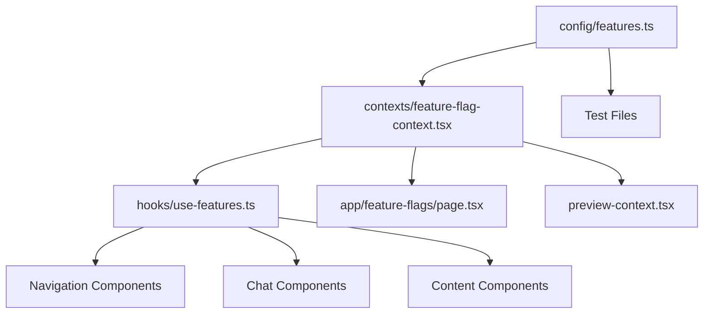

# Feature Flag Audit Report
**Date:** 2025-08-11  
**Epic:** Epic 2 - Complete Feature Flag Infrastructure Removal  
**Story:** 2.1 - Audit and Document Feature Flag Usage  

## Executive Summary

### Overview
The Catalyst Studio application currently uses a **client-side only** feature flag system based on localStorage. This audit documents all 14 feature flags, their usage across 40+ files, and provides a comprehensive inventory for safe removal.

### Key Findings
- **Total Feature Flags:** 14 flags across 4 categories
- **Files Affected:** 40+ files (components, tests, configuration, contexts)
- **Lines of Code:** Approximately 600+ lines directly related to feature flags
- **Storage Method:** localStorage with 'featureFlags' key
- **Caching:** Map-based cache with 1-second TTL
- **Server-Side Impact:** NONE - entirely client-side implementation
- **Database Impact:** NONE - no Prisma schema involvement

### Complexity Assessment
**Medium Complexity** - While the feature flag system is client-side only (simplifying removal), it has deep integration across the component tree through Context providers and hooks.

---

## Feature Flag Inventory

### 1. Core Feature Flags (5)
| Flag Name | Default State | Purpose | Status |
|-----------|--------------|---------|--------|
| `enhancedChat` | false | Enhanced chat with structured prompts | In Use |
| `contentBuilder` | false | Content type builder UI (deprecated) | Deprecated |
| `contentTypeBuilder` | true | Content type builder UI (Story 1.3) | Active |
| `previewSystem` | true | Multi-device preview (ENABLED FOR TESTING) | Active |
| `projectPersistence` | false | Save/load projects functionality | In Use |

### 2. UI Enhancement Flags (4)
| Flag Name | Default State | Purpose | Status |
|-----------|--------------|---------|--------|
| `catalystBranding` | false | Catalyst X visual identity | In Use |
| `glassMorphism` | false | Glass morphism effects | In Use |
| `animations` | false | Framer Motion animations | In Use |
| `threeColumnLayout` | false | New layout structure | In Use |

### 3. Integration Flags (2)
| Flag Name | Default State | Purpose | Status |
|-----------|--------------|---------|--------|
| `analyticsDisplay` | false | Analytics dashboard | In Use |
| `sourceCodeView` | false | Code editor view | In Use |

**Note:** `cmsIntegration` was removed in Story 1.10 (comment exists in code)

### 4. Development Flags (3)
| Flag Name | Default State | Purpose | Status |
|-----------|--------------|---------|--------|
| `debugMode` | NODE_ENV === 'development' | Debug mode toggle | Active |
| `performanceLogging` | false | Performance logging | In Use |
| `errorReporting` | true | Error reporting enabled | Active |

---

## File Inventory

### Core Infrastructure Files (5)
1. **`/config/features.ts`** (263 lines)
   - Main feature flag configuration
   - Contains all flag definitions, validation, caching
   - Exports: `isFeatureEnabled`, `enableFeature`, `disableFeature`, `clearFeatureCache`
   - Security features: XSS prevention, input validation
   - Performance: Map-based cache with TTL

2. **`/contexts/feature-flag-context.tsx`** 
   - React Context provider for feature flags
   - Centralizes state management
   - Provides hooks integration
   - Contains hardcoded list of features (lines 40-50+)

3. **`/hooks/use-features.ts`** (73 lines)
   - Custom React hooks for feature management
   - Exports: `useFeature`, `useFeatures`, `useFeatureToggle`, `useLayoutReady`
   - Wraps context methods

4. **`/app/feature-flags/page.tsx`**
   - UI for managing feature flags
   - Development-only toggle interface
   - Shows all flags with switches

5. **`/enable-content-builder.js`**
   - Utility script for enabling content builder
   - Direct localStorage manipulation

### Component Files Using Feature Flags (15+)

#### Navigation Components (5)
- `/components/navigation/navigation-sidebar.tsx` - Conditional sidebar items
- `/components/navigation/navigation-item.tsx` - Feature flag checks for items
- `/components/navigation/navigation-section.tsx` - Section visibility
- `/components/navigation/mobile-navigation.tsx` - Mobile menu items
- `/lib/navigation/types.ts` - Navigation type definitions with featureFlag property

#### Chat Components (3)
- `/components/chat/enhanced-chat-panel.tsx` - Enhanced chat features
- `/components/chat/feature-flagged-chat-persistence.tsx` - Persistence logic
- `/app/chat/page.tsx` - Chat page with feature checks

#### Content/Preview Components (3)
- `/app/content-builder/page.tsx` - Content builder page
- `/lib/context/preview-context.tsx` - Preview system context with feature check
- `/app/test-enhanced-chat/page.tsx` - Test page for enhanced chat

#### UI Enhancement Components (1)
- `/components/glass-morphism.tsx` - Glass morphism effects

### Test Files (10+)

#### Unit Tests (2)
- `/__tests__/features.test.ts` - Feature flag unit tests
- `/__tests__/components.test.tsx` - Component tests with feature mocks

#### E2E Tests (5)
- `/tests/features/deployment-simple.spec.ts` - Deployment tests
- `/tests/features/persistence.spec.ts` - Persistence tests
- `/tests/preview-system.spec.ts` - Preview system tests
- `/tests/content-type-builder.spec.ts` - Content type builder tests
- `/tests/content-builder-persistence.spec.ts` - Content builder persistence

### Documentation Files (3)
- `/docs/testing-guide.md` - References feature flag testing
- `/docs/architecture.md` - Epic 2 architecture with feature flag details
- Various story files with feature flag references

---

## Dependency Map

### Component Dependencies



### Feature to Component Mapping

| Feature Flag | Primary Components | Test Coverage |
|--------------|-------------------|---------------|
| `enhancedChat` | enhanced-chat-panel, chat/page, test-enhanced-chat | Unit + E2E |
| `contentTypeBuilder` | content-builder/page | content-type-builder.spec.ts |
| `previewSystem` | preview-context | preview-system.spec.ts |
| `projectPersistence` | feature-flagged-chat-persistence | persistence.spec.ts |
| `threeColumnLayout` | use-features hook, layout components | Component tests |
| `glassMorphism` | glass-morphism component | Component tests |
| Navigation flags | All navigation components | Navigation tests |

---

## localStorage Usage Analysis

### Direct localStorage Access Points
1. **config/features.ts** - Primary access point
   - Read: `localStorage.getItem('featureFlags')`
   - Write: `localStorage.setItem('featureFlags', JSON.stringify(flags))`
   - Key: `'featureFlags'`

2. **Test Files** - Direct manipulation for test setup
   - All E2E tests set flags via `page.evaluate()`
   - Pattern: `localStorage.setItem('featureFlags', JSON.stringify({...}))`

3. **enable-content-builder.js** - Utility script
   - Direct localStorage manipulation

### Cache Implementation
- Map-based cache: `featureCache = new Map<FeatureName, boolean>()`
- TTL: 1 second (`CACHE_TTL = 1000`)
- Refresh mechanism: `refreshCacheIfNeeded()`
- Initialization: `initializeCache()` on module load

---

## Risk Assessment

### Critical Paths
1. **Navigation System** - Deep integration with feature flags
   - All navigation items can be feature-flagged
   - Recursive checking in navigation tree
   - Risk: Broken navigation if not carefully removed

2. **Context Provider Tree** - FeatureFlagProvider in app root
   - Wraps entire application
   - Multiple hooks depend on it
   - Risk: Component errors if context removed incorrectly

3. **Test Infrastructure** - Heavy reliance on feature flag mocking
   - All E2E tests manipulate localStorage
   - Risk: Test failures if not updated properly

### Potential Issues
1. **Hardcoded Feature Lists** - Context has hardcoded array (lines 40-50)
2. **Mixed Flag States** - Some true, some false by default
3. **Deprecated Flags** - contentBuilder vs contentTypeBuilder confusion
4. **Development-Only Functions** - enableFeature/disableFeature restricted to dev
5. **Type Error** - `contexts/feature-flag-context.tsx` line 50 references removed 'cmsIntegration' flag

---

## Removal Strategy Recommendations

### Recommended Removal Order (Story Sequence)

1. **Story 2.2: Core Infrastructure Removal**
   - Start with `/config/features.ts` removal
   - TypeScript will identify all usage points
   - Forces addressing all imports

2. **Story 2.3: Component Cleanup**
   - Remove checks from navigation components first
   - Then chat and content components
   - Finally UI enhancement components

3. **Story 2.4: Context and Hooks Removal**
   - Remove FeatureFlagProvider from app
   - Delete context and hooks files
   - Update all hook usages

4. **Story 2.5: Test Updates**
   - Remove localStorage manipulations
   - Update test expectations
   - Remove feature flag mocks

5. **Story 2.6: UI and Utils Cleanup**
   - Remove `/app/feature-flags` page
   - Delete utility scripts
   - Clean up type definitions

6. **Story 2.7: Final Verification**
   - localStorage cleanup code
   - Documentation updates
   - Final testing

### Migration Patterns

**Pattern 1: Simple Flag Check Removal**
```typescript
// Before
if (isFeatureEnabled('previewSystem')) {
  return <PreviewComponent />
}
return null

// After
return <PreviewComponent />
```

**Pattern 2: Navigation Item Simplification**
```typescript
// Before
const visibleItems = items.filter(item => 
  !item.featureFlag || isFeatureEnabled(item.featureFlag)
)

// After
const visibleItems = items // All items visible
```

**Pattern 3: Test Simplification**
```typescript
// Before
await page.evaluate(() => {
  localStorage.setItem('featureFlags', JSON.stringify({ previewSystem: true }))
})
await page.reload()

// After
// Direct testing, no setup needed
```

---

## Metrics

### Removal Impact
- **Files to Modify:** 40+
- **Lines to Remove:** ~600 direct lines, ~200 indirect
- **Test Updates Required:** 7+ test files
- **Components Simplified:** 15+
- **Type Definitions to Remove:** 3 (FeatureFlags, FeatureName, navigation types)

### Expected Benefits
- **Performance:** Eliminate localStorage reads and cache overhead
- **Complexity:** Remove conditional rendering logic
- **Security:** Remove localStorage attack vector
- **Maintenance:** Simpler codebase without feature toggles
- **Testing:** Simpler test setup without flag manipulation

---

## Verification Checklist

### Pre-Removal Verification
- [ ] All features confirmed production-ready
- [ ] No rollback requirements identified
- [ ] Test coverage adequate for all features

### Post-Removal Verification
- [ ] All Epic 1 features functional
- [ ] No console errors
- [ ] All tests passing
- [ ] Navigation fully visible
- [ ] Chat features working
- [ ] Preview system operational
- [ ] No localStorage artifacts remaining

---

## Conclusion

The feature flag system is well-contained as a client-side only implementation, making removal straightforward but requiring careful attention to the numerous integration points. The systematic approach outlined in Stories 2.2-2.7 will ensure safe and complete removal while maintaining all Epic 1 functionality.

**Next Step:** Proceed with Story 2.2 - Core Infrastructure Removal, starting with `/config/features.ts` deletion to leverage TypeScript for finding all usage points.

---

*End of Audit Report*