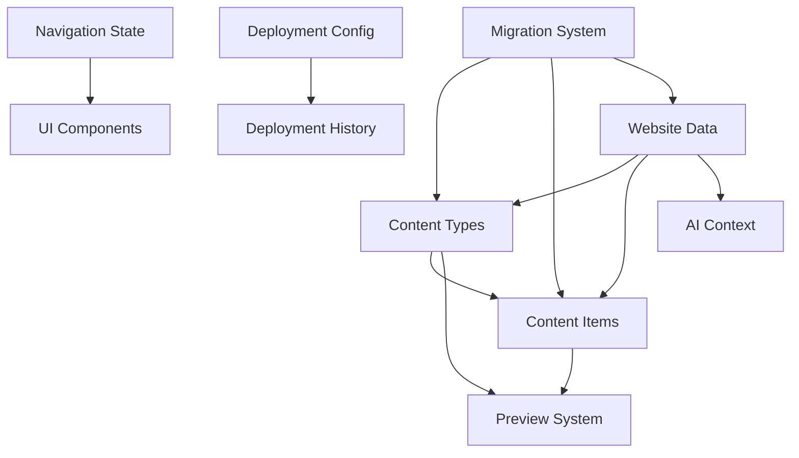

# Storage Migration Plan

## Executive Summary
This document outlines the technical approach for migrating Catalyst Studio from browser-based storage (localStorage, sessionStorage, IndexedDB) to a database-backed solution. The migration will be executed in phases to minimize risk and ensure data integrity.

## Current Architecture Analysis

### Storage Layers
```
┌─────────────────────────────────────────┐
│         Application Layer               │
├─────────────────────────────────────────┤
│   React Contexts │ Zustand Stores       │
├─────────────────────────────────────────┤
│        Storage Service Layer            │
│  (Strategies: IndexedDB, localStorage)  │
├─────────────────────────────────────────┤
│         Browser Storage APIs            │
│  localStorage │ sessionStorage │ IDB    │
└─────────────────────────────────────────┘
```

### Data Flow Patterns
1. **Direct Access**: Components directly call localStorage/sessionStorage
2. **Context Pattern**: React contexts manage storage with effects
3. **Store Pattern**: Zustand stores with persist middleware
4. **Service Pattern**: Storage service with strategy fallbacks

## Target Architecture

### Proposed Stack
```
┌─────────────────────────────────────────┐
│         Application Layer               │
├─────────────────────────────────────────┤
│   React Contexts │ Zustand Stores       │
├─────────────────────────────────────────┤
│         API Client Layer                │
│    (React Query / SWR for caching)      │
├─────────────────────────────────────────┤
│          Next.js API Routes             │
├─────────────────────────────────────────┤
│        Database Service Layer           │
├─────────────────────────────────────────┤
│            Database                     │
│    (PostgreSQL / MongoDB / SQLite)      │
└─────────────────────────────────────────┘
```

## Module Dependency Graph



### Dependency Analysis
- **Content Types**: Core dependency for most modules
- **Website Data**: Container for all website-specific data
- **Migration System**: Touches all data modules during upgrade

## Migration Approach

### Phase 1: Database Setup & Core Infrastructure
**Duration: 1 Sprint**

#### Tasks:
1. **Database Selection**
   - Evaluate options: PostgreSQL, MongoDB, SQLite
   - Consider hosting: Vercel Postgres, Supabase, PlanetScale
   - Decision criteria: Cost, scalability, ease of integration

2. **Schema Design**
   ```sql
   -- Example PostgreSQL schema
   CREATE TABLE websites (
     id UUID PRIMARY KEY,
     name VARCHAR(255),
     created_at TIMESTAMP,
     updated_at TIMESTAMP
   );

   CREATE TABLE content_types (
     id UUID PRIMARY KEY,
     website_id UUID REFERENCES websites(id),
     name VARCHAR(255),
     schema JSONB,
     created_at TIMESTAMP
   );

   CREATE TABLE content_items (
     id UUID PRIMARY KEY,
     content_type_id UUID REFERENCES content_types(id),
     data JSONB,
     created_at TIMESTAMP,
     updated_at TIMESTAMP
   );

   CREATE TABLE user_preferences (
     id UUID PRIMARY KEY,
     user_id VARCHAR(255),
     preferences JSONB
   );
   ```

3. **API Layer Setup**
   - Create Next.js API routes structure
   - Implement database connection pooling
   - Add error handling and logging

### Phase 2: Content Management Migration
**Duration: 1 Sprint**
**Risk Level: High** (Core functionality)

#### Implementation Strategy:
```typescript
// New API-based content service
class ContentAPIService {
  async getContentTypes(websiteId: string) {
    return fetch(`/api/websites/${websiteId}/content-types`);
  }
  
  async saveContentType(websiteId: string, contentType: ContentType) {
    return fetch(`/api/websites/${websiteId}/content-types`, {
      method: 'POST',
      body: JSON.stringify(contentType)
    });
  }
}

// Hybrid approach during migration
class HybridContentService {
  async getContentTypes(websiteId: string) {
    try {
      // Try API first
      return await this.api.getContentTypes(websiteId);
    } catch {
      // Fallback to localStorage
      return this.localStorage.getContentTypes();
    }
  }
}
```

#### Migration Steps:
1. Create database tables for content
2. Build API endpoints with validation
3. Implement hybrid service (API with localStorage fallback)
4. Migrate existing data via background job
5. Update React contexts to use new service
6. Remove localStorage dependencies after verification

### Phase 3: Website Storage Migration
**Duration: 2 Sprints**
**Risk Level: High** (Large data volumes)

#### Challenges:
- Large data sets (potentially MBs per website)
- Binary data (images, files)
- Performance requirements

#### Solutions:
```typescript
// Chunked upload for large data
class WebsiteDataService {
  async uploadLargeData(websiteId: string, data: Blob) {
    const chunkSize = 1024 * 1024; // 1MB chunks
    const chunks = Math.ceil(data.size / chunkSize);
    
    for (let i = 0; i < chunks; i++) {
      const chunk = data.slice(i * chunkSize, (i + 1) * chunkSize);
      await this.uploadChunk(websiteId, i, chunk);
    }
  }
  
  // Use presigned URLs for direct uploads
  async getUploadUrl(websiteId: string) {
    const response = await fetch(`/api/websites/${websiteId}/upload-url`);
    return response.json(); // Returns S3/cloud storage URL
  }
}
```

### Phase 4: User Preferences & Settings
**Duration: 0.5 Sprint**
**Risk Level: Low** (Non-critical data)

#### Approach:
- Batch migrate all user preferences
- Keep localStorage as cache for performance
- Sync changes to database asynchronously

### Phase 5: Deployment & History Migration
**Duration: 1 Sprint**
**Risk Level: Medium** (Contains sensitive data)

#### Security Considerations:
```typescript
// Encrypted storage for sensitive configs
class SecureDeploymentService {
  async saveProviderConfig(config: ProviderConfig) {
    // Encrypt sensitive fields
    const encrypted = await this.encrypt(config.apiKey);
    
    return fetch('/api/deployment/providers', {
      method: 'POST',
      body: JSON.stringify({
        ...config,
        apiKey: encrypted
      })
    });
  }
}
```

### Phase 6: Cleanup & Optimization
**Duration: 0.5 Sprint**
**Risk Level: Low**

#### Tasks:
1. Remove legacy storage code
2. Optimize database queries
3. Implement caching strategies
4. Performance testing

## Risk Assessment & Mitigation

### High-Risk Areas

| Risk | Impact | Probability | Mitigation |
|------|--------|-------------|------------|
| Data loss during migration | Critical | Low | Comprehensive backups, staged rollout |
| Performance degradation | High | Medium | Caching layer, CDN for static data |
| API rate limiting | Medium | Medium | Request batching, client-side cache |
| Large data transfer issues | High | High | Chunked uploads, compression |
| Browser compatibility | Low | Low | Progressive enhancement |

### Rollback Strategy

```typescript
class MigrationController {
  async rollback(checkpoint: string) {
    // 1. Stop new writes to database
    await this.pauseWrites();
    
    // 2. Restore from backup
    await this.restoreFromCheckpoint(checkpoint);
    
    // 3. Switch back to localStorage
    await this.enableLocalStorageMode();
    
    // 4. Verify data integrity
    await this.verifyDataIntegrity();
  }
}
```

## Performance Considerations

### Caching Strategy
```typescript
// React Query for API caching
const useContentTypes = (websiteId: string) => {
  return useQuery({
    queryKey: ['contentTypes', websiteId],
    queryFn: () => fetchContentTypes(websiteId),
    staleTime: 5 * 60 * 1000, // 5 minutes
    cacheTime: 10 * 60 * 1000, // 10 minutes
  });
};
```

### Optimistic Updates
```typescript
// Optimistic UI updates
const updateContentType = useMutation({
  mutationFn: updateContentTypeAPI,
  onMutate: async (newData) => {
    // Cancel outgoing refetches
    await queryClient.cancelQueries(['contentTypes']);
    
    // Snapshot previous value
    const previous = queryClient.getQueryData(['contentTypes']);
    
    // Optimistically update
    queryClient.setQueryData(['contentTypes'], newData);
    
    return { previous };
  },
  onError: (err, newData, context) => {
    // Rollback on error
    queryClient.setQueryData(['contentTypes'], context.previous);
  }
});
```

## Database Schema Requirements

### Core Tables
```sql
-- Websites table
CREATE TABLE websites (
  id UUID PRIMARY KEY DEFAULT gen_random_uuid(),
  name VARCHAR(255) NOT NULL,
  slug VARCHAR(255) UNIQUE,
  metadata JSONB DEFAULT '{}',
  created_at TIMESTAMP DEFAULT NOW(),
  updated_at TIMESTAMP DEFAULT NOW()
);

-- Content types table
CREATE TABLE content_types (
  id UUID PRIMARY KEY DEFAULT gen_random_uuid(),
  website_id UUID REFERENCES websites(id) ON DELETE CASCADE,
  name VARCHAR(255) NOT NULL,
  slug VARCHAR(255),
  schema JSONB NOT NULL,
  created_at TIMESTAMP DEFAULT NOW(),
  updated_at TIMESTAMP DEFAULT NOW(),
  UNIQUE(website_id, slug)
);

-- Content items table
CREATE TABLE content_items (
  id UUID PRIMARY KEY DEFAULT gen_random_uuid(),
  content_type_id UUID REFERENCES content_types(id) ON DELETE CASCADE,
  website_id UUID REFERENCES websites(id) ON DELETE CASCADE,
  data JSONB NOT NULL,
  status VARCHAR(50) DEFAULT 'draft',
  created_at TIMESTAMP DEFAULT NOW(),
  updated_at TIMESTAMP DEFAULT NOW()
);

-- User preferences table
CREATE TABLE user_preferences (
  id UUID PRIMARY KEY DEFAULT gen_random_uuid(),
  user_id VARCHAR(255) UNIQUE NOT NULL,
  preferences JSONB DEFAULT '{}',
  created_at TIMESTAMP DEFAULT NOW(),
  updated_at TIMESTAMP DEFAULT NOW()
);

-- Deployment configurations table
CREATE TABLE deployment_configs (
  id UUID PRIMARY KEY DEFAULT gen_random_uuid(),
  website_id UUID REFERENCES websites(id) ON DELETE CASCADE,
  provider VARCHAR(50) NOT NULL,
  config JSONB NOT NULL, -- Encrypted sensitive data
  created_at TIMESTAMP DEFAULT NOW(),
  updated_at TIMESTAMP DEFAULT NOW()
);

-- Deployment history table
CREATE TABLE deployment_history (
  id UUID PRIMARY KEY DEFAULT gen_random_uuid(),
  website_id UUID REFERENCES websites(id) ON DELETE CASCADE,
  deployment_config_id UUID REFERENCES deployment_configs(id),
  status VARCHAR(50) NOT NULL,
  metadata JSONB DEFAULT '{}',
  deployed_at TIMESTAMP DEFAULT NOW()
);

-- Create indexes for performance
CREATE INDEX idx_content_types_website ON content_types(website_id);
CREATE INDEX idx_content_items_website ON content_items(website_id);
CREATE INDEX idx_content_items_type ON content_items(content_type_id);
CREATE INDEX idx_deployment_history_website ON deployment_history(website_id);
```

## Testing Strategy

### Unit Tests
- Mock API responses
- Test data transformation logic
- Validate error handling

### Integration Tests
- Database operations
- API endpoint validation
- Migration process

### E2E Tests
- Full user workflows
- Data persistence verification
- Performance benchmarks

### Load Testing
```javascript
// Example K6 load test
import http from 'k6/http';
import { check } from 'k6';

export let options = {
  stages: [
    { duration: '30s', target: 20 },
    { duration: '1m', target: 20 },
    { duration: '30s', target: 0 },
  ],
};

export default function() {
  let response = http.get('http://localhost:3000/api/content-types');
  check(response, {
    'status is 200': (r) => r.status === 200,
    'response time < 500ms': (r) => r.timings.duration < 500,
  });
}
```

## Success Metrics

### Performance KPIs
- API response time < 200ms (p95)
- Database query time < 50ms (p95)
- Page load time unchanged or improved
- Zero data loss during migration

### Operational KPIs
- 100% backward compatibility during migration
- Rollback time < 5 minutes
- Migration completion within timeline
- All tests passing post-migration

## Timeline Summary

| Phase | Duration | Dependencies | Risk |
|-------|----------|--------------|------|
| Phase 1: Infrastructure | 1 Sprint | None | Low |
| Phase 2: Content Management | 1 Sprint | Phase 1 | High |
| Phase 3: Website Storage | 2 Sprints | Phase 1 | High |
| Phase 4: User Preferences | 0.5 Sprint | Phase 1 | Low |
| Phase 5: Deployment System | 1 Sprint | Phase 1 | Medium |
| Phase 6: Cleanup | 0.5 Sprint | All | Low |
| **Total** | **6 Sprints** | - | - |

## Next Steps

1. **Immediate Actions**
   - Review and approve migration plan
   - Select database technology
   - Set up development database instance
   - Create detailed technical design for Phase 1

2. **Pre-Migration Checklist**
   - [ ] Backup all existing browser storage data
   - [ ] Document current data structures
   - [ ] Set up monitoring and alerting
   - [ ] Create rollback procedures
   - [ ] Communicate timeline to stakeholders

3. **Team Requirements**
   - Backend developer for API development
   - Frontend developer for service integration
   - DevOps for database setup and monitoring
   - QA for comprehensive testing

## Conclusion

This migration plan provides a structured approach to transitioning from browser storage to a database-backed solution. The phased approach minimizes risk while ensuring data integrity and application stability throughout the migration process.